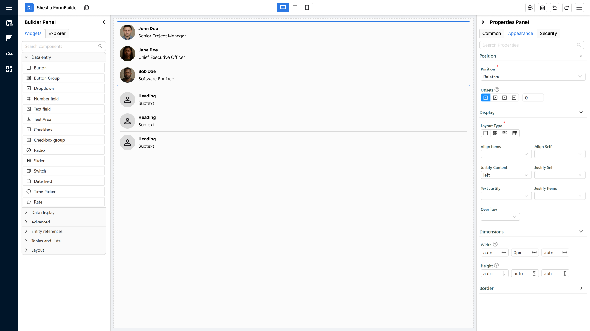
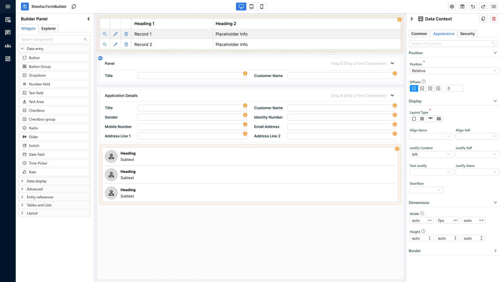
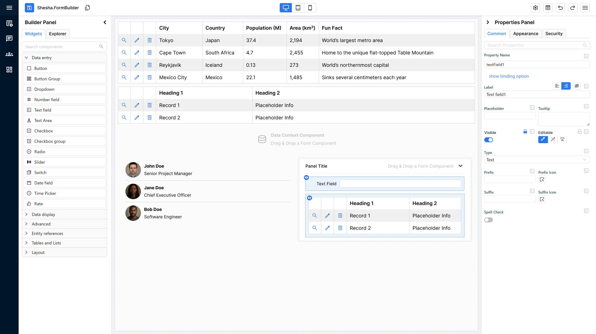
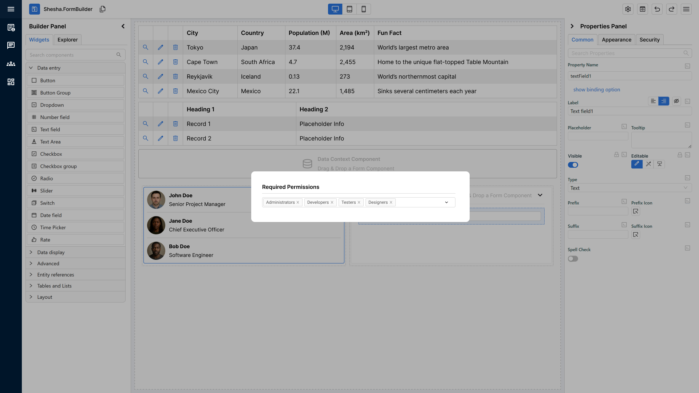
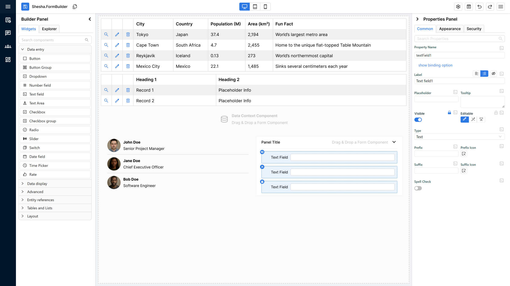
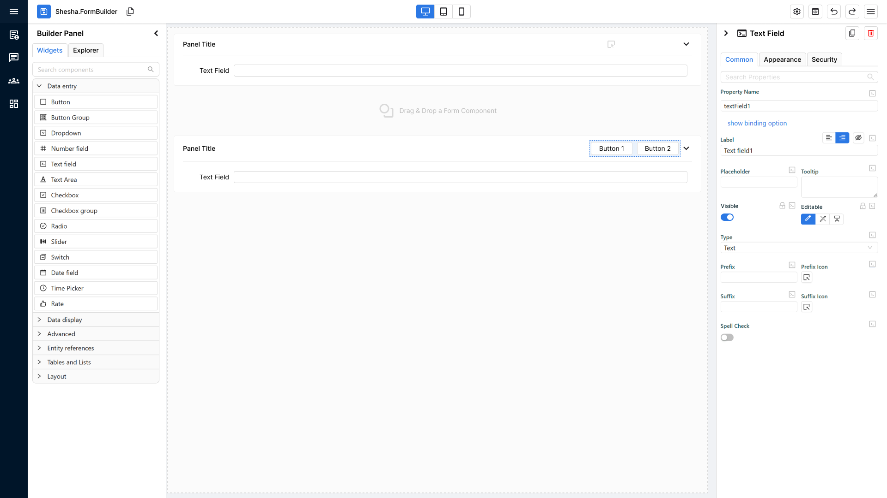
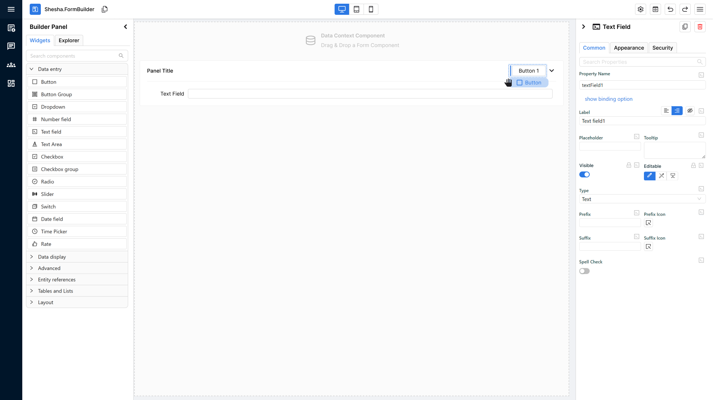
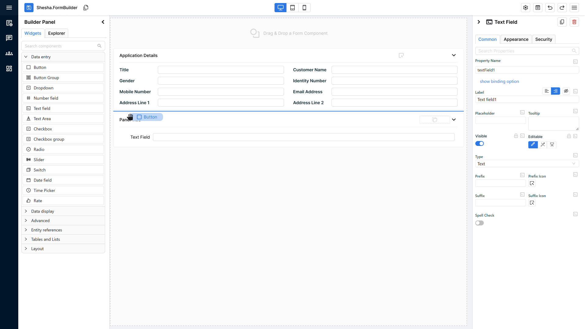
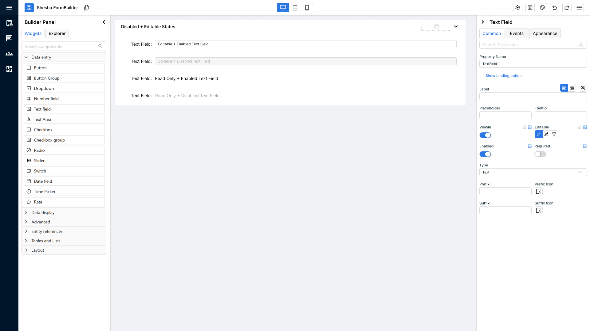

# Component Standards & Developer Checklist

This document defines the visual, behavioural, and structural standards for Form Builder components, along with a developer pre-QA checklist to ensure consistency, usability, and clarity before release.

## 1. Summarised Checklist

### **1. Property Ordering**
-  Main contains only **essential properties** needed to make the component usable on first drop.
-  Properties appear in this order: **Identity → Visibility/State → Core Behaviour → Primary Visuals**.
-  **Visibility/State** items (Visible, Enabled, Editable + permission padlocks) are always placed **before** behaviour and styling.
-  Core behaviour properties (e.g., binding / action / key config) are placed **before** non-essential styling options.
-  Non-essential or advanced properties are **not** placed in Main (they go to secondary tabs/sections).

---

### **2. WYSIWYG Rendering & Fallbacks**

-  Component renders in **true WYSIWYG form** by default.
-  When data/config is missing, component renders a **clean fallback** that still looks like the real component.
-  No visible error blocks, warnings, or layout distortions.
-  Placeholder/dummy values appear clean and intentional.
-  Builder view visually matches final rendered form.

---

### **3. Misconfiguration Indicators**

-  Misconfigured components show an **orange “i” icon** in the top-right with a helpful tooltip.
-  Containers/Data Context show **orange background + orange dotted border** (no icon).
-  Indicators only appear when configuration is missing or invalid.
-  No intrusive warnings or layout-shifting UI.
- Tooltips need to all be clear and understandable
-  Misconfigured properties must show red on their border, just like a validation check.

---

### **4. Permissions Rework (Visibility & Editability)**

-  Permissions moved from Security tab → **padlock buttons** on Visible & Editable properties.
-  Clicking padlock opens the permissions dialog.
-  Padlock icon turns **primary colour** when permissions are applied.
-  Visibility icons appear correctly on the component:
    -  Eye = manually hidden
    -  Padlock = hidden by permissions
    -  FX = hidden by custom logic
-  Users can re-open the dialog to edit/remove permissions.
    
---

### **5. Updated Container Look & Feel**

-  Standalone containers show **icon + text** until they are small enough to show only Icon.
-  Nested containers show **icon only**.
-  On drag-over (any container):
    -  Primary-coloured **dotted border** appears
    -  **10% primary background fill** appears
    -  Icon/text hide while dragging over
-  If container contains components, the **drop indicator** appears correctly while keeping the above styling.

---

### **6. Updated Drop Indicators**

-  Dragged component shows primary-coloured rounded rectangle with its name.
-  A clear **drop indicator line** appears where the new component will land.
-  Horizontal line appears for vertically stacked layouts.
-  Vertical line appears for horizontally stacked layouts.
-  Indicator updates dynamically as the component moves.
-  Indicator disappears immediately after drop.
-  Component lands exactly where the indicator showed.

---

### **7. Disabled States on Components**

-  New **Enabled** property exists (Enabled / Disabled / Inherited).
-  All four state combinations render correctly:
    -  Editable + Enabled → normal editable
    -  Editable + Disabled → editable look + disabled-grey overlay
    -  Read-only + Enabled → normal read-only
    -  Read-only + Disabled → read-only look + disabled-grey overlay
-  Disabled styling is consistent across all component types.
-  All Ant Design components fully support disabled mode.
-  Inherited mode correctly follows container's Enabled state.

---
### **8. Error Logging & Misconfiguration**

-  **All component errors are caught** — no uncaught console errors.
-  **Standardised error logging** is used for all components (no custom logging, no raw console.logs).
-  **Misconfigurations are surfaced to the user** through the correct UI indicators (informational icon, visibility icon, container highlight).
-  **Error messages are clear and actionable** so the user knows what is wrong and how to fix it.
-  Components handle **model changes safely** (rebinding, fallback states) without breaking visually.
-  **Runtime errors never break the UI** — components always fall back to a stable, visible state.

## 2. WYSIWYG Components.

### **Core Requirement**

All components must render in a **true WYSIWYG state** immediately when added to the form builder.  
No bold error blocks, warnings, or placeholder visuals that break the expected final layout.

### **Fallback Default Rendering**

If a component is missing required data or configuration, it must still render a **clean, visually accurate placeholder version** of itself.

### Fallback Rules:

- Must look like the component’s real rendered structure and size.
- Should show placeholder text or dummy values instead of error states.
- Should not distort layout, spacing, or visual style

**Example**:  
**Data Table**
- If real data isn’t present:
    - Render columns such as _Column 1, Column 2_.
    - Render 1–3 dummy rows like _Record 1, Record 2_.
    - If nothing is available, still render a table layout frame.

### **Developer Pre-QA Summary**

Before sending to QA, developers must confirm:
1. **Component renders in true WYSIWYG form by default.**
2. **Placeholder/fallback version looks like the final component when data is missing.**
3. **No visible errors or warning blocks appear in the builder that distort the layout.**
4. **Structure, spacing, and appearance match the final rendered form.**
5. **Dummy/placeholder values look clean and intentional (not broken or empty).**

## 3. Misconfiguration Informational Icons & Visual Indicators

### **Core Requirement**

When a component is added to the form builder and is **missing required configuration**, it must still render (using fallback mode if needed) **and visually indicate** that something is misconfigured without breaking the WYSIWYG view.

### **Informational Icon (for standard components)**

For all _normal components_ (anything that is not a container or Data Context):
#### Display Rule
- A small **orange circle with an “i” icon** appears on the **top-right corner** of the component.
- It must always be visible when the component is misconfigured.
#### Tooltip Rule
- Hovering over the icon reveals a **tooltip** explaining:
    - What configuration is missing
    - What the user needs to fix
- Tooltip should NOT alter component layout or cause UI shifting.

### **Special Exceptions: Containers & Data Context**

Containers and Data Context components behave differently because misconfigurations may apply to _nested_ components.

#### Instead of an icon, they receive:
- **Orange background tint** (light, non-intrusive)
- **Orange dotted border** around the entire container
    
#### Purpose:
- To visually indicate the entire structural component has a configuration issue.
- To avoid cluttering dozens of icons inside nested layouts.

### **Developer Pre-QA Summary**

Before sending to QA, developers must confirm:
1. **Components with misconfiguration display an orange “i” icon on the top-right.**
2. **Tooltip on hover clearly explains the configuration issue.**
3. Properties Panel should **highlight the property in red** like a validation when there's a misconfiguration related to it
4. **No warnings, no red blocks, no layout distortion.**
5. **Containers & Data Context use orange fill + orange dotted border instead of icons.**
6. **Indicators only appear when configuration is missing or invalid — never when valid.**

## 4. Permissions Rework (Visibility & Editability Controls)

### **Core Requirement**

Permissions settings are no longer stored under a separate **Security** tab.  
Instead, permissions are now integrated directly into the **Visible** and **Editable** properties on the main tab in the properties panel.

Each of these properties now includes a **padlock button** that opens a permissions dialog.

### **Padlock Button & Permission Dialog**

#### Behaviour
- The **padlock icon** appears next to both **Visible** and **Editable** settings.
- Clicking it opens a **permissions dialog** where the user can configure:
    - Who can see the component
    - Who can edit the component
        
#### Visual State Indicator
- If **any permissions are applied**, the padlock icon switches to a **primary-coloured state** to visually confirm that custom permissions exist.

### **Visibility Status Icon (Blue Circle Icon on the Component)**

When a component has **any visibility-related settings applied**, a **blue circular icon** appears on the component in the builder matching the style of the informational icon from Feature 2.

#### Icon States
1. **Eye Icon**
    - Appears when the component is **explicitly set to not visible**.
    
2. **Padlock Icon**
    - Appears when the component is **not visible due to permission-based rules**  
        (e.g., hidden for certain roles or groups).
        
3. **FX Icon**
    - Appears when the component’s visibility is controlled by **custom logic or JS expressions**. If both permissions and FX are active, then the FX icon takes precedence.
        

#### Purpose
- To give the user a quick, visual, non-disruptive indicator of _why_ a component may be hidden or conditionally shown.

### **Editing or Removing Permissions**

Users can update or remove permissions by:
- Clicking the **padlock** icon next to Visible or Editable again.
- Reopening the dialog to modify or clear the existing permission rules.
    
Changes update the component immediately, and icon states refresh accordingly.

### **Developer Pre-QA Summary**

Before sending to QA, developers must confirm:
1. **Security tab is fully removed; permissions live under Visible and Editable.**
2. **Padlock button opens permissions dialog for both properties.**
3. **Padlock icon turns primary colour when any permission rule is applied.**
4. **Visibility status icon appears on the component when visibility rules exist:**
    - Eye = manually hidden
    - Padlock = hidden due to permissions
    - FX = hidden due to custom logic/JS
5. **Users can re-open the dialog via padlock to edit or clear permissions.**

## 5. Container Default Look & Feel (Updated Icons & Drag-Over Behaviour)

### **Updated Container Icon & Label**

All container components now share the same improved visual identity:
- **Standalone containers:**
    - Display **icon + supporting text**.
    - When a container becomes very small, it should have a fallback where it only shows the icon and removes the text.
- Containers as part of the component** (e.g., inside Panels header):
    - Display **icon only**, no supporting text.
        
This keeps containers visually consistent but avoids crowding inside smaller nested containers.

### **Unified Drag-Over Behaviour (Applies to ALL Containers)**

Whether a container is standalone or nested, it now has the **same enhanced drag-and-drop feedback**.
#### When a user drags a component _over_ any container:
- The container shows a **primary-coloured dotted border**.
- The background fills with the **primary theme colour at 10% opacity**.
- The container’s **icon and optional text temporarily disappear** to emphasize the drop zone.

This provides a universal, clear indication of where a component can be dropped.

### **Behaviour When the Container Already Contains Components**

If the container already has child components inside it:
#### Container shows:
- The **new drop indicator** to guide where the new component will land relative to existing content.
- The **same visual styling** as drag-over mode:
    - Primary dotted border
    - 10% opacity primary fill
    - Hidden icon/text
        
The goal: consistent visual feedback + clear placement indicators.

### **Developer Pre-QA Summary**

Before sending to QA, developers must confirm:
1. **Standalone containers show icon + text by default.**
2. **Nested containers show icon-only.**
3. **On drag-over:**
    - Primary-coloured dotted border appears.
    - 10% opacity primary fill appears.
    - Icon/text disappear.
4. **When the container already contains components:**
    - Standard drop indicator shows correctly.
    - Border + fill styling remains consistent.
5. **Behaviour is identical across all container types; only text vs no-text differs.**

## 6. Updated Drop Indicators for Precise Component Placement

### **Purpose of the Feature**

The new drop indicator system removes the guesswork from placing components in the form builder.  
Users can now see _exactly_ where a component will land before they release the mouse.

### **Component Held During Drag**

When the user begins dragging a component:
#### Visual Representation of the Component Being Held
- The dragged component appears as a **rounded rectangle**.
- It uses the **primary theme colour** as its background.
- Inside, the **component name** is clearly displayed.
- This provides instant visual confirmation of what is being placed.

### **Precision Drop Indicators in the Form Builder**

As the user drags the component around the builder, a **primary-coloured line** appears to show the exact drop location.

#### Two Possible Line Types (Depending on Layout)

1. **Horizontal Drop Line**
    - Appears when components are stacked vertically.
    - The line appears _between two components_ to show where the new one will slot in.
        
2. **Vertical Drop Line**
    - Appears when components are arranged horizontally.
    - Indicates the new component will be inserted between items in a horizontal row.
        
These indicators dynamically adjust based on the structure of the layout the user is hovering over.

### **Behaviour on Drop**

When the user releases the component:
- The component is inserted precisely where the line appeared.
- The **drop indicator line disappears immediately** after the drop.
- The builder returns to its normal visual state.
### **Developer Pre-QA Summary**

Before handing to QA, developers must confirm:
1. **Dragging a component shows a rounded rectangle with primary-coloured fill and the component’s name.**
2. **A primary-coloured drop indicator line appears wherever the component could be placed.**
3. **Indicator line correctly reflects layout direction:**
    - Horizontal line for vertical stacks
    - Vertical line for horizontal stacks
4. **Line updates dynamically as the user moves the component around.**
5. **Drop indicator disappears immediately once the component is released.**
6. **Inserted component appears exactly where the indicator line was shown.**

## 7. Disabled States on Components (Enabled Property + Visual Clarity)

### **Purpose of the Feature**

This rework improves **visual clarity** between components that are:
- Editable
- Read-only
- Disabled
    
Users should be able to quickly understand a component’s interactive state through consistent visual cues.

### **New “Enabled” Property**

A new property called **Enabled** is added to the **Main** tab in the properties panel (just below “Visible”).
It has **three options**:
1. **True**
2. **False**
3. **Inherited**

### **Combined State Logic (Editable × Enabled)**

The component’s final appearance depends on the combination of **Editable** and **Enabled**, resulting in **four possible visual states**:

#### **1) Editable = true + Enabled = true**
- Component appears as a **fully editable, normal** component.
- Standard interactive styling.
    
#### **2) Editable = true + Enabled = false**
- Component is **editable in principle**, but marked as **disabled**.
- Displays a **disabled-grey visual treatment** on top of the editable look.
- It appears disabled and cannot be interacted with.

#### **3) Editable = Read-Only + Enabled = true**
- Component appears as a **standard read-only** component.
- No disabled styling applied.
- Read-only visuals are unchanged.
    
#### **4) Editable = Read-Only + Enabled = false**
- Component looks **read-only**, but layered with a **disabled-grey visual treatment**.
- Visually communicates that it is not only read-only but also **disabled** at a higher level.
    
This allows users to distinguish:
- _“I can’t edit this”_ 
- _“This entire component is disabled”_

### **Component Support Requirements**

All standard components provided by **Ant Design** and used in Shesha must support the disabled state, including:

- Inputs
- Toggles
- Checkboxes
- Selects
- Date/time pickers
- Any other Ant-driven interactive components
    
Disabled styling must be consistent across all component types.

### **Developer Pre-QA Summary (Checklist for this Feature)**

Before handing off to QA, developers must confirm:
1. **“Enabled” property exists under the Main tab with options: Enabled, Disabled, Inherited.**
2. **All four state combinations (Editable × Enabled) render visually correctly:**
    - Editable + Enabled → normal editable
    - Editable + Disabled → editable styling + disabled-grey overlay
    - Read-only + Enabled → normal read-only
    - Read-only + Disabled → read-only styling + disabled-grey overlay
3. **Disabled-grey styling is consistent and visually clear across all components.**
4. **All Ant Design components support disabled mode correctly.**
5. **Inherited mode correctly follows the parent container's Enabled setting.**

## 8. General Component Properties Ordering.

The **Main** section contains the essential properties required to make a component usable immediately after being added to the form.  
Only include properties here that impact:  
- Component identity  
- Visibility & interactive state  
- Core behaviour  
- Primary visual identity

Everything else belongs in secondary tabs. The Properties also follow a 'Progressive Disclosure' pattern, so only show things which are needed right now. If the user enables a toggle and there's additional options, only show them when the toggle is enabled. Don't overwhelm the user with options if they are not mandatory to a property. 

We are purposefully keeping tabs to a minimum therefore please ensure that the properties you are adding can be added to existing tabs. **Please do not** create new tabs for one property. 

### Main Section General Guideline
#### **1. Identity**
Properties that tell the user what the component is.

1. **Component Name**
2. **Property Name / Context / Binding**
    
> These always appear first.  
> If the user can’t identify the component at a glance, it’s unusable.
#### **2. Visibility & State**
Properties that determine whether the component appears and can be interacted with.

3. **Visible**
4. **Editable / Read-only**
5. **Enabled** (Enabled / Disabled / Inherited)

> These must be placed before behaviour or styling so users can establish basic access rules immediately.

#### **3. Core Behaviour**
Properties required for the component to perform its primary purpose.

Examples:
- **Field / Data**
- **On Click** (for buttons)
- **Main Data Source or Key** (for display components)

> These define what the component “does”  if not set, the component is incomplete.

#### **4. Primary Visual Identity**
Only include high-level visuals that affect clarity or recognisability.

Examples:
- **Icon**
- **Style / Variant**
- **Tooltip**
- **Basic Dimensions** (width/size only if essential)

> Do _not_ include detailed styling here, just enough to make the component feel correct in the form.

When deciding if a property belongs in _Main_, ask:

> **Is this property essential for the component to be understandable, visible, usable, or recognisable on first drop?**

If **YES**, put it in Main in the order above.  
If **NO**, move it to a secondary tab (Appearance, Data, Advanced, etc.).

Always remember to reference other components to get a general feel of their layouts if you need additional guidance. 

