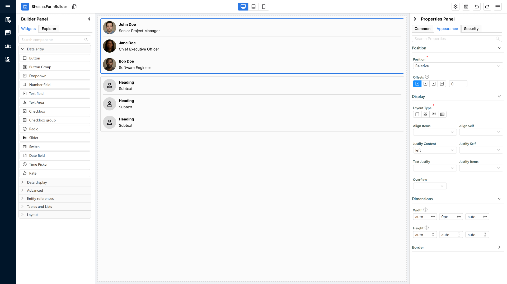
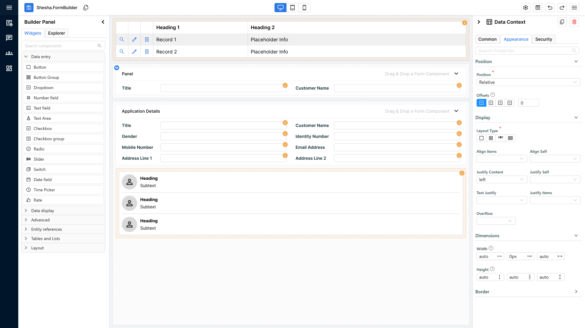
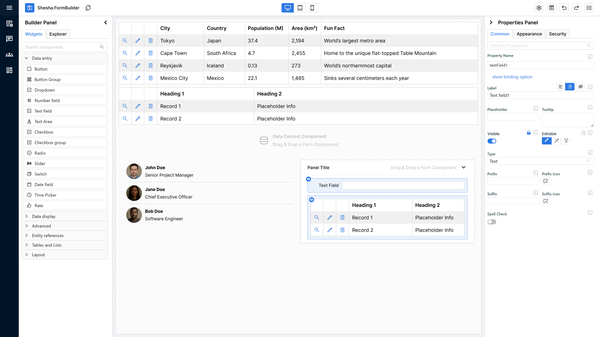
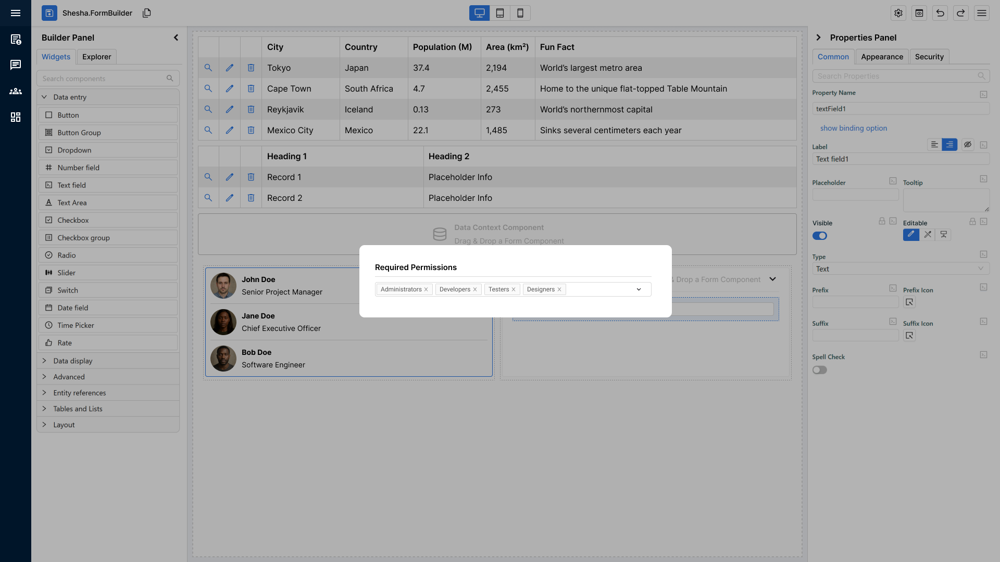
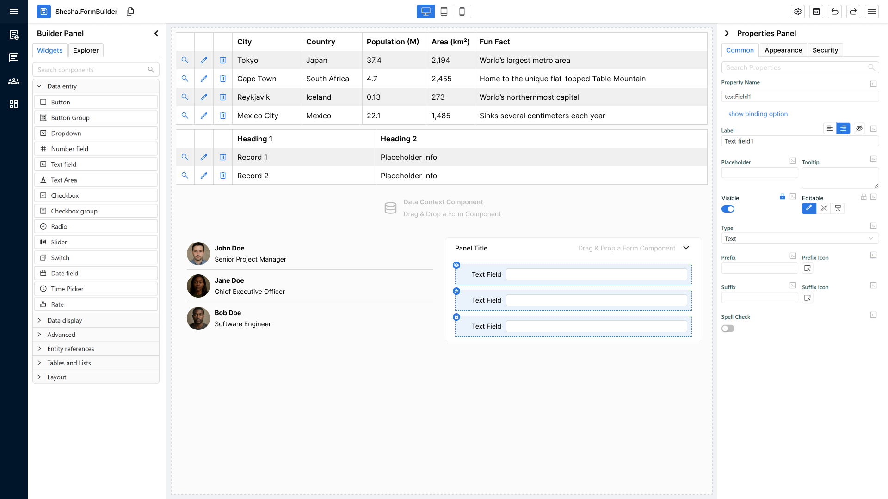
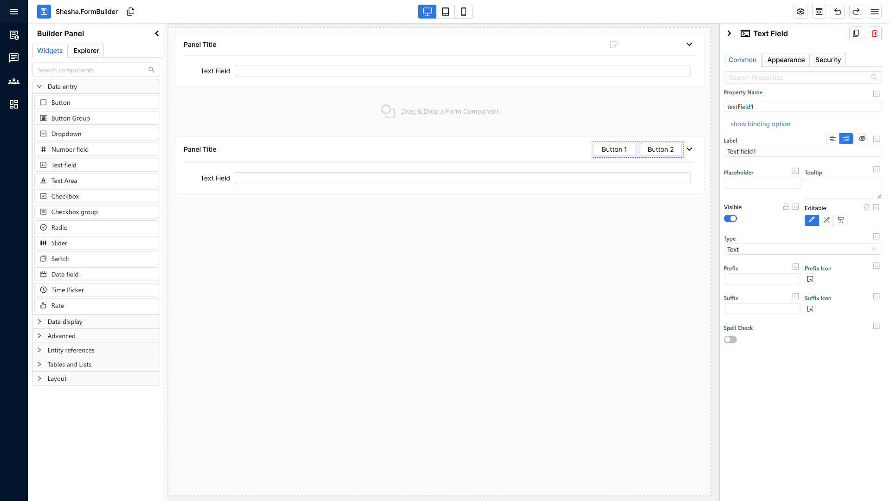
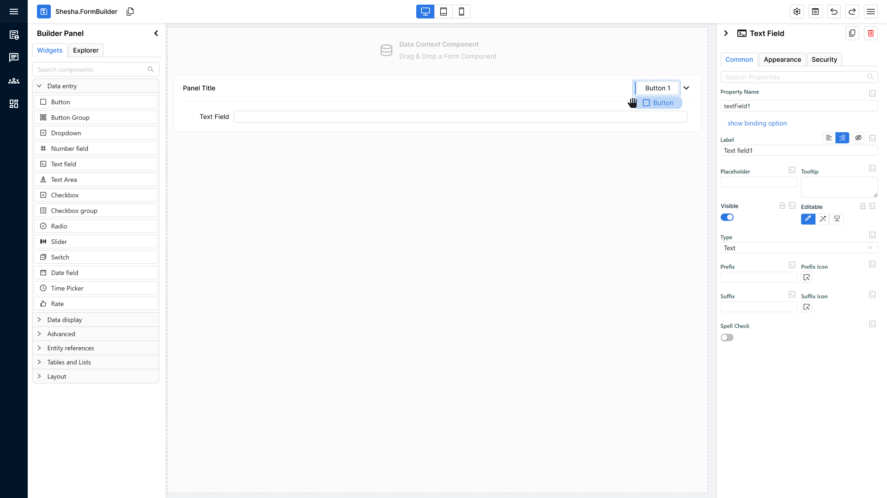
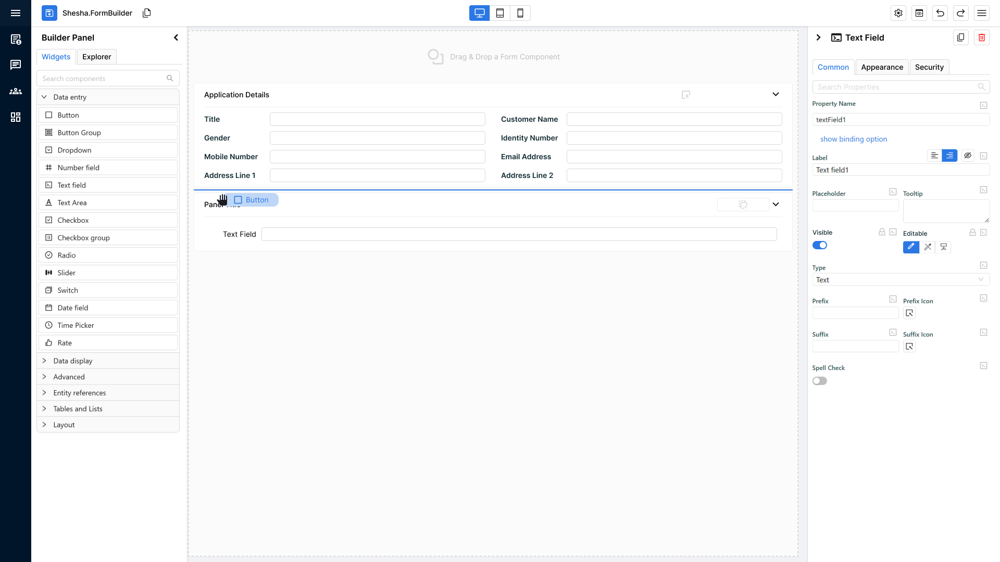
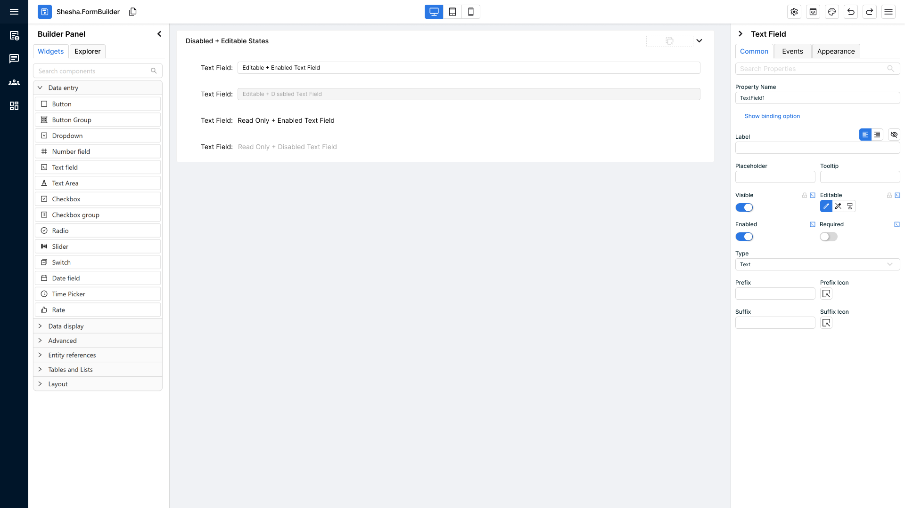

# Component Standards & Developer Checklist

This document defines the visual, behavioural, and structural standards for Form Builder components, along with a developer pre-QA checklist to ensure consistency, usability, and clarity before release.

## 1. Summarised Checklist

### **1. Property Ordering**
-  Main contains only **essential properties** needed to make the component usable on first drop.
-  Properties appear in this order: **Identity → Visibility/State → Core Behaviour → Primary Visuals**.
-  **Visibility/State** items (Visible, Enabled, Editable + permission padlocks) are always placed **before** behaviour and styling.
-  Core behaviour properties (e.g., binding / action / key config) are placed **before** non-essential styling options.
-  Non-essential or advanced properties are **not** placed in Main (they go to secondary tabs/sections).

---

### **2. WYSIWYG Rendering & Fallbacks**

-  Component renders in **true WYSIWYG form** by default.
-  When data/config is missing, component renders a **clean fallback** that still looks like the real component.
-  No visible error blocks, warnings, or layout distortions.
-  Placeholder/dummy values appear clean and intentional.
-  Builder view visually matches final rendered form.

---

### **3. Misconfiguration Indicators**

-  Misconfigured components show an **orange “i” icon** in the top-right with a helpful tooltip.
-  Containers/Data Context show **orange background + orange dotted border** (no icon).
-  Indicators only appear when configuration is missing or invalid.
-  No intrusive warnings or layout-shifting UI.
- Tooltips need to all be clear and understandable
-  Misconfigured properties must show red on their border, just like a validation check.

---

### **4. Permissions Rework (Visibility & Editability)**

-  Permissions moved from Security tab → **padlock buttons** on Visible & Editable properties.
-  Clicking padlock opens the permissions dialog.
-  Padlock icon turns **primary colour** when permissions are applied.
-  Permissions act as a **restriction layer only** (can restrict, never promote).
-  Permissions are evaluated **after Explicit / Inherited / JS values resolve**.
-  Visibility icons appear correctly on the component:
    -  Eye = manually hidden
    -  Padlock = hidden by permissions
    -  FX = hidden by custom logic
-  Users can re-open the dialog to edit/remove permissions.
    
---

### **5. Updated Container Look & Feel**

-  Standalone containers show **icon + text** until they are small enough to show only Icon.
-  Nested containers show **icon only**.
-  On drag-over (any container):
    -  Primary-coloured **dotted border** appears
    -  **10% primary background fill** appears
    -  Icon/text hide while dragging over
-  If container contains components, the **drop indicator** appears correctly while keeping the above styling.

---

### **6. Updated Drop Indicators**

-  Dragged component shows primary-coloured rounded rectangle with its name.
-  A clear **drop indicator line** appears where the new component will land.
-  Horizontal line appears for vertically stacked layouts.
-  Vertical line appears for horizontally stacked layouts.
-  Indicator updates dynamically as the component moves.
-  Indicator disappears immediately after drop.
-  Component lands exactly where the indicator showed.

---

### **7. Disabled States on Components**

-  New **Enabled** property exists (Enabled / Disabled / Inherited).
-  All four state combinations render correctly:
    -  Editable + Enabled → normal editable
    -  Editable + Disabled → editable look + disabled-grey overlay
    -  Read-only + Enabled → normal read-only
    -  Read-only + Disabled → read-only look + disabled-grey overlay
-  Disabled styling is consistent across all component types.
-  All Ant Design components fully support disabled mode.
-  Inherited mode correctly follows container's Enabled state.

---
### **8. Error Logging & Misconfiguration**

-  **All component errors are caught** — no uncaught console errors.
-  **Standardised error logging** is used for all components (no custom logging, no raw console.logs).
-  **Misconfigurations are surfaced to the user** through the correct UI indicators (informational icon, visibility icon, container highlight).
-  **Error messages are clear and actionable** so the user knows what is wrong and how to fix it.
-  Components handle **model changes safely** (rebinding, fallback states) without breaking visually.
-  **Runtime errors never break the UI** — components always fall back to a stable, visible state.


---

### **9. Theme-Level Component Specific Settings**

- Components must support **theme-level component specific settings**.
- Theme defaults must apply consistently across **Form Builder** and **Runtime**.
- Components must not rely on hardcoded values when theme-level configuration exists.

---

### **10. Entity Configuration Inheritance (Formatting Defaults)**

- Components bound to entity properties must **inherit formatting defaults** from the **Entity Configuration layer**.
- This includes formatting such as:
  - Date format
  - Prefix / suffix
  - Thousand separator
  - Number of decimal places
- Component-level formatting overrides are supported, but inheritance must be the default behaviour.

## 2. WYSIWYG Components.

### **Core Requirement**

All components must render in a **true WYSIWYG state** immediately when added to the form builder.  
No bold error blocks, warnings, or placeholder visuals that break the expected final layout.

### **Fallback Default Rendering**

If a component is missing required data or configuration, it must still render a **clean, visually accurate placeholder version** of itself.



### Fallback Rules:

- Must look like the component’s real rendered structure and size.
- Should show placeholder text or dummy values instead of error states.
- Should not distort layout, spacing, or visual style

**Example**:  
**Data Table**
- If real data isn’t present:
    - Render columns such as _Column 1, Column 2_.
    - Render 1–3 dummy rows like _Record 1, Record 2_.
    - If nothing is available, still render a table layout frame.

### **Developer Pre-QA Summary**

Before sending to QA, developers must confirm:
1. **Component renders in true WYSIWYG form by default.**
2. **Placeholder/fallback version looks like the final component when data is missing.**
3. **No visible errors or warning blocks appear in the builder that distort the layout.**
4. **Structure, spacing, and appearance match the final rendered form.**
5. **Dummy/placeholder values look clean and intentional (not broken or empty).**

## 3. Misconfiguration Informational Icons & Visual Indicators

### **Core Requirement**

When a component is added to the form builder and is **missing required configuration**, it must still render (using fallback mode if needed) **and visually indicate** that something is misconfigured without breaking the WYSIWYG view.



### **Informational Icon (for standard components)**

For all _normal components_ (anything that is not a container or Data Context):
#### Display Rule
- A small **orange circle with an “i” icon** appears on the **top-right corner** of the component.
- It must always be visible when the component is misconfigured.
#### Tooltip Rule
- Hovering over the icon reveals a **tooltip** explaining:
    - What configuration is missing
    - What the user needs to fix
- Tooltip should NOT alter component layout or cause UI shifting.

### **Special Exceptions: Containers & Data Context**

Containers and Data Context components behave differently because misconfigurations may apply to _nested_ components.

#### Instead of an icon, they receive:
- **Orange background tint** (light, non-intrusive)
- **Orange dotted border** around the entire container
    
#### Purpose:
- To visually indicate the entire structural component has a configuration issue.
- To avoid cluttering dozens of icons inside nested layouts.

### **Developer Pre-QA Summary**

Before sending to QA, developers must confirm:
1. **Components with misconfiguration display an orange “i” icon on the top-right.**
2. **Tooltip on hover clearly explains the configuration issue.**
3. Properties Panel should **highlight the property in red** like a validation when there's a misconfiguration related to it
4. **No warnings, no red blocks, no layout distortion.**
5. **Containers & Data Context use orange fill + orange dotted border instead of icons.**
6. **Indicators only appear when configuration is missing or invalid — never when valid.**

## 4. Permissions Rework (Visibility & Editability Controls)

### **Core Requirement**

Permissions settings are no longer stored under a separate **Security** tab.  
Instead, permissions are now integrated directly into the **Visible** and **Editable** properties on the main tab in the properties panel.

Each of these properties now includes a **padlock button** that opens a permissions dialog.




### **Padlock Button & Permission Dialog**

#### Behaviour
- The **padlock icon** appears next to both **Visible** and **Editable** settings.
- Clicking it opens a **permissions dialog** where the user can configure:
    - Who can see the component
    - Who can edit the component
        
#### Visual State Indicator
- If **any permissions are applied**, the padlock icon switches to a **primary-coloured state** to visually confirm that custom permissions exist.

---

### **Permission Resolution Logic (Authoritative Behaviour)**

Permissions act strictly as a **restriction layer**.

They:
- Can restrict (downgrade)
- Cannot promote (upgrade)
- Cannot override explicit structural modes

Structural configuration (**Explicit / Inherited / JS**) always resolves first.  
Permissions are evaluated last as the final gate.

---

### **Editable – Final Resolution Rules**

#### Step 1 – Resolve Base Mode

The Editable state must first resolve to a base mode:

- Explicit `Editable`
- Explicit `ReadOnly`
- `Inherited` (resolved from parent container or form mode)
- JS-calculated result

This produces a resolved base mode.

---

#### Step 2 – Apply Permissions (Only If Editable)

If the resolved base mode is:

**`ReadOnly`**
- Final result = `ReadOnly`
- Permissions do not apply
- Structural mode takes precedence

**`Editable`**
- Permissions are evaluated:
  - If allowed → Final = `Editable`
  - If forbidden → Final = `ReadOnly`

Permissions can downgrade `Editable` to `ReadOnly`.  
They can never upgrade `ReadOnly` to `Editable`.

---

#### JS Enforcement Rule

If JS determines:

```
return true; // Editable
```

Permissions must still be evaluated afterwards.

Final resolution order:

1. Resolve explicit / inherited / JS mode
2. Apply permission restriction
3. Produce final state

JS cannot bypass permissions.

---

### **Visible – Final Resolution Rules**

The same principle applies to visibility.

#### Step 1 – Resolve Base Visibility

Base visibility resolves first:

- Explicit `Visible`
- Inherited result
- JS-calculated visibility

---

#### Step 2 – Apply Permissions (Only If Visible = true)

If resolved base visibility is:

**`false`**
- Component remains hidden
- Permissions do not apply
- Structural visibility takes precedence

**`true`**
- Permissions are evaluated:
  - If allowed → Component visible
  - If forbidden → Component hidden

Permissions can hide a component.  
They cannot force a hidden component to become visible.

---

### **Resolution Priority Order**

For both Editable and Visible, the evaluation order is:

1. Explicit configuration
2. Inherited configuration
3. JS-calculated result
4. Permission restriction (final gate)

Permissions are always evaluated last.


### **Visibility Status Icon (Blue Circle Icon on the Component)**

When a component has **any visibility-related settings applied**, a **blue circular icon** appears on the component in the builder matching the style of the informational icon from Feature 2.

#### Icon States
1. **Eye Icon**
    - Appears when the component is **explicitly set to not visible**.
    
2. **Padlock Icon**
    - Appears when the component is **not visible due to permission-based rules**  
        (e.g., hidden for certain roles or groups).
        
3. **FX Icon**
    - Appears when the component’s visibility is controlled by **custom logic or JS expressions**. If both permissions and FX are active, then the FX icon takes precedence.
        


#### Purpose
- To give the user a quick, visual, non-disruptive indicator of _why_ a component may be hidden or conditionally shown.

### **Editing or Removing Permissions**

Users can update or remove permissions by:
- Clicking the **padlock** icon next to Visible or Editable again.
- Reopening the dialog to modify or clear the existing permission rules.
    
Changes update the component immediately, and icon states refresh accordingly.

### **Developer Pre-QA Summary**

Before sending to QA, developers must confirm:
1. **Security tab is fully removed; permissions live under Visible and Editable.**
2. **Padlock button opens permissions dialog for both properties.**
3. **Padlock icon turns primary colour when any permission rule is applied.**
4. **Visibility status icon appears on the component when visibility rules exist:**
    - Eye = manually hidden
    - Padlock = hidden due to permissions
    - FX = hidden due to custom logic/JS
5. **Users can re-open the dialog via padlock to edit or clear permissions.**


## 5. Container Default Look & Feel (Updated Icons & Drag-Over Behaviour)

### **Updated Container Icon & Label**

All container components now share the same improved visual identity:
- **Standalone containers:**
    - Display **icon + supporting text**.
    - When a container becomes very small, it should have a fallback where it only shows the icon and removes the text.
- Containers as part of the component** (e.g., inside Panels header):
    - Display **icon only**, no supporting text.
        
This keeps containers visually consistent but avoids crowding inside smaller nested containers.



### **Unified Drag-Over Behaviour (Applies to ALL Containers)**

Whether a container is standalone or nested, it now has the **same enhanced drag-and-drop feedback**.
#### When a user drags a component _over_ any container:
- The container shows a **primary-coloured dotted border**.
- The background fills with the **primary theme colour at 10% opacity**.
- The container’s **icon and optional text temporarily disappear** to emphasize the drop zone.

This provides a universal, clear indication of where a component can be dropped.

### **Behaviour When the Container Already Contains Components**

If the container already has child components inside it:
#### Container shows:
- The **new drop indicator** to guide where the new component will land relative to existing content.
- The **same visual styling** as drag-over mode:
    - Primary dotted border
    - 10% opacity primary fill
    - Hidden icon/text
        
The goal: consistent visual feedback + clear placement indicators.

### **Developer Pre-QA Summary**

Before sending to QA, developers must confirm:
1. **Standalone containers show icon + text by default.**
2. **Nested containers show icon-only.**
3. **On drag-over:**
    - Primary-coloured dotted border appears.
    - 10% opacity primary fill appears.
    - Icon/text disappear.
4. **When the container already contains components:**
    - Standard drop indicator shows correctly.
    - Border + fill styling remains consistent.
5. **Behaviour is identical across all container types; only text vs no-text differs.**

## 6. Updated Drop Indicators for Precise Component Placement

### **Purpose of the Feature**

The new drop indicator system removes the guesswork from placing components in the form builder.  
Users can now see _exactly_ where a component will land before they release the mouse.




### **Component Held During Drag**

When the user begins dragging a component:
#### Visual Representation of the Component Being Held
- The dragged component appears as a **rounded rectangle**.
- It uses the **primary theme colour** as its background.
- Inside, the **component name** is clearly displayed.
- This provides instant visual confirmation of what is being placed.

### **Precision Drop Indicators in the Form Builder**

As the user drags the component around the builder, a **primary-coloured line** appears to show the exact drop location.

#### Two Possible Line Types (Depending on Layout)

1. **Horizontal Drop Line**
    - Appears when components are stacked vertically.
    - The line appears _between two components_ to show where the new one will slot in.
        
2. **Vertical Drop Line**
    - Appears when components are arranged horizontally.
    - Indicates the new component will be inserted between items in a horizontal row.
        
These indicators dynamically adjust based on the structure of the layout the user is hovering over.

### **Behaviour on Drop**

When the user releases the component:
- The component is inserted precisely where the line appeared.
- The **drop indicator line disappears immediately** after the drop.
- The builder returns to its normal visual state.
### **Developer Pre-QA Summary**

Before handing to QA, developers must confirm:
1. **Dragging a component shows a rounded rectangle with primary-coloured fill and the component’s name.**
2. **A primary-coloured drop indicator line appears wherever the component could be placed.**
3. **Indicator line correctly reflects layout direction:**
    - Horizontal line for vertical stacks
    - Vertical line for horizontal stacks
4. **Line updates dynamically as the user moves the component around.**
5. **Drop indicator disappears immediately once the component is released.**
6. **Inserted component appears exactly where the indicator line was shown.**

## 7. Disabled States on Components (Enabled Property + Visual Clarity)

### **Purpose of the Feature**

This rework improves **visual clarity** between components that are:
- Editable
- Read-only
- Disabled
    
Users should be able to quickly understand a component’s interactive state through consistent visual cues.

### **New “Enabled” Property**

A new property called **Enabled** is added to the **Main** tab in the properties panel (just below “Visible”).
It has **three options**:
1. **True**
2. **False**
3. **Inherited**

### **Combined State Logic (Editable × Enabled)**



The component’s final appearance depends on the combination of **Editable** and **Enabled**, resulting in **four possible visual states**:

#### **1) Editable = true + Enabled = true**
- Component appears as a **fully editable, normal** component.
- Standard interactive styling.
    
#### **2) Editable = true + Enabled = false**
- Component is **editable in principle**, but marked as **disabled**.
- Displays a **disabled-grey visual treatment** on top of the editable look.
- It appears disabled and cannot be interacted with.

#### **3) Editable = Read-Only + Enabled = true**
- Component appears as a **standard read-only** component.
- No disabled styling applied.
- Read-only visuals are unchanged.
    
#### **4) Editable = Read-Only + Enabled = false**
- Component looks **read-only**, but layered with a **disabled-grey visual treatment**.
- Visually communicates that it is not only read-only but also **disabled** at a higher level.
    
This allows users to distinguish:
- _“I can’t edit this”_ 
- _“This entire component is disabled”_

### **Component Support Requirements**

All standard components provided by **Ant Design** and used in Shesha must support the disabled state, including:

- Inputs
- Toggles
- Checkboxes
- Selects
- Date/time pickers
- Any other Ant-driven interactive components
    
Disabled styling must be consistent across all component types.

### **Developer Pre-QA Summary (Checklist for this Feature)**

Before handing off to QA, developers must confirm:
1. **“Enabled” property exists under the Main tab with options: Enabled, Disabled, Inherited.**
2. **All four state combinations (Editable × Enabled) render visually correctly:**
    - Editable + Enabled → normal editable
    - Editable + Disabled → editable styling + disabled-grey overlay
    - Read-only + Enabled → normal read-only
    - Read-only + Disabled → read-only styling + disabled-grey overlay
3. **Disabled-grey styling is consistent and visually clear across all components.**
4. **All Ant Design components support disabled mode correctly.**
5. **Inherited mode correctly follows the parent container's Enabled setting.**

## 8. General Component Properties Ordering.

The **Main** section contains the essential properties required to make a component usable immediately after being added to the form.  
Only include properties here that impact:  
- Component identity  
- Visibility & interactive state  
- Core behaviour  
- Primary visual identity

Everything else belongs in secondary tabs. The Properties also follow a 'Progressive Disclosure' pattern, so only show things which are needed right now. If the user enables a toggle and there's additional options, only show them when the toggle is enabled. Don't overwhelm the user with options if they are not mandatory to a property. 

We are purposefully keeping tabs to a minimum therefore please ensure that the properties you are adding can be added to existing tabs. **Please do not** create new tabs for one property. 

### Main Section General Guideline
#### **1. Identity**
Properties that tell the user what the component is.

1. **Component Name**
2. **Property Name / Context / Binding**
    
> These always appear first.  
> If the user can’t identify the component at a glance, it’s unusable.
#### **2. Visibility & State**
Properties that determine whether the component appears and can be interacted with.

3. **Visible**
4. **Editable / Read-only**
5. **Enabled** (Enabled / Disabled / Inherited)

> These must be placed before behaviour or styling so users can establish basic access rules immediately.

#### **3. Core Behaviour**
Properties required for the component to perform its primary purpose.

Examples:
- **Field / Data**
- **On Click** (for buttons)
- **Main Data Source or Key** (for display components)

> These define what the component “does”  if not set, the component is incomplete.

#### **4. Primary Visual Identity**
Only include high-level visuals that affect clarity or recognisability.

Examples:
- **Icon**
- **Style / Variant**
- **Tooltip**
- **Basic Dimensions** (width/size only if essential)

> Do _not_ include detailed styling here, just enough to make the component feel correct in the form.

When deciding if a property belongs in _Main_, ask:

> **Is this property essential for the component to be understandable, visible, usable, or recognisable on first drop?**

If **YES**, put it in Main in the order above.  
If **NO**, move it to a secondary tab (Appearance, Data, Advanced, etc.).

Always remember to reference other components to get a general feel of their layouts if you need additional guidance. 


## 9. Theme-Level Component Specific Settings

### **Purpose of the Feature**

To encourage consistency and reduce repeated configuration, components must support **theme-level component specific settings**.  
These settings allow the platform to define default styling/behaviour centrally, ensuring a consistent experience across all forms.

### **Core Requirement**

Components must:
- Respect theme-level defaults by default
- Render consistently in both:
  - **Form Builder**
  - **Runtime**
- Avoid hardcoded behaviour where theme config is available

### **Developer Pre-QA Summary**

Before handing off to QA, developers must confirm:
1. Theme-level component specific settings apply correctly to the component.
2. Theme settings affect the component consistently in **Builder** and **Runtime**.
3. Component behaviour does not rely on hardcoded values where theme configuration exists.

## 10. Entity Configuration Inheritance (Formatting Defaults)

### **Purpose of the Feature**

To encourage consistency and follow the **DRY principle**, formatting-related configuration can be defined centrally at the **Entity Configuration layer**.  
Any form component binding to those entity properties should therefore **inherit those formatting settings by default**.

This ensures formatting for things like numbers and dates stays consistent across all forms without requiring manual reconfiguration in every component.

### **Core Requirement**

When a component binds to an entity property that contains formatting configuration, it must automatically inherit those values by default.

This includes (but is not limited to):
- Date format
- Prefix
- Suffix
- Thousand separator
- Number of decimal places

### **Expected Behaviour**
- Inheritance must be the default behaviour for bound fields.
- Component-level overrides are supported where explicitly configured.
- Inherited formatting must apply consistently in both:
  - **Form Builder**
  - **Runtime**

### **Developer Pre-QA Summary**

Before handing off to QA, developers must confirm:
1. Components bound to entity properties inherit formatting defaults from the **Entity Configuration layer**.
2. Inherited formatting is applied consistently in **Builder** and **Runtime**.
3. Overrides work correctly when explicitly set, but inheritance remains the default behaviour.

## 11. Error Handling & Informative Console Error Messages

### Purpose of the Feature
To keep component quality, we need to adopt good error handling. When a misconfiguration, bad API responses, or an unexpected runtime state occurs. By having an error handler ensures the component fails smoothly, the UI stays stable, and developers have the context to debug.

This section covers two concerns:
- **Try/catch patterns**: how to safely wrap error-prone logic
- **Informative console error messages**: what a good error message looks like and the key concepts behind it

### *Core Requirments*
All components must:
-   Catch and handle errors without crashing the UI
-   Log errors in a standardised, informative way
-   Never surface raw or cryptic errors to the end user

### **Try/Catch Patterns**
 
#### **When to use try/catch**
 
Wrap logic in a try/catch whenever the operation could fail for reasons outside your control. This includes:
- **API / async calls** — network failures, timeouts, unexpected response shapes
- **JSON parsing** — user-supplied or externally sourced data that may be malformed
- **Dynamic property access** — reading deeply nested object paths that may not exist
- **Third-party or Ant Design interactions** — library calls that may throw in edge cases
- **Data transformation logic** — mapping, filtering, or reducing data that has unknown shape

#### **What good try/catch looks like (Node.js/TypeScript)**
```typescript
// ✅ Good — specific, scoped, informative
try {
  const result = await http.get('api/crud/getUsers');
  form.setFieldValue('result', result);
} catch (error) {
  logger.error('DataTable | Failed to fetch entity data', {
    entityId,
    error: error instanceof Error ? error.message : String(error),
  });
  form.setFieldValue('result', null); // fall back to a safe state
}
```
 
```typescript
// ❌ Bad — silent catch, swallows the error entirely
try {
  const result = await http.get('api/crud/getUsers');
  form.setFieldValue('result', result);
} catch {
  // nothing here — no log, no fallback, no trace
}
```
 
```typescript
// ❌ Bad — catch is too broad, resets global state unnecessarily
try {
  parseComponentConfig(config);
} catch (e) {
  resetEntireForm();
}
```
#### **Key try/catch rules**
- **Always log inside the catch block** — a silent catch is worse than no catch at all
- **Scope the try block tightly** — only wrap the line(s) that can actually throw, not entire functions
- **Provide a safe fallback** — after catching, return `null`, an empty array, or a default state so the component stays stable
- **Never rethrow without context** — if you rethrow, add information before doing so
- **Avoid swallowing async errors** — ensure promises are `await`ed inside try blocks, or `.catch()` is chained

---

### **Informative Console Error Messages**

#### **What makes an error message informative?**
A good error message answers three questions immediately:
 
1. **Where** did this happen? (Which component or function?)
2. **What** went wrong? (The actual failure, not just "error occurred")
3. **Why** does it matter / what was the context? (The data or state involved)

#### **Structure of a good error message**
 
```
[ComponentName | FunctionName] Short description of what failed — { relevant context }
```

**Examples:**
```typescript
// ✅ Good
console.error('DataTable | fetchRows — API returned unexpected shape', {
  endpoint: '/api/entity/list',
  receivedType: typeof response.data,
  entityId,
});
 
// ✅ Good
console.error('DatePicker | parseDefaultValue — Failed to parse date string', {
  rawValue: defaultValue,
  expectedFormat: 'YYYY-MM-DD',
  error: error.message,
});
 
// ❌ Bad — no context, no location, not actionable
console.error('Something went wrong');
 
// ❌ Bad — logs the raw error object only (poor readability in some environments)
console.error(error);
 
// ❌ Bad — uses console.log for an error (gets lost in noise)
console.log('Error loading data');
```

#### **Key concepts for error messages**
 
| Concept | Description |
|---|---|
| **Prefix with component name** | Always start with the component or module name so the source is immediately clear in a busy console |
| **Be specific about what failed** | "Failed to parse config" is better than "Error". "API returned 403 on entity fetch" is better than "Request failed" |
| **Include the relevant state** | Log the values that caused the failure — `entityId`, `fieldName`, `rawValue` — so the bug is reproducible |
| **Use the correct log level** | `console.error` for real failures, `console.warn` for degraded-but-recoverable states, never `console.log` for errors |
| **Avoid leaking sensitive data** | Do not log tokens, passwords, or personally identifiable information |
| **Use structured logging** | Pass a second argument object with key/value pairs rather than string concatenation — it's searchable and readable |

---
 
### **Logging Levels — When to Use Which**
 
| Level | When to use |
|---|---|
| `console.error` | Component threw, data fetch failed, the UI cannot proceed as intended |
| `console.warn` | Something unexpected happened but the component can still render (e.g. missing optional prop, fell back to default) |
| `console.info` | Significant lifecycle events useful for debugging (use sparingly) |
| `console.log` | Development-only debugging — **must not appear in committed code** |
 
---
 
### **User-Facing Error Messages vs Console Errors**
 
Console errors are for **developers**. What the user sees is a separate concern.
 
| Audience | Goal | Example |
|---|---|---|
| **Developer (console)** | Full context, stack trace, relevant state | `'FormBuilder \| loadConfig — Failed to parse JSON config: Unexpected token at position 42'` |
| **End user (UI)** | Clear, calm, actionable — no technical jargon | `"This field couldn't load its options. Please refresh or contact your administrator."` |
 
Never expose raw error messages, stack traces, or internal field names to the end user. Always translate them into plain language.
 
---
 
### **Developer Pre-QA Summary**
 
Before handing off to QA, developers must confirm:
1. **All error-prone logic is wrapped in try/catch** — API calls, JSON parsing, dynamic access, and third-party interactions.
2. **Every catch block logs an informative message** — including component name, what failed, and relevant context values.
3. **No silent catches exist** — every catch either logs, falls back gracefully, or both.
4. **Correct log levels are used** — `console.error` for failures, `console.warn` for degraded states, no `console.log` in committed code.
5. **The UI always falls back to a stable state** — a caught error must never leave the component broken or blank without a safe fallback.
6. **User-facing messages are plain and actionable** — no raw errors, stack traces, or internal identifiers are shown to the end user.
