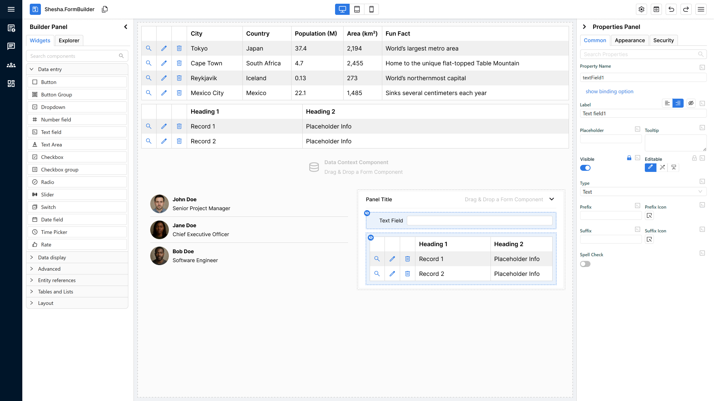
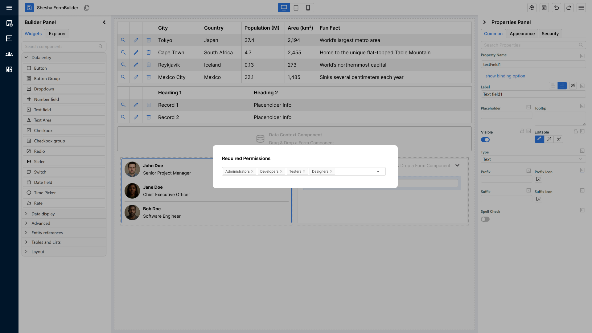
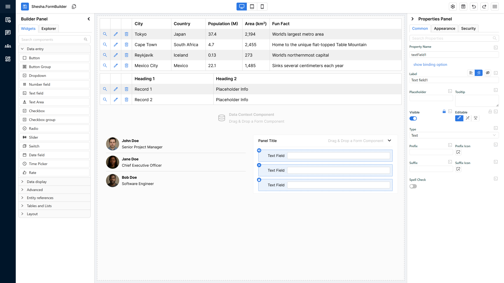
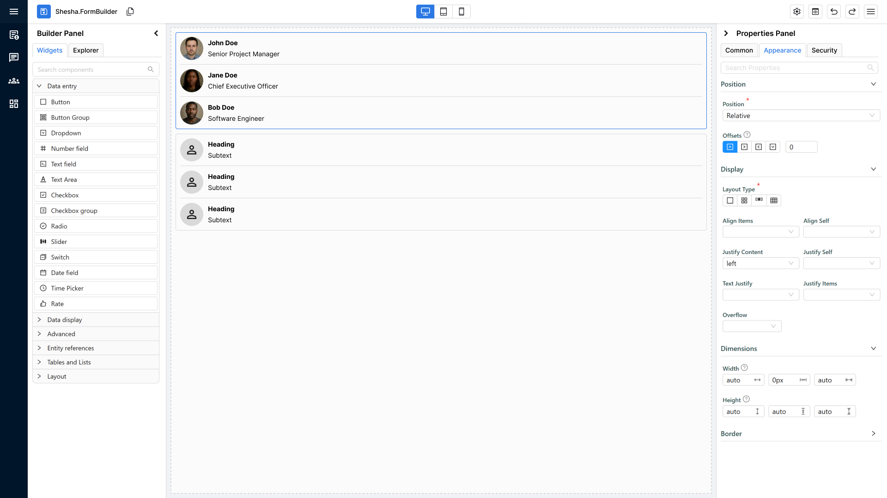
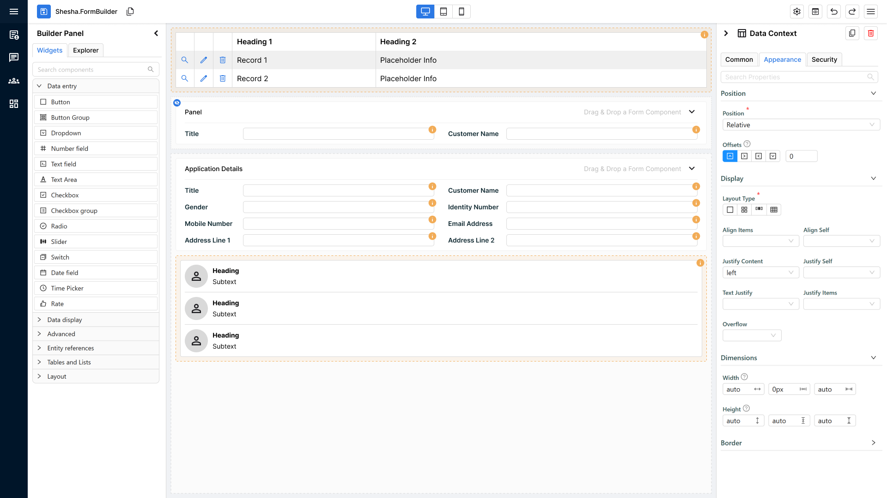
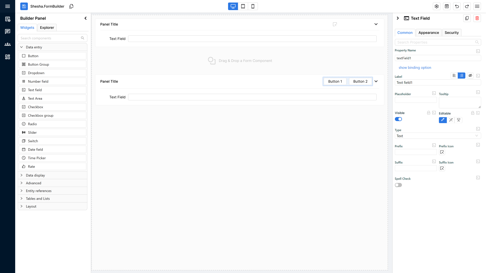
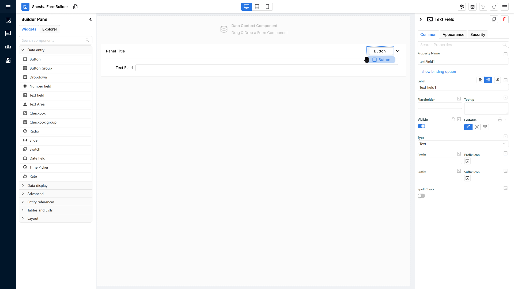
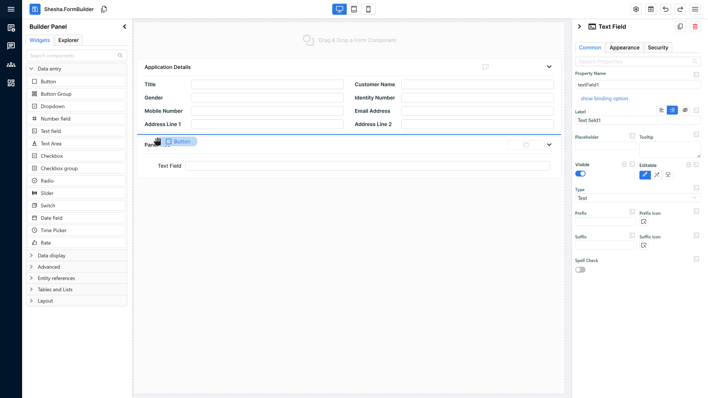

# Component Standards & Developer Checklist

This document defines the visual, behavioural, and structural standards for Form Builder components, along with a developer pre-QA checklist to ensure consistency, usability, and clarity before release.

## Summarised Checklist

Each item below corresponds to the detailed section of the same number. The order follows the sequence a developer works through when building or refactoring a component: lay out the properties panel, establish where values are inherited from, get the component rendering, wire up runtime behaviour, and finally handle the canvas behaviour that applies to containers.

### **1. General Component Properties Ordering**

-  Components use the standard three tabs: **Main**, **Events**, **Appearance**. Do not add further tabs.
-  **Main** contains only **essential properties** needed to make the component usable on first drop.
-  Properties appear in this order: **Identity → Visibility/State → Core Behaviour → Primary Visuals**.
-  **Visibility/State** items (Visible, then Interaction Mode, each with its JS toggle and permission padlock) are always placed **before** behaviour and styling, and are added via `stdVisibleEditableInputs`.
-  Core behaviour properties (e.g., binding / action / key config) are placed **before** non-essential styling options.
-  Non-essential or advanced properties are **not** placed in Main (they go to Appearance or a collapsible panel).

---

### **2. Interaction Mode on Components**

-  The component uses the single **Interaction Mode** property. There is **no separate `Enabled` property**.
-  Values are `editable` / `readOnly` / `disabled` / `inherited`, stored on `model.editMode`.
-  Data components declare `interactionType: 'full'` (four options). Buttons and actions declare `'disabling'` (three options — the first is labelled **Enabled**, not Editable, and `readOnly` is not offered).
-  The component implements **both `model.readOnly` and `model.disabled`**; the two booleans are derived from the single setting, never configured independently.
-  `editable` allows data changes and non-mutating interaction; `readOnly` allows non-mutating interaction only; `disabled` allows neither.
-  Disabled and read-only styling is consistent across all component types.
-  `inherited` correctly resolves from the parent container, and ultimately from the form mode.

---

### **3. Permissions Rework (Visibility & Interaction Mode)**

-  Permissions moved from Security tab → **padlock buttons** on the Visible & Interaction Mode properties.
-  Permissions are stored per property: **`visiblePermissions`** and **`editModePermissions`**. The legacy flat `permissions` array is migrated via `migratePermissionsToVisiblePermissions`.
-  Clicking padlock opens the permissions dialog.
-  Padlock icon turns **primary colour** when permissions are applied.
-  Permissions act as a **restriction layer only** (can restrict, never promote).
-  Permissions are evaluated **after Explicit / Inherited / JS values resolve**.
-  Visibility icons appear correctly on the component:
    -  Eye = manually hidden
    -  Padlock = hidden by permissions
    -  FX = hidden by custom logic
-  Users can re-open the dialog to edit/remove permissions.

---

### **4. Entity Configuration Inheritance (Formatting Defaults)**

- Components bound to entity properties must **inherit formatting defaults** from the **Entity Configuration layer** by default.
- Inheritance must be visible in the **Properties Panel** and use the same inheritance model as **Theme → Component** values.
- The panel must clearly distinguish **Theme inherited**, **Entity inherited**, and **Custom / overridden** values, and allow users to **override** or **resume inheritance** without accidentally changing the current value.
- The inheritance popup replaces the old tooltip, appears consistently across supported property types, and shows the source, actions, and any relevant update information.
- If an inherited value is intentionally empty, the **entire input** must still show the inherited/custom state so the user can see that the value is not plain default text.
- If the upstream inherited value changes after a form was configured, the component must inherit the new value automatically and show an **information/update indicator** to notify the user.

---

### **5. Theme-Level Component Specific Settings**

- Components must support **theme-level component specific settings**.
- Theme defaults must apply consistently across **Form Builder** and **Runtime**.
- Components must not rely on hardcoded values when theme-level configuration exists.

---

### **6. WYSIWYG Rendering & Fallbacks**

-  Component renders in **true WYSIWYG form** by default.
-  When data/config is missing, component renders a **clean fallback** that still looks like the real component.
-  No visible error blocks, warnings, or layout distortions.
-  Placeholder/dummy values appear clean and intentional.
-  Builder view visually matches final rendered form.

---

### **7. Misconfiguration Indicators**

-  Misconfigured components show an **orange “i” icon** (`#faad14`) in the top-right with a helpful tooltip.
-  Errors are raised through **`SheshaError`** helpers and surfaced by `ErrorIconPopover` — never by ad-hoc rendering.
-  Design-time configuration checks are declared on the component via **`validateModel`**.
-  Containers/Data Context show **orange background + orange dotted border** (no icon).
-  Indicators only appear when configuration is missing or invalid.
-  No intrusive warnings or layout-shifting UI.
-  Tooltips need to all be clear and understandable, and link to the component's documentation page.
-  Misconfigured properties must show red on their border in the Properties Panel, just like a validation check.

---

### **8. Component API**

- The component registers its API via `useComponentApi()` + `updateApi(...)` and removes it on unmount.
- Its API shape is declared in `componentsApi/componentApi.ts`, extending `CommonComponentApi` or `InputComponentApi<T>`.
- Standard members are inherited, not re-implemented: `componentName`, `context`, `propertyName`, `visible`, `interactionMode`, `style` (+ `value`, `required`, `focus`, `isValid`, `getErrors`, `reset` for inputs).
- Component-specific members are registered at **`level: 3`** with matched getter/setter pairs.
- `focus()` is wired in the component (it needs a live DOM ref), not in the common layer.
- Every member has a **JSDoc comment**, since the file is served verbatim as IntelliSense to the JS editors.
- Members that must not be mutated at runtime are declared `readonly`.
- API writes may **restrict but never promote** — they cannot make a hidden component visible, cannot bypass permissions, and cannot weaken an Entity-enforced constraint.

---

### **9. Configurable Events**

- Every event the component exposes is configurable **as an action**, not only as a script.
- Each event has an action configurator on the Events tab, directly above its code editor.
- Action properties follow the `on{Event}Action` naming and are typed `IConfigurableActionConfiguration`.
- `allowedActions` restricts the list wherever only a subset of actions is valid.
- Both the action and the script fire, action first.
- The arguments context carries the event payload, matching what the script path exposes.

---

### **10. Runtime Error Diagnostics**

-  Every exception is logged with enough context to diagnose it without reproducing it: **form name, component name, and the event or action that was running**.
-  The three runtime error classes are each covered: exceptions from **component code**, from an **event script**, and from **a chain of configured actions**.
-  **`eventName` is passed to `handleEvent`** at every call site, including the component's own inline `onChange`.
-  The **original error object is logged**, preserving the stack trace.
-  **No exception is silently swallowed**, and **no local error boundary** is added over the framework's.
-  **Runtime errors never break the UI** — components always fall back to a stable, visible state.
-  Misconfiguration is raised through **`SheshaError`** and surfaced per item 3, not through runtime logging.

---

### **11. Updated Container Look & Feel**

-  Standalone containers show **icon + text** until they are small enough to show only Icon.
-  Nested containers show **icon only**.
-  On drag-over (any container):
    -  Primary-coloured **dotted border** appears
    -  **10% primary background fill** appears
    -  Icon/text hide while dragging over
-  If container contains components, the **drop indicator** appears correctly while keeping the above styling.

---

### **12. Updated Drop Indicators**

-  Dragged component shows primary-coloured rounded rectangle with its name.
-  A clear **drop indicator line** appears where the new component will land.
-  Horizontal line appears for vertically stacked layouts.
-  Vertical line appears for horizontally stacked layouts.
-  Indicator updates dynamically as the component moves.
-  Indicator disappears immediately after drop.
-  Component lands exactly where the indicator showed.

## 1. General Component Properties Ordering

### **Tab Structure**

Components use exactly three tabs, in this order:

| Tab | Contains |
|---|---|
| **Main** | Identity, visibility & state, core behaviour, primary visual identity, validations |
| **Events** | Event handler scripts, added via `stdEventHandlers` |
| **Appearance** | Font, dimensions, border, background, shadow, margin & padding, custom styles — added via `stdAppearancePanels` |

We are purposefully keeping tabs to a minimum, so please ensure the properties you are adding fit an existing tab. **Please do not** create a new tab for one property.

> The first tab is named **Main**, because it is the tab every component inherits from the master component. Some settings forms currently declare it as `key: 'common', title: 'Common'`; that is incorrect and should be corrected to `main` / `Main` when the component is refactored.

The **Main** tab contains the essential properties required to make a component usable immediately after being added to the form.  
Only include properties here that impact:  
- Component identity  
- Visibility & interactive state  
- Core behaviour  
- Primary visual identity

Everything else belongs in Appearance or in a collapsible panel. The Properties also follow a 'Progressive Disclosure' pattern, so only show things which are needed right now. If the user enables a toggle and there's additional options, only show them when the toggle is enabled. Don't overwhelm the user with options if they are not mandatory to a property. Use `visibleJs` on an input row to disclose progressively, and `stdCollapsiblePanel` to group a related set such as Format or Validations.

### Main Tab General Guideline
#### **1. Identity**
Properties that tell the user what the component is.

1. **Component Name**
2. **Property Name / Context / Binding**

> These always appear first.  
> If the user can’t identify the component at a glance, it’s unusable.
#### **2. Visibility & State**
Properties that determine whether the component appears and can be interacted with.

3. **Visible** — a switch, defaulting to on
4. **Interaction Mode** — `editable` / `readOnly` / `disabled` / `inherited` (see Section 2)

Both are added together by `stdVisibleEditableInputs`, which places them on one row in this order and attaches the JS toggle and permission padlock to each. Do not add them individually.

> These must be placed before behaviour or styling so users can establish basic access rules immediately.
>
> There is no separate **Enabled** property. Interaction Mode covers both concerns.

#### **3. Core Behaviour**
Properties required for the component to perform its primary purpose.

Examples:
- **Field / Data**
- **On Click** (for buttons)
- **Main Data Source or Key** (for display components)

> These define what the component “does”  if not set, the component is incomplete.

#### **4. Primary Visual Identity**
Only include high-level visuals that affect clarity or recognisability.

Examples:
- **Icon**
- **Style / Variant**
- **Tooltip**
- **Basic Dimensions** (width/size only if essential)

> Do _not_ include detailed styling here, just enough to make the component feel correct in the form.

When deciding if a property belongs in _Main_, ask:

> **Is this property essential for the component to be understandable, visible, usable, or recognisable on first drop?**

If **YES**, put it in Main in the order above.  
If **NO**, move it to Appearance or into a collapsible panel.

Always remember to reference other components to get a general feel of their layouts if you need additional guidance. `numberField/settingsForm.ts` is the reference implementation.

### **Developer Pre-QA Summary**

Before handing off to QA, developers must confirm:
1. **The component uses only the three standard tabs** — Main, Events, Appearance — with those keys and titles.
2. **Main follows the order** Identity → Visibility & State → Core Behaviour → Primary Visual Identity.
3. **Visible and Interaction Mode are added via `stdVisibleEditableInputs`**, not hand-built.
4. **No non-essential property has been added to Main** that belongs in Appearance or a collapsible panel.
5. **Progressive disclosure is applied** — dependent options only appear once their parent toggle is set.
6. **Appearance panels are added via `stdAppearancePanels`** with `removeStyleRouter` passed through.

## 2. Interaction Mode on Components


> **Supersedes the previous "Disabled States / Enabled Property" section.** There is no separate `Enabled` property. A component's interaction state is a single setting, described below.

### **Purpose of the Feature**

Improve visual and behavioural clarity between components that are **editable**, **read-only**, and **disabled**, using one setting rather than two interacting ones.

Two separate settings produced combinations that carry no meaning — a read-only component cannot be interactive, so toggling Enabled on it says nothing. A single setting removes the invalid states and gives the configurator a simpler mental model: a component is either editable, read-only, disabled, or it inherits its mode from its parent.

### **The Interaction Mode Property**

A single property, stored on `model.editMode`, replacing the old Edit Mode setting. Add it to the Main tab with the shared helper, which also places `Visible` immediately before it and attaches the JS toggle and permission padlock to both:

```ts
.stdVisibleEditableInputs('full')      // data components
.stdVisibleEditableInputs('disabling') // buttons, actions, button group items
```

Allowed values (`EditMode` in `providers/form/models.ts`):

| Value | Data changes allowed? | Non-mutating interaction allowed? |
|---|---|---|
| `editable` | Yes | Yes |
| `readOnly` | No | Yes |
| `disabled` | No | No |
| `inherited` | Resolved from the parent container, and ultimately the form mode | — |

The type union also still accepts `boolean` for values saved by older forms: `false` is read as disabled, and `true`/undefined as inherited by the selector. **Do not write boolean values in new code** — they exist only so existing forms keep working until migrated.

Non-mutating interactions include copying text, opening record details, sorting or filtering a grid, previewing and downloading attachments, expanding a section, viewing comments, and drilling into read-only charts. **This is the practical test that separates `readOnly` from `disabled`** — it is a behavioural distinction, not a shade of grey.

### **Interaction Type: which options the component offers**

`InteractionType` controls how many options the selector shows, and what the first one is called. The stored value is always `editable` — only the label changes.

| `interactionType` | Options shown | First option labelled | Use for |
|---|---|---|---|
| `'full'` | editable, disabled, readOnly, inherited | **Editable** | Data-entry fields, containers, layout components |
| `'disabling'` | editable, disabled, inherited | **Enabled** | Buttons, actions, button group items |

Buttons are never "editable" in a data sense — the only question is whether the user can trigger them — so `readOnly` is not offered.

Components that display nothing interactive (labels, static text, icons, dividers, static HTML) do not need Interaction Mode at all.

### **Deriving `readOnly` and `disabled`**

The single configured value is split into two booleans **in code, not in configuration**. Components must implement both `model.readOnly` and `model.disabled`.

| Interaction Mode | `model.readOnly` | `model.disabled` |
|---|---|---|
| `editable` | false | false |
| `readOnly` | true | false |
| `disabled` | false | true |
| `inherited` | resolved from parent | resolved from parent |

Use `getDisabledAndReadOnly(mode)` from `formComponentApi.ts` rather than deriving these by hand — it is the single source for this mapping, and deriving the flags independently is how components drift apart.

### **Inheritance**

```
effectiveInteractionMode =
  ownInteractionMode === 'inherited'
    ? parentEffectiveInteractionMode
    : ownInteractionMode;
```

There is **always** a top-level parent — the form mode — so `inherited` never falls through to a component default. The form mode carries the same three states (`editable` / `disabled` / `readOnly`).

Because a button in `disabling` mode has no `readOnly` option, a button set to `inherited` under a `readOnly` parent resolves to enabled: the parent forbids *editing*, not *triggering*. Only a `disabled` parent disables the button.

| Parent mode | Button set to `inherited` |
|---|---|
| `editable` | enabled |
| `readOnly` | enabled |
| `disabled` | disabled |

### **Use Cases This Covers**

1. **Detail form with an "Enable editing" button.** The form opens `disabled`. Editable fields are `inherited`, so they show as disabled and the user can see they *could* become editable. Purely informational fields are `readOnly`, so they stay informational when the form mode changes. Pressing the button switches the form to `editable`.
2. **The same form, view-only.** The button is hidden and the form opens `readOnly`. `readOnly` components stay as they are; `inherited` components become `readOnly`. Every component reads as uniformly non-editable.
3. **A whole form pinned read-only** regardless of the mode it is invoked in — set every component to `readOnly`.
4. **Conditional additional-info panel.** A Panel is `disabled` with `inherited` children plus a checkbox. Ticking the checkbox switches the panel to `editable` and its children become editable with it.
5. **Toggling individual fields on and off** — the same mechanism as case 4 at field level.

### **Component Support Requirements**

All Ant Design components used in Shesha must support both the disabled and read-only presentations. Read-only and disabled styling must be consistent across component types.

> `enableStyleOnReadonly` is a legacy property carried by older settings forms. It is **not** part of the standard Appearance panels produced by `stdAppearancePanels`. Migrators preserve it where it already exists; do not add it to a component you are refactoring.

### **Developer Pre-QA Summary**

Before handing off to QA, developers must confirm:
1. **Interaction Mode is present on the Main tab, directly after Visible**, added via `stdVisibleEditableInputs`.
2. **The correct `interactionType` is declared** — `'disabling'` for buttons and actions, `'full'` for everything else.
3. **All offered modes render correctly**: editable, read-only, disabled, and inherited.
4. **The component implements both `model.readOnly` and `model.disabled`**, derived from the single setting.
5. **`readOnly` still permits non-mutating interaction** (selecting and copying text, expanding, previewing) while `disabled` permits none.
6. **`inherited` resolves from the parent container and ultimately the form mode**, with no fallback to a component default.
7. **Permissions are attached to the property** (`editModePermissions`) and cannot promote a restricted mode.
8. **Legacy boolean values migrate correctly** via `migrateReadOnly` / `migrateVisibility`, and old forms continue to render.

## 3. Permissions Rework (Visibility & Interaction Mode Controls)


### **Core Requirement**

Permissions settings are no longer stored under a separate **Security** tab.  
Instead, permissions are now integrated directly into the **Visible** and **Interaction Mode** properties on the Main tab in the properties panel.

Each of these properties now includes a **padlock button** that opens a permissions dialog.

Permissions are stored per property on the component model:

| Property | Permission field |
|---|---|
| Visible | `visiblePermissions` |
| Interaction Mode | `editModePermissions` |

The legacy flat `permissions` array is still read for backward compatibility, and components are migrated to `visiblePermissions` with `migratePermissionsToVisiblePermissions`. Both are declared on the settings form by passing `permissionSettings: true` on the input — which `stdVisibleEditableInputs` already does for you.




### **Padlock Button & Permission Dialog**

#### Behaviour
- The **padlock icon** appears next to both the **Visible** and **Interaction Mode** settings.
- Clicking it opens a **permissions dialog** where the user can configure:
    - Who can see the component
    - Who can edit the component

#### Visual State Indicator
- If **any permissions are applied**, the padlock icon switches to a **primary-coloured state** to visually confirm that custom permissions exist.

---

### **Permission Resolution Logic (Authoritative Behaviour)**

Permissions act strictly as a **restriction layer**.

They:
- Can restrict (downgrade)
- Cannot promote (upgrade)
- Cannot override explicit structural modes

Structural configuration (**Explicit / Inherited / JS**) always resolves first.  
Permissions are evaluated last as the final gate.

---

### **Interaction Mode – Final Resolution Rules**

#### Step 1 – Resolve Base Mode

The Interaction Mode must first resolve to a base mode:

- Explicit `editable`
- Explicit `readOnly`
- Explicit `disabled`
- `inherited` (resolved from parent container, and ultimately from the form mode)
- JS-calculated result

This produces a resolved base mode.

---

#### Step 2 – Apply Permissions (Only If Editable)

If the resolved base mode is:

**`readOnly` or `disabled`**
- Final result is unchanged
- Permissions do not apply
- Structural mode takes precedence
- The padlock icon is greyed out and disabled

**`editable`**
- Permissions are evaluated:
  - If allowed → Final = `editable`
  - If forbidden → the component is restricted

Where `editModePermissions` are not granted, the component is restricted in both dimensions — `readOnly` and `disabled` are both set — so the user can neither edit nor interact with it.

Permissions can downgrade `editable`.  
They can never upgrade `readOnly` or `disabled` to `editable`.

---

#### JS Enforcement Rule

If JS determines:

```
return true; // Editable
```

Permissions must still be evaluated afterwards.

Final resolution order:

1. Resolve explicit / inherited / JS mode
2. Apply permission restriction
3. Produce final state

JS cannot bypass permissions.

---

### **Visible – Final Resolution Rules**

The same principle applies to visibility.

#### Step 1 – Resolve Base Visibility

Base visibility resolves first:

- Explicit `Visible`
- Inherited result
- JS-calculated visibility

---

#### Step 2 – Apply Permissions (Only If Visible = true)

If resolved base visibility is:

**`false`**
- Component remains hidden
- Permissions do not apply
- Structural visibility takes precedence

**`true`**
- Permissions are evaluated:
  - If allowed → Component visible
  - If forbidden → Component hidden

Permissions can hide a component.  
They cannot force a hidden component to become visible.

---

### **Where the API Sits in This Chain**

The Component API is subject to the same restriction principle. A script may make a component more restricted, never less:

- `visible = false` is honoured. `visible = true` **cannot** reveal a component that configuration, JS, or permissions have hidden.
- API writes cannot bypass `visiblePermissions` or `editModePermissions`.
- API writes cannot weaken an Entity-enforced constraint (see Section 4).

See Section 8 for the full API contract.

---

### **Resolution Priority Order**

For both Interaction Mode and Visible, the evaluation order is:

1. Explicit configuration
2. Inherited configuration
3. JS-calculated result
4. Permission restriction (final gate)

Permissions are always evaluated last.


### **Visibility Status Icon (Blue Circle Icon on the Component)**

When a component has **any visibility-related settings applied**, a **blue circular icon** appears on the component in the builder matching the style of the informational icon from Feature 2.

#### Icon States
1. **Eye Icon**
    - Appears when the component is **explicitly set to not visible**.

2. **Padlock Icon**
    - Appears when the component is **not visible due to permission-based rules**  
        (e.g., hidden for certain roles or groups).

3. **FX Icon**
    - Appears when the component’s visibility is controlled by **custom logic or JS expressions**. If both permissions and FX are active, then the FX icon takes precedence.



#### Purpose
- To give the user a quick, visual, non-disruptive indicator of _why_ a component may be hidden or conditionally shown.

### **Editing or Removing Permissions**

Users can update or remove permissions by:
- Clicking the **padlock** icon next to Visible or Interaction Mode again.
- Reopening the dialog to modify or clear the existing permission rules.

Changes update the component immediately, and icon states refresh accordingly.

### **Developer Pre-QA Summary**

Before sending to QA, developers must confirm:
1. **Security tab is fully removed; permissions live under Visible and Interaction Mode**, stored as `visiblePermissions` and `editModePermissions`.
2. **Padlock button opens permissions dialog for both properties.**
3. **Padlock icon turns primary colour when any permission rule is applied.**
4. **Visibility status icon appears on the component when visibility rules exist:**
    - Eye = manually hidden
    - Padlock = hidden due to permissions
    - FX = hidden due to custom logic/JS
5. **Users can re-open the dialog via padlock to edit or clear permissions.**

## 4. Entity Configuration Inheritance (Formatting Defaults)


### **Purpose of the Feature**

To encourage consistency and follow the **DRY principle**, formatting-related configuration can be defined centrally at the **Entity Configuration layer**.  
Any form component binding to those entity properties should therefore **inherit those formatting settings by default**.

This ensures formatting for things like numbers and dates stays consistent across all forms without requiring manual reconfiguration in every component. It also ensures the **Properties Panel** makes inherited values easy to identify, understand, and override safely.

### **Core Requirement**

When a component binds to an entity property that contains formatting configuration, it must automatically inherit those values by default.

This includes (but is not limited to):
- Date format
- Prefix
- Suffix
- Thousand separator
- Number format
- Number of decimal places

The same inheritance UX model must be used consistently for:
- **Entity → Component** formatting inheritance
- **Theme → Component** inherited values shown in the same Properties Panel

### **Expected Behaviour**
- Inheritance must be the default behaviour for bound fields.
- Component-level overrides are supported where explicitly configured.
- Inherited formatting must apply consistently in both:
  - **Form Builder**
  - **Runtime**
- The Properties Panel must clearly show whether a value is:
  - **Theme inherited**
  - **Entity inherited**
  - **Custom / overridden**
- Users must be able to **Override Inheritance** without accidentally changing the current value.
- Users must be able to explicitly **Resume Inheritance** after a local override was applied.
- A local value that happens to match the inherited value must still remain a **custom/overridden value** until the user explicitly resumes inheritance.

### **Properties Panel Visual Rules**
- Inherited/custom state is shown using the approved state colours in the Properties Panel:
  - **Theme inherited**
  - **Entity inherited**
  - **Custom / overridden**
- The standard treatment is to highlight the **label text** and/or **value text** using the state colour with the small coloured block behind it, as shown in the approved mockups.
- If the value is intentionally **empty**, but that empty state is still inherited or custom, the **entire input field** must be highlighted so the inheritance state remains visible.
- The same visual language must be used consistently across supported property types so users do not need to learn different inheritance cues for different controls.

### **Inheritance Popup Rules**
- The old tooltip should be replaced with a richer **inheritance popup**.
- The popup must appear on the **same trigger/event** for supported property types.
- The popup must include:
  - Existing tooltip/help content
  - The inheritance source
  - The correct inheritance action
- The popup must support:
  - **Override Inheritance**
  - **Resume Inheritance**

### **Upstream Change Notification**
If an inherited source value changes **after** a form/component has already been configured:
- The component must automatically inherit the updated value if it is still in inherited mode.
- An **information/update indicator** must appear to notify the user that the inherited source changed after the form/component was configured.
- Hovering the indicator should explain what changed and that the value was updated through inheritance.

### **Inheritance Types**

Not every property inherits the same way. Each property must be classified into one of four types, and the classification determines both the UI affordance and what the Component API is permitted to do to it.

| Type | Meaning | Examples |
|---|---|---|
| **Entity-enforced** | The entity is authoritative. The component may only become *more* restrictive, never less. | Interaction Mode, Required |
| **Entity-enforced with narrowing allowed** | Inherited, but the component may tighten the bound. | Min, Max |
| **Inherit-or-override** | The component may stay inherited or switch to an explicit value. | Thousands separator, Custom format, Validation message, Number format group |
| **Seed-from-entity-once** | Copied at creation/binding time, then component-owned. | Default Editor |
| **Component-only** | Purely form/UI behaviour, no entity inheritance. | Label, Placeholder, Tooltip, Prefix/Suffix, Events, Appearance |

Governing rules:

- **Constraint rule.** Entity-crucial settings may only be narrowed by the component, never widened.
- **Tri-state rule.** Non-critical booleans that can inherit must offer Yes / No / Default rather than a plain switch.
- **Propagation rule.** Only properties still in Default/Inherit auto-update when the entity changes. Explicit overrides are left untouched.
- **Seed-once rule.** Creation-time defaults are copied once and then owned by the component.

Some inheritance decisions are **group-level** — Number format, Num decimal places and Show as percentage inherit together as a set, not independently.

### **Inheritance and the Component API**

Runtime writes through the Component API are bound by the same rules:

- A write to an **Entity-enforced** property may only narrow the constraint. A component exposing `min` or `max` through its API must validate that the incoming value tightens rather than widens the entity's bound, and reject the write otherwise.
- A write is a **transient runtime value**, not an explicit override. It must not permanently detach the property from inheritance — a subsequent entity change still propagates to a property that was never explicitly overridden in the designer.

### **Developer Pre-QA Summary**

Before handing off to QA, developers must confirm:
1. Components bound to entity properties inherit formatting defaults from the **Entity Configuration layer** by default.
2. Inherited formatting is applied consistently in **Builder** and **Runtime**.
3. The Properties Panel clearly distinguishes **Theme inherited**, **Entity inherited**, and **Custom / overridden** values.
4. Users can **override inheritance** without unintentionally changing the current value.
5. Users can explicitly **resume inheritance** after a local override.
6. Empty inherited/custom values still visibly show their state by highlighting the **entire input field**.
7. The inheritance popup replaces the old tooltip and appears consistently across supported property types.
8. If an inherited source changes after a form/component was configured, an **information/update indicator** appears and explains the update.

## 5. Theme-Level Component Specific Settings


### **Purpose of the Feature**

To encourage consistency and reduce repeated configuration, components must support **theme-level component specific settings**.  
These settings allow the platform to define default styling/behaviour centrally, ensuring a consistent experience across all forms.

### **Core Requirement**

Components must:
- Respect theme-level defaults by default
- Render consistently in both:
  - **Form Builder**
  - **Runtime**
- Avoid hardcoded behaviour where theme config is available

Theme settings for a component live under **Settings → DefaultUI → Theme settings → Components**, grouped by component category.

### **How This Is Implemented**

- **Do not compute a final CSS object and assign it to the component's `Style` property.** Take the model as-is and generate Ant Design CSS-in-JS classes from the Appearance properties using `createStyles`, with the shared helpers `borderStyles`, `backgroundStyles`, `shadowStyles`, `paddingStyles`, `dimensionsStyles` and `fontStyles`. The old `useFormComponentStyles` calculation is removed. This is what allows styles to cascade — only values actually set in the model emit CSS, and everything else stays resolvable at a higher level.
- Still assign `Style` when `model.styleJson` (Custom style) is set, since that is expected to contain a valid `CSSProperties` object.
- **Provide `getDefaultStyles`** on the component definition so it renders correctly with no settings at all.
- **Provide `previewConfiguration`** so the component can be previewed in the theme configurator across style combinations.
- Pass `removeStyleRouter` through the settings form and into `stdAppearancePanels` so inheritance displays correctly.

### **Developer Pre-QA Summary**

Before handing off to QA, developers must confirm:
1. Theme-level component specific settings apply correctly to the component.
2. Theme settings affect the component consistently in **Builder** and **Runtime**.
3. Component behaviour does not rely on hardcoded values where theme configuration exists.
4. **`getDefaultStyles` is implemented** and the component renders correctly with no configuration.
5. **`previewConfiguration` is implemented** and the component previews correctly in Theme settings.
6. **Styles are generated as classes via `createStyles`**, not computed and assigned to `Style`.

## 6. WYSIWYG Components


### **Core Requirement**

All components must render in a **true WYSIWYG state** immediately when added to the form builder.  
No bold error blocks, warnings, or placeholder visuals that break the expected final layout.

### **Fallback Default Rendering**

If a component is missing required data or configuration, it must still render a **clean, visually accurate placeholder version** of itself.



### Fallback Rules:

- Must look like the component’s real rendered structure and size.
- Should show placeholder text or dummy values instead of error states.
- Should not distort layout, spacing, or visual style

**Example**:  
**Data Table**
- If real data isn’t present:
    - Render columns such as _Column 1, Column 2_.
    - Render 1–3 dummy rows like _Record 1, Record 2_.
    - If nothing is available, still render a table layout frame.

### **Developer Pre-QA Summary**

Before sending to QA, developers must confirm:
1. **Component renders in true WYSIWYG form by default.**
2. **Placeholder/fallback version looks like the final component when data is missing.**
3. **No visible errors or warning blocks appear in the builder that distort the layout.**
4. **Structure, spacing, and appearance match the final rendered form.**
5. **Dummy/placeholder values look clean and intentional (not broken or empty).**

## 7. Misconfiguration Informational Icons & Visual Indicators


### **Core Requirement**

When a component is added to the form builder and is **missing required configuration**, it must still render (using fallback mode if needed) **and visually indicate** that something is misconfigured without breaking the WYSIWYG view.



### **Informational Icon (for standard components)**

For all _normal components_ (anything that is not a container or Data Context):
#### Display Rule
- A small **orange circle with an “i” icon** appears on the **top-right corner** of the component.
- It must always be visible when the component is misconfigured.
#### Tooltip Rule
- Hovering over the icon reveals a **tooltip** explaining:
    - What configuration is missing
    - What the user needs to fix
- Tooltip should NOT alter component layout or cause UI shifting.

### **Special Exceptions: Containers & Data Context**

Containers and Data Context components behave differently because misconfigurations may apply to _nested_ components.

#### Instead of an icon, they receive:
- **Orange background tint** (light, non-intrusive)
- **Orange dotted border** around the entire container

#### Purpose:
- To visually indicate the entire structural component has a configuration issue.
- To avoid cluttering dozens of icons inside nested layouts.

### **How This Is Implemented**

Do not hand-roll misconfiguration UI. The framework provides the whole surface:

- **Declare design-time checks** on the component definition:

  ```ts
  validateModel: (model, addModelError) => {
    if (isNullOrWhiteSpace(model.propertyName))
      addModelError('propertyName', 'Property Name is required');
  }
  ```

- **Raise errors from component code** with the `SheshaError` helpers, never with bare `throw` or `console.error`:
  - `SheshaError.throwPropertyError(propertyName, message?)` — a specific property is misconfigured. Defaults to *"Please make sure the `{propertyName}` property is configured properly."* and is raised as a `warning`.
  - `SheshaError.throwModelErrors(errors)` — several properties at once (`warning`).
  - `SheshaError.throwError(message)` — a genuine failure rather than a misconfiguration (`error`).
- **Rendering is handled by `ErrorIconPopover`**, which draws the orange filled info icon (`#faad14`, 16px, top-right by default) and resolves a documentation link for the component type from `components/componentErrors/component-docs.json`. If a new component is added, add its documentation URL to that file — otherwise the tooltip loses its "See component documentation" link.
- Severity comes from `ISheshaErrorTypes`: `'info' | 'warning' | 'error'`.

### **Developer Pre-QA Summary**

Before sending to QA, developers must confirm:
1. **Components with misconfiguration display an orange “i” icon on the top-right.**
2. **Tooltip on hover clearly explains the configuration issue.**
3. Properties Panel should **highlight the property in red** like a validation when there's a misconfiguration related to it
4. **No warnings, no red blocks, no layout distortion.**
5. **Containers & Data Context use orange fill + orange dotted border instead of icons.**
6. **Indicators only appear when configuration is missing or invalid — never when valid.**
7. **All misconfiguration is raised through `SheshaError` helpers** — no bare `throw`, no `console.error`, no bespoke error rendering.
8. **The component type has an entry in `component-docs.json`** so the tooltip can link to its documentation.
9. **The two icon mechanisms are not confused:**
    - `ValidationIcon` (red, driven by `settingsValidationErrors`) reports **settings validation** and is rendered only by `designerFormComponent` — it must never appear in edit or view mode.
    - `ErrorIconPopover` (orange “i”) reports **misconfiguration and runtime errors** and does appear outside the designer where a component cannot render correctly.

## 8. Component API


### **Purpose of the Feature**

Every component exposes a small, predictable API so that scripts elsewhere on the form — event handlers, configured actions, JS settings — can read and change it at runtime without reaching into internals.

The API is deliberately narrow. Shesha's primary mechanism for controlling a form remains **state management** through the model, data and contexts: a JS setting that reads `contexts.formContext.someFlag` recalculates whenever that flag changes, which is more predictable than one-off imperative writes. The Component API exists for the cases where addressing a specific component directly is genuinely clearer, not as a replacement for state-driven configuration.

### **Core Requirement**

A refactored component must:

- Register its API on mount and remove it on unmount
- Declare its API shape in `componentsApi/componentApi.ts`, with JSDoc on every member
- Inherit the standard members rather than reimplementing them
- Expose only what has a real use case, and mark everything else `readonly`

---

### **Accessing Components from a Script**

Components are addressed by **component name**, camel-cased:

```ts
components.textField1.value = String(components.decimal.value);
components.decimal.style.background = { color: 'red' };
message.info(`Checkbox1.value: ${components.checkbox1.value}`);
```

The surface is **property assignment**, not setter methods. Methods exist only for actions — `focus()`, `click()`, `reset()`, `expand()`, `collapse()`.

The root is `components`, separate from `form`, which is the Form API.

---

### **The Standard API**

Every registered component receives these, from `BaseComponentApi` and `CommonComponentApi`:

| Member | Type | Notes |
|---|---|---|
| `componentName` | `readonly string` | Identifier only, never mutable at runtime |
| `context` | `readonly string \| undefined` | The context the component is bound to; `undefined` for form data |
| `propertyName` | `readonly string` | The property the component is bound to |
| `visible` | `boolean` | Writable, but restriction-only — see below |
| `interactionMode` | `InteractionMode \| undefined` | `'editable' \| 'readOnly' \| 'disabled' \| 'inherited'` |
| `style` | `readonly IComponentStyle` | The object is read-only; its members are writable |

Input components additionally receive `InputComponentApi<T>`:

| Member | Type | Notes |
|---|---|---|
| `value` | `T` | Readable and writable |
| `required` | `boolean` | Form-data binding only |
| `focus()` | `void` | |
| `isValid()` | `Promise<boolean>` | Form-data binding only |
| `getErrors()` | `Promise<string[]>` | Form-data binding only |
| `reset()` | `void` | Resets to default value; form-data binding only |

`style` groups the visual sub-objects so the first level of the API stays uncluttered: `background`, `border`, `font`, `shadow`, `styleBox`.

#### Validation is bound to the form model

`isValid()`, `getErrors()`, `reset()` and `required` are implemented through `Antd.Form` (`validateFields`, `resetFields`), so they only work when the component is bound to **form/model data**. They do **not** work for components bound to a context.

Note the current failure mode: with no `propertyName`, `isValid()` resolves to `true` and `getErrors()` resolves to `[]`. A context-bound component therefore reports itself valid rather than reporting that validation is unavailable. Document this for configurators; do not rely on it in scripts.

The API does not provide `setErrors()` or `clearErrors()`. `Antd.Form` offers no equivalent, so supplying them would require a bespoke layer over it. Do not add them to a component's API.

---

### **Restriction, Never Promotion**

The API obeys the same principle as permissions (Section 3). A script may make a component more restricted; it may not loosen a restriction imposed by configuration, logic, or permissions.

- `visible = false` is honoured.
- `visible = true` **cannot** reveal a component hidden by its configuration, by a JS setting, or by permissions. The write is refused.
- API writes cannot bypass `visiblePermissions` or `editModePermissions`.
- API writes must not weaken an Entity-enforced constraint (Section 4).

Apply this consistently across every writable member, not only `visible`. A setter that accepts a promoting write on one property and refuses it on another is worse than either rule applied uniformly, because the configurator cannot predict which they are dealing with.

A write that is refused must be **logged with the context required by Section 10**. A configurator whose script appears to do nothing has no other way to find out why.

---

### **Registering a Component's API**

Registration happens in **layers**, each with a `level`. A member registered at an equal or higher level replaces one registered lower, so the layers stack predictably:

| Level | Registered by | Provides |
|---|---|---|
| 1 | `formComponentApi.ts` (common layer) | `componentName`, `context`, `propertyName`, `visible`, `interactionMode`, `style`, and for inputs `required`, `value`, `isValid`, `getErrors`, `reset` |
| 2 | `EventsAndApiValueProcessor` | Replaces `value` with a live getter/setter wired to the component's change handler |
| 3 | The component itself | Component-specific members and methods |

Levels 1 and 2 are handled for you. **Your component registers at level 3.**

```ts
const componentApi = useComponentApi();
const inputRef = useRef<InputNumberRef>(null);

useEffect(() => {
  componentApi?.updateApi<NumberFieldApi>({
    id: model.id,
    componentName: model.componentName ?? "",
    level: 3,
    typeDefinition: { typeName: 'NumberFieldApi', files: [{ content: apiCode, fileName: 'apis/componentApi.ts' }] },
    properties: [
      { name: 'min', getter: () => model.validate?.minValue, setter: (value) => apiContext?.updateApiModel({ validate: { minValue: value } }) },
      { name: 'max', getter: () => model.validate?.maxValue, setter: (value) => apiContext?.updateApiModel({ validate: { maxValue: value } }) },
    ],
    api: { focus: () => inputRef.current?.focus() },
  });
}, [apiContext, componentApi, model.componentName, model.id, model.validate?.minValue, model.validate?.maxValue]);

useEffectOnce(() => () => componentApi?.removeApi(model.id));
```

Points to observe:

- **`removeApi` on unmount is mandatory.** Without it the API list retains components that no longer exist.
- **`focus()` is registered here, not in the common layer**, because it needs a live ref to the DOM node.
- **`properties` are getter/setter pairs.** A getter without a setter yields a read-only member — which is how you expose a derived value safely.
- **Dependencies must list every model value the getters read**, or the API will serve stale values.

The API description assembles from `KnownFormComponent` (standard properties and methods) and `EventsAndApiValueProcessor` (value handling).

---

### **Declaring the API Type**

Add the component's API to `shesha-reactjs/src/componentsApi/componentApi.ts`. This file is served **verbatim** to the JS editors as a type definition, so it is simultaneously the type contract and the IntelliSense documentation a configurator reads.

```ts
export interface NumberFieldApi extends InputComponentApi<number | undefined> {
  /** Minimum value */
  min?: number;
  /** Maximum value */
  max?: number;
};
```

Rules:

- Extend `InputComponentApi<T>` for data-entry components, `CommonComponentApi` for everything else.
- **Every member needs a JSDoc comment.** It is the only documentation the configurator sees.
- Mark anything that must not be mutated at runtime `readonly` — the type is the enforcement.
- Add only members with a real use case. The type file is generated into every code editor, so an over-broad API costs both comprehension and performance.
- Where a component's API adds nothing beyond the base, a type alias is correct: `export type TextFieldApi = InputComponentApi<string | undefined>;`

---

### **Events**

The standard event set is defined once in `designer-components/_common/events.ts` and must be used at both call sites:

`onChange`, `onFocus`, `onBlur`, `onClick`, `onDoubleClick`, `onMouseEnter`, `onMouseMove`, `onMouseLeave`, `onKeyDown`, `onKeyUp`

- The settings form advertises the events: `stdEventHandlers([...ALL_INPUT_EVENTS], DataTypes.number)`
- The runtime binds them: `getComponentEvents(model, ALL_INPUT_EVENTS_WITHOUT_CHANGE, ctx, value, DataTypes.number)`
- **`onChange` is bound inline by each component**, not by `getComponentEvents`, because it also updates the component's value.
- Use the shared constants at both call sites. **A settings form that advertises an event the runtime never binds produces a handler the configurator can write and save but which silently never fires.**
- Components that deliberately omit double-click use the `..._WITHOUT_DOUBLE_CLICK` pair.

Note that `onHover` and `onKeyPress` are **not** available: HTML has no hover event (use `onMouseEnter`/`onMouseLeave`, with `onMouseMove` where continuous tracking is genuinely needed) and `onKeyPress` is deprecated (use `onKeyDown`/`onKeyUp`).

Each of these events must also be configurable as an action — see Section 9.

---

### **Component Names as API Identifiers**

Components are addressed by name, so names must behave like identifiers. They are camel-cased on registration.

Requirements:

- A component's name must survive camel-casing into a usable identifier. Names carrying characters that cannot appear in an identifier — such as those produced by some form templates — are a misconfiguration.
- **Names must be unique within a form.** Two components sharing a name cannot both be addressed, and camel-casing can itself collapse two visibly different names into the same identifier.
- An invalid or duplicated name must be surfaced as a misconfiguration under Section 7 — an icon on the component and a red highlight on the property in the Properties Panel. A browser console warning alone is not sufficient, because the configurator never sees it.

An unaddressable component has no API, so this is a precondition rather than a refinement.

---

### **Developer Pre-QA Summary**

Before handing off to QA, developers must confirm:

1. **The component registers its API** with `useComponentApi()` + `updateApi(...)` at `level: 3`, and **removes it on unmount** with `removeApi(model.id)`.
2. **The API type is declared** in `componentsApi/componentApi.ts`, extending `InputComponentApi<T>` or `CommonComponentApi`.
3. **Every API member has a JSDoc comment**, and immutable members are marked `readonly`.
4. **Standard members are inherited, not reimplemented** — `componentName`, `context`, `propertyName`, `visible`, `interactionMode`, `style`, and for inputs `value`, `required`, `focus`, `isValid`, `getErrors`, `reset`.
5. **`focus()` is wired in the component** where the component can receive focus.
6. **Getter/setter pairs are complete and dependency-correct** — no stale reads, and read-only members expose a getter only.
7. **Style mutation goes through `style`** and its grouped sub-objects, never through a flattened first-level property.
8. **IntelliSense resolves in the JS editors** — the component appears in autocomplete under `components.`, and its members and their descriptions appear correctly.
9. **The settings form and runtime event lists match**, both drawn from the shared constants in `_common/events.ts`.
10. **`onChange` is bound inline** and updates the component's value.
11. **API writes cannot promote** — a hidden component cannot be revealed, permissions cannot be bypassed, Entity-enforced constraints cannot be weakened.
12. **Errors in scripts using the API are logged with the context required by Section 10**, including the event name.

## 9. Configurable Events


### **Purpose of the Feature**

Every event a component exposes must be configurable **as an action**, in the same way a Button's *On Click* is configured — not only as a JavaScript snippet.

Writing a script requires a developer. Selecting an action does not, and Shesha's configuration experience is aimed at non-technical users. An action is also structured rather than free text, so it can be validated in the designer and it names itself in the log when it fails.

### **Core Requirement**

For each event in the component's standard event set, the settings form offers **both**:

- an **action configurator**, holding an `IConfigurableActionConfiguration`
- the existing **code editor**, holding a script

Both fire when the event occurs. The action runs first, then the script.

### **Property Naming**

The script property keeps its existing name. The action property takes the event name with an `Action` suffix, so the two sit side by side and neither collides:

| Event | Script property | Action property |
|---|---|---|
| `onChange` | `onChangeCustom` | `onChangeAction` |
| `onClick` | `onClickCustom` | `onClickAction` |
| `onBlur` | `onBlurCustom` | `onBlurAction` |

Declare the action property on the component's props interface as `IConfigurableActionConfiguration | undefined`.

### **Adding It to the Settings Form**

Add the action configurator on the Events tab, immediately above the matching code editor:

```ts
.addConfigurableActionConfigurator({ propertyName: 'onClickAction', label: 'On Click' })
```

Where only a subset of actions makes sense for an event, restrict the list rather than leaving the configurator to choose something that cannot work:

```ts
.addConfigurableActionConfigurator({
  propertyName: 'onClickAction',
  label: 'On Click',
  allowedActions: ['Common:Navigate', 'Common:Show Dialog'],
})
```

### **Executing the Action**

Use the dispatcher, and pass the event payload so the action's arguments can reference it:

```ts
const { executeAction } = useConfigurableActionDispatcher();
const allData = useAvailableConstantsData();

const onClick = (event: SyntheticEvent): void => {
  if (isDefined(model.onClickAction))
    executeAction({
      actionConfiguration: model.onClickAction,
      argumentsEvaluationContext: { ...allData, event, value },
    }).catch((error: unknown) =>
      console.error(`${formName} | ${model.componentName} | 'onClick' action failed`, error));

  ctx?.handleEvent(event, { value }, model.onClickCustom, 'onClick');
};
```

The arguments context must carry the same values the script path exposes for that event — at minimum `event` and `value` — so a configurator who switches an event from a script to an action does not lose access to the data they were using.

### **Migrations**

The action property is new, so add a **new migration version**; do not amend an existing one. Existing components need no data migration, since an absent action configuration simply means no action runs.

### **Developer Pre-QA Summary**

Before handing off to QA, developers must confirm:

1. **Every event in the component's event set has an action configurator** on the Events tab, alongside its code editor.
2. **Action properties follow the `on{Event}Action` naming**, and are typed `IConfigurableActionConfiguration | undefined`.
3. **The action configurator sits directly above its matching code editor**, so the pairing is obvious.
4. **`allowedActions` is set** wherever only a subset of actions is valid for that event.
5. **The action and the script both fire**, action first.
6. **The arguments context carries the event payload** — the same values the script path exposes.
7. **A failing action is logged with the context required by Section 10**, including the event name.
8. **A new migration version was added** for the new properties.

## 10. Runtime Error Diagnostics


### **Purpose of the Feature**

When a component raises an exception at runtime, the log must carry enough detail to diagnose it **without reproducing it** — which form, which component, and which script or action was running.

This section is about diagnostic context, not about general error-handling technique. Standard TypeScript practice for try/catch is assumed and is not restated here. Design-time misconfiguration is a separate concern handled through `SheshaError` and `validateModel` — see Section 7.

### **Core Requirement**

Every exception a component can raise is caught by the framework and logged with locating context. A developer reading the console must be able to identify the source without guessing.

### **Classes of Runtime Error**

Three distinct sources of unhandled exception, each caught in a different place:

| Class | Source | Caught by | Context that must appear in the log |
|---|---|---|---|
| **1. Component code** | The component's own render or handler logic | `CustomErrorBoundary`, applied by `FormComponentErrorWrapper` | form name, component name, component type |
| **2. Event script** | A configured script on `onChange`, `onClick`, and so on — including any use of the Component API | `useEvents` in `eventsAndApiValueProcessor` | form name, component name, **event name** |
| **3. Configured action chain** | A failure while executing a chain of configured actions | `configurableActionsDispatcher` | form name, component name, action owner and action name |

Class 2 is the most common in practice and the least diagnosable without the event name, because the code that failed was written by a configurator rather than a developer.

### **Passing the Event Name**

`handleEvent` accepts an optional fourth argument, `eventName`, and includes it in the logged message. **It must be supplied.** Without it the log reports only that *an* event script failed on a component, leaving the configurator to check every handler on that component by hand.

This applies to both call sites:

- `getComponentEvents`, which binds the standard event set
- the inline `onChange` handler each component wires itself

```ts
// The component's own onChange
ctx?.handleEvent(undefined, { value: newValue }, model.onChangeCustom, 'onChange');
```

### **Log Message Requirements**

- **Identify the form.** Component name alone is not enough — the same component name recurs across forms, and the reader has no way to know which one raised the error.
- **Identify the component by name and type.** A name that is empty or unset must not be logged as the literal string `undefined`; log the component id instead so the component can still be located.
- **Name the script or action.** Event name for class 2; action owner and name for class 3.
- **Attach the original error object**, not a stringified summary — the stack trace is the most useful part and must survive.
- **Never swallow an exception.** A catch block that neither logs nor falls back visibly makes the failure undiagnosable.
- **Do not add a second error boundary.** The framework already wraps every component; a local boundary hides the failure from the standard one.

### **Developer Pre-QA Summary**

Before handing off to QA, developers must confirm:

1. **Every event handler passes `eventName`** to `handleEvent`, including the component's own inline `onChange`.
2. **A thrown event script is logged with form name, component name, and event name**, and the component remains usable.
3. **An exception in component code is caught by the framework boundary** — no local error boundary has been added, and the component does not crash the surrounding form.
4. **A failing action chain logs the action owner and name** alongside the form and component.
5. **The original error object is logged**, preserving the stack trace.
6. **No exception is silently swallowed** — every catch either logs with context, falls back visibly, or both.
7. **Misconfiguration is raised through `SheshaError`, not through runtime logging** — see Section 7.

## 11. Container Default Look & Feel (Updated Icons & Drag-Over Behaviour)


### **Updated Container Icon & Label**

All container components now share the same improved visual identity:
- **Standalone containers:**
    - Display **icon + supporting text**.
    - When a container becomes very small, it should have a fallback where it only shows the icon and removes the text.
- Containers as part of the component** (e.g., inside Panels header):
    - Display **icon only**, no supporting text.

This keeps containers visually consistent but avoids crowding inside smaller nested containers.



### **Unified Drag-Over Behaviour (Applies to ALL Containers)**

Whether a container is standalone or nested, it now has the **same enhanced drag-and-drop feedback**.
#### When a user drags a component _over_ any container:
- The container shows a **primary-coloured dotted border**.
- The background fills with the **primary theme colour at 10% opacity**.
- The container’s **icon and optional text temporarily disappear** to emphasize the drop zone.

This provides a universal, clear indication of where a component can be dropped.

### **Behaviour When the Container Already Contains Components**

If the container already has child components inside it:
#### Container shows:
- The **new drop indicator** to guide where the new component will land relative to existing content.
- The **same visual styling** as drag-over mode:
    - Primary dotted border
    - 10% opacity primary fill
    - Hidden icon/text

The goal: consistent visual feedback + clear placement indicators.

### **Developer Pre-QA Summary**

Before sending to QA, developers must confirm:
1. **Standalone containers show icon + text by default.**
2. **Nested containers show icon-only.**
3. **On drag-over:**
    - Primary-coloured dotted border appears.
    - 10% opacity primary fill appears.
    - Icon/text disappear.
4. **When the container already contains components:**
    - Standard drop indicator shows correctly.
    - Border + fill styling remains consistent.
5. **Behaviour is identical across all container types; only text vs no-text differs.**

## 12. Updated Drop Indicators for Precise Component Placement


### **Purpose of the Feature**

The new drop indicator system removes the guesswork from placing components in the form builder.  
Users can now see _exactly_ where a component will land before they release the mouse.




### **Component Held During Drag**

When the user begins dragging a component:
#### Visual Representation of the Component Being Held
- The dragged component appears as a **rounded rectangle**.
- It uses the **primary theme colour** as its background.
- Inside, the **component name** is clearly displayed.
- This provides instant visual confirmation of what is being placed.

### **Precision Drop Indicators in the Form Builder**

As the user drags the component around the builder, a **primary-coloured line** appears to show the exact drop location.

#### Two Possible Line Types (Depending on Layout)

1. **Horizontal Drop Line**
    - Appears when components are stacked vertically.
    - The line appears _between two components_ to show where the new one will slot in.

2. **Vertical Drop Line**
    - Appears when components are arranged horizontally.
    - Indicates the new component will be inserted between items in a horizontal row.

These indicators dynamically adjust based on the structure of the layout the user is hovering over.

### **Behaviour on Drop**

When the user releases the component:
- The component is inserted precisely where the line appeared.
- The **drop indicator line disappears immediately** after the drop.
- The builder returns to its normal visual state.
### **Developer Pre-QA Summary**

Before handing to QA, developers must confirm:
1. **Dragging a component shows a rounded rectangle with primary-coloured fill and the component’s name.**
2. **A primary-coloured drop indicator line appears wherever the component could be placed.**
3. **Indicator line correctly reflects layout direction:**
    - Horizontal line for vertical stacks
    - Vertical line for horizontal stacks
4. **Line updates dynamically as the user moves the component around.**
5. **Drop indicator disappears immediately once the component is released.**
6. **Inserted component appears exactly where the indicator line was shown.**

