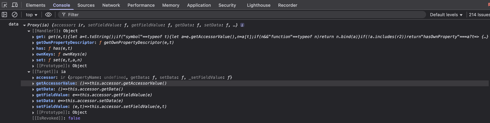

# Proxying Input Variables

Some component properties can be configured using JS. For example, the Hidden property can be set using a switch, or it can be calculated using JS code.
The JS executable function has several input variables (such as `contexts`, `data`, `form`, `http`, and others). The list of variables may vary depending on the property and may be supplemented in new versions of the system.



The recalculation of the property value (execution of the JS executable function for this property) is performed taking into account the dependencies on the variables used in the function and their nested properties.
For example, if the form has two fields (`firstName`, `lastName`, `description`) and the `Hidden` property for the `description` field is configured as

```javascript
return data.firstName?.length > 3;
```

then the recalculation of the `Hidden`property (executing the executable function for the`Hidden`property) will be performed only when the`firstName` field is changed.

Changing the lastName field will not cause recalculation of the `Hidden` property (executing an executable function for the `Hidden` property) for the `description` field.

This is implemented specifically to optimize component rendering.
Without this optimization, changing any field would cause the execution of all JS executable functions for all(!) fields of all(!) components. That is, changing any field would result in re-rendering of all(!) components on the form, not just those that depend on the field being modified.
This is not a problem for forms with 2-5 components. But complex forms with 10-20 or more fields, tabs, and sub-forms cause significant delays in the interface response due to the full re-rendering of all components on the form.

To implement this optimization, all input variables in the executable JS functions of component properties are wrapped in special proxies that control dependencies.
When accessing a specific field, the proxy returns the real value of the field, which in no way disrupts the function code.
However, an attempt to log variables (for example, `console.log(data)` or `console.log(JSON.stringify(data))`) will log the proxy object.
Starting from version 0.44, the function of the hidden variable `test.getArguments(arguments)` can be used in the executable function, which returns an array of input variables without proxying.
Prior to version 0.44, you can get the value of a variable without acidification through the `_data` property (for example, `data._data`, `pageContext._data`, etc.)

In addition, proxying allows you to work with form data and contexts without using additional methods like `setFieldValue`, `setFieldsValue` or `setFormData`. Instead, it is allowed to write and read data directly to/from the data field. For example:

```javascript
data.firstName = data.firstName + ' test';
```
