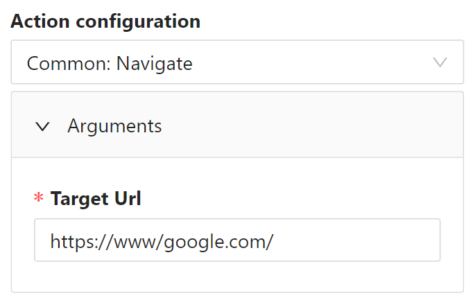
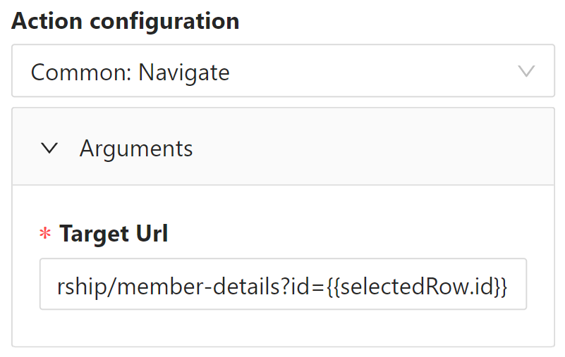
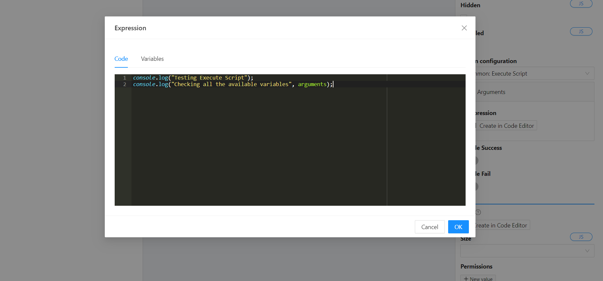
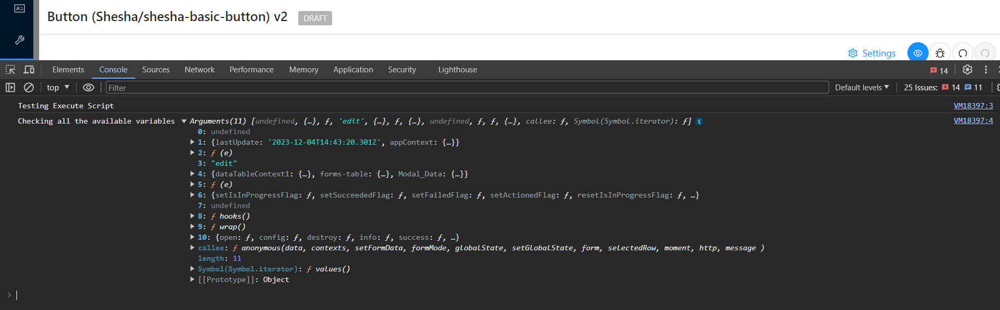
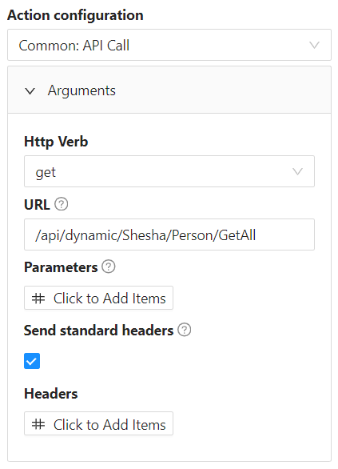
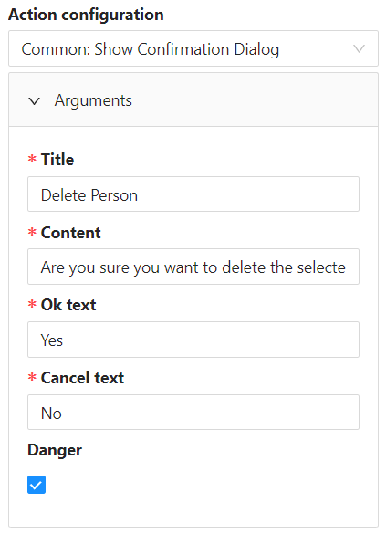
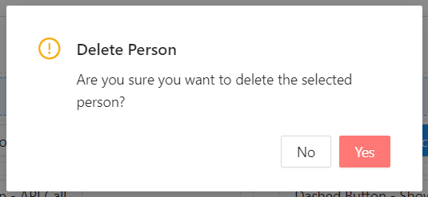
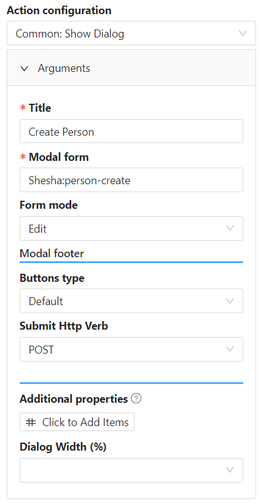

# Action Configurations

This section covers configuring actions to be triggered upon button click.

## Common

### Navigate

It is also important to note that dynamic values can be used to construct the navigation path dynamically. Depending on where the button functionality is being implemented, you have access to various variables such as `data`, `globalState`, `selectedRow`.

_Read more about each of these Shesha objects [here](/docs/category/shesha-objects)_

### Execute Script (Accepts javascript expressions)

This provides a code editor that allows the user to enter custom JavaScript code. It also includes a list of variables, which can be used for the convenience of the configurator as it exposes common JavaScript functions and also gives you the functionality to execute HTTP functions.

_Read more about custom javascript scripting [here](/docs/front-end-basics/configured-views/client-side-scripting/basic-scripting)_

### API call

This provides an interface for configuring an API call instead of having to execute custom JavaScript.

### Show Confirmation Dialog

This provides an interface for configuring a user interface component that is commonly used to obtain user confirmation before proceeding with a potentially critical or irreversible action in a software application or a website. The purpose of the confirmation dialog is to prevent users from accidentally taking actions that could have significant consequences.

### Show Dialog

This provides an interface for configuring which modal dialog to render and the actions thereof.

### Close Dialog

This closes the opened modal dialog

## Designer Form

- ### Start edit
- ### Cancel edit
- ### Submit
- ### Reset
- ### Refresh (refreshes form data by fetching it from the backend)
