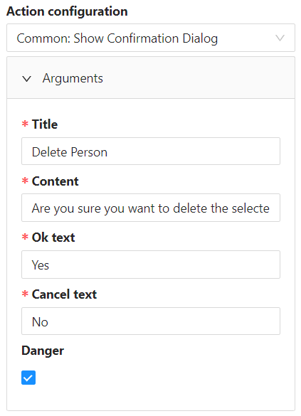
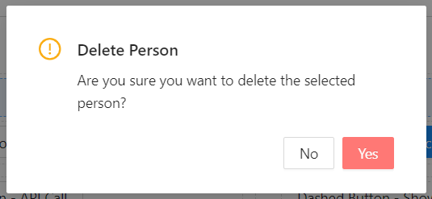
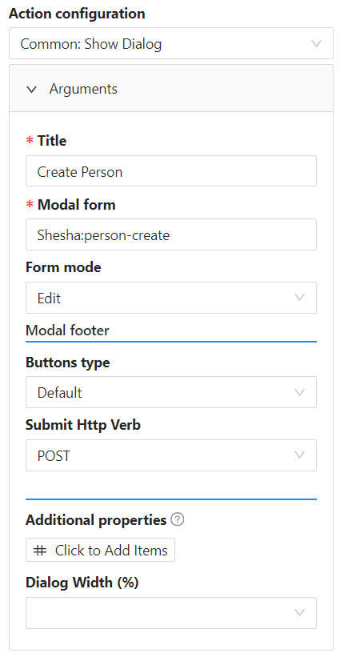
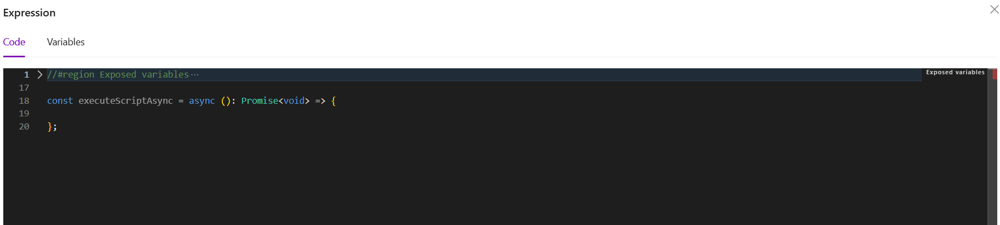
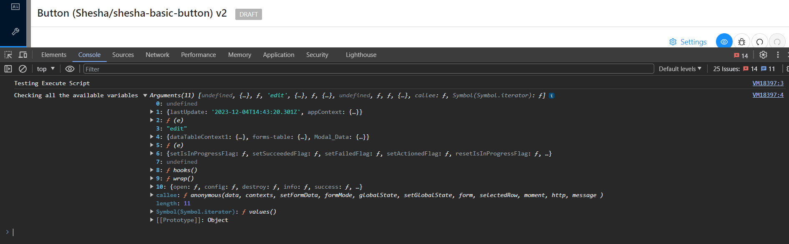
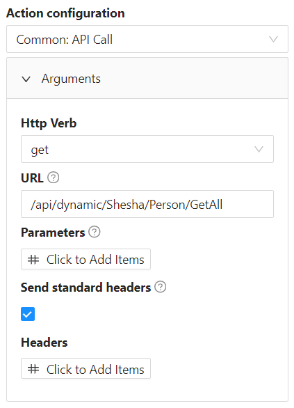
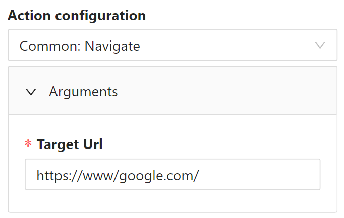
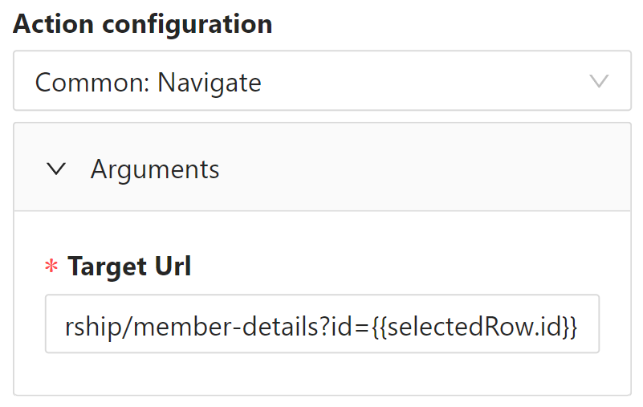

import LayoutBanners from './LayoutBanners';

# Action Configurations

Actions define what happens when a user interacts with a component - clicking a button, submitting a form, or selecting a row. Rather than writing code for every interaction, you configure actions through the designer by selecting an action type, filling in its settings, and optionally chaining a second action to run on success or failure.

When you open the action configurator on a component, you will always see four base groups: **Common**, **Debug Panel**, **Configuration Items**, and **Form**. Depending on which component you are configuring, additional groups may also appear. Components such as the DataTable, Wizard, Drawer, SubForm, and DataList each register their own action group under their component name. These extra groups only appear when you are configuring an action on that component.

:::info
Every action has an **On Success** and **On Fail** handler. You can chain another action to run automatically after the first one completes. This lets you build multi-step flows - such as showing a confirmation, then navigating - without writing any script.
:::

---

## Common

Common actions are available on any component in any form.

### Show Confirmation Dialog

Show Confirmation Dialog displays a modal prompt asking the user to confirm before the next step proceeds. Configure this as the first action in a chain, with the actual operation placed in the `On Success` handler. If the user clicks confirm, the `On Success` action runs. If they cancel, nothing happens.

**Configuration fields:**
- **Title** - the heading shown inside the dialog, e.g. `Delete record?`.
- **Content** - the body text shown below the title, e.g. `This action cannot be undone.`.
- **Ok Text** - label for the confirm button. Defaults to `Yes`.
- **Cancel Text** - label for the cancel button. Defaults to `No`.
- **Danger** - when enabled, the confirm button renders in red to signal a destructive action.


*Show Confirmation Dialog configuration with title, content, and button labels.*


*The confirmation dialog as it appears to the user at runtime.*

:::warning
Show Confirmation Dialog does nothing on its own. The action to run after confirmation must be placed in the **On Success** handler. If you leave `On Success` empty, clicking confirm has no visible effect.
:::

---

### Show Dialog

Show Dialog opens a modal window and renders a configured form inside it. Use this when you need the user to complete a secondary task - filling in additional details, reviewing a record, or confirming information - without navigating away from the current page.

**Configuration fields:**
- **Title** - the heading displayed in the modal header.
- **Modal Form** - the form to render inside the dialog. Select from the form picker.
- **Form Mode** - `Edit` allows the user to make changes. `Read only` displays the form as a non-editable view.
- **Dialog Width** - preset sizes: Small (40%), Medium (60%), Large (80%), or Custom.
- **Custom Width / Units** - available when width is set to Custom. Enter a number and choose `%` or `px`.
- **Arguments** - a JavaScript expression that evaluates to an object. The result is passed into the dialog form as its initial arguments. Variables from the current context (including `data`) are available.
- **Footer** - configure whether to show a footer and whether to use default buttons or custom ones.
- **Show Close Icon** - when enabled, a close button appears in the top-right corner of the modal.

<LayoutBanners url="https://app.guideflow.com/embed/lpnvw5xhjr" type={1}/>


*Show Dialog configuration with form selection, mode, width, and arguments fields.*


:::tip
Inside the dialog form, access the arguments object using the `formArguments` variable in any script or binding expression.
:::

:::note
When the dialog form is submitted, the result is available as `actionResponse` in any `On Success` action chained after Show Dialog.

```js
// On Success > Execute Script after Show Dialog:
form.setFieldsValue({ approvedBy: actionResponse?.approverName });
```
:::

---

### Close Dialog

Close Dialog closes the currently visible modal. Use this on buttons inside a dialog form - for example, a Cancel button that should dismiss the modal without submitting.

**Configuration fields:**
- **Show Dialog Result** - determines whether the dialog resolves as a success or failure when closed.
  - `Success` - the parent form's `On Success` handler fires after the dialog closes.
  - `Fail` - the parent form's `On Fail` handler fires after the dialog closes.

:::note
Close Dialog only works when triggered from inside an open modal. Using it outside a dialog has no effect.
:::

---

### Execute Script

Execute Script opens a code editor where you write JavaScript that runs when the action fires. Use this when no other action type covers what you need - for example, updating multiple fields at once, calling a utility function, or performing conditional logic before triggering something else.

**Configuration fields:**
- **Expression** - the JavaScript code to run.

The editor exposes a full list of variables available in the current context.

| Variable | Type | Description |
|---|---|---|
| `data` | `object` | Current form field values |
| `form` | `FormInstance` | The Ant Design form instance |
| `formMode` | `'readonly' \| 'edit' \| 'designer'` | The current mode of the form |
| `globalState` | `object` | Application-wide global state |
| `setGlobalState` | `(payload: { key: string, data: any }) => void` | Updates a key in global state |
| `http` | `AxiosInstance` | Pre-configured axios instance for HTTP calls |
| `message` | `object` | Ant Design message API for showing toast notifications |
| `moment` | `object` | The moment.js library |
| `fileSaver` | `object` | API for saving files on the client |
| `contexts` | `object` | Data context values available on the current page |
| `actionResponse` | `object` | The result of the previous action in a chain (on success path) |
| `actionError` | `object` | The error from the previous action in a chain (on fail path) |


*Execute Script code editor showing the expression field.*


*Available variables listed in the Execute Script editor context.*

:::warning
`setFormData(...)` is deprecated. To update form fields from script, use `form.setFieldsValue({ fieldName: value })`.
:::

**Example - Build a full name from first and last name:**
```js
const first = data.firstName ?? '';
const last = data.lastName ?? '';
form.setFieldsValue({ fullName: `${first} ${last}`.trim() });
```

**Example - Fetch a related record and populate a field:**
```js
if (!data.organisationId) return;

const response = await http.get(`/api/dynamic/Shesha/Organisation/Get`, {
  params: { id: data.organisationId }
});

form.setFieldsValue({
  organisationName: response.data.result.name
});
```

**Example - Show a message and update global state:**
```js
setGlobalState({ key: 'stepOneComplete', data: true });
message.success('Step 1 completed.');
```

:::note
`actionResponse` and `actionError` are only populated when Execute Script is used as an `On Success` or `On Fail` handler after another action. They are `undefined` when Execute Script runs as a standalone action.
:::

_Read more about client-side scripting [here](/docs/front-end-basics/configured-views/client-side-scripting/basic-scripting)_

---

### Show Message

Show Message displays a toast notification. Use this to give users feedback after an action completes - confirming a save, warning about a missing step, or reporting an error.

**Configuration fields:**
- **Message** - the text to display in the notification.
- **Type** - controls the appearance and icon of the toast: `info`, `success`, `error`, `warning`, or `loading`.

:::tip
Show Message works well as an `On Success` or `On Fail` handler after an API Call or Submit action. Chain it after the primary action to give users immediate feedback.
:::

---

### Sign In

Sign In triggers the Shesha authentication flow using the values currently entered in the form. It reads `username` and `password` from the form data and calls the login endpoint.

This action has no configuration fields. Place it on the submit button of a login form.

:::warning
Sign In reads credentials directly from the form. The form must have fields bound to `username` and `password` for this action to work correctly.
:::

---

### API Call

API Call triggers a backend endpoint without requiring custom JavaScript. Use this when you need to fire a specific API operation - such as running a server-side process, posting data, or fetching a value - and you want to keep the configuration visual.

**Configuration fields:**
- **HTTP Verb** - the request method: `GET`, `POST`, `PUT`, `DELETE`, `PATCH`, or others.
- **URL** - the endpoint path. Use the autocomplete to pick from registered Shesha endpoints, or type a custom path.
- **Parameters** - key-value pairs sent as query string (for GET/DELETE) or request body (for POST/PUT/PATCH).
- **Send Standard Headers** - when enabled, Shesha adds its standard authentication and content-type headers automatically. Leave this on unless you have a reason to override headers manually.
- **Headers** - additional headers to include in the request.



:::tip
The result of an API Call is available as `actionResponse` in any `On Success` Execute Script action chained after it.

```js
// In an On Success > Execute Script action chained after API Call:
const result = actionResponse?.result;
form.setFieldsValue({ confirmationCode: result?.code });
```
:::

:::warning
For GET and DELETE requests, Shesha encodes the parameters as query string values. For POST, PUT, and PATCH, parameters are sent as the request body. Make sure your verb matches how your endpoint expects to receive data.
:::

---

### Navigate

Navigate sends the user to a different page. You choose the destination either by selecting a configured form from the form picker, or by entering a URL directly.

**Configuration fields:**
- **Navigation Type** - choose `Form` to pick a form by name, or `URL` to enter a path directly.
- **Form** - appears when type is `Form`. Select the target form from the autocomplete.
- **Target URL** - appears when type is `URL`. Enter the path, e.g. `/persons/details`.
- **Query Parameters** - key-value pairs appended to the URL as query string values, e.g. `id = {{data.id}}`.



:::note
Dynamic values can be used to construct the navigation path dynamically. Variables such as `data`, `globalState`, and `selectedRow` are available depending on where the action is configured.
:::



:::warning
Do not use `navigateTo(...)` in any Execute Script action - this function does not exist in Shesha. To navigate programmatically from script, use the Navigate action type instead.
:::

_Read more about Shesha objects [here](/docs/category/shesha-objects)_

---

## Debug Panel

The Debug Panel group contains actions that control the developer debug panel. This panel shows internal form state, context values, and other diagnostic information useful when building or troubleshooting a form.

### Toggle Debug Panel

Toggle Debug Panel opens the debug panel if it is closed, or closes it if it is open. Use this on a developer-facing button when you want quick access to inspect form state without using the keyboard shortcut.

This action has no configuration fields. You can also open the debug panel at any time using the keyboard shortcut `Ctrl + F12`.

:::note
The debug panel is a developer tool. It is not intended for end users and should not be placed on forms that are visible in production.
:::

---

## Configuration Items

The Configuration Items group contains actions for managing the lifecycle of Shesha configuration items - forms, reference lists, API configurations, and other configurable components. These actions are used by administrators and developers to version, publish, and move configuration between environments.

### Create New Item Version

Create New Item Version creates a new draft version of an existing configuration item. Use this when you want to make changes to a published form, reference list, or other configuration item without affecting the live version. The new draft can be edited and tested before being published.

This action has no configuration fields. It targets the configuration item currently open or selected in context.

---

### Set Item Ready

Set Item Ready marks the current draft version of a configuration item as ready for review or publishing. Use this as part of a review workflow where a second person needs to approve changes before they go live.

This action has no configuration fields.

---

### Delete Item

Delete Item permanently removes a configuration item. Use this to clean up unused or obsolete items from the configuration.

This action has no configuration fields.

:::danger
Deleting a configuration item is permanent and cannot be undone. Any forms or components that reference the deleted item will stop working. Always confirm that an item is no longer in use before deleting it.
:::

---

### Publish Item

Publish Item makes the current ready version of a configuration item live. Once published, the item becomes the active version used by the application.

This action has no configuration fields.

:::warning
Publishing replaces the current live version immediately. Make sure the item has been fully tested before publishing.
:::

---

### Cancel Item Version

Cancel Item Version discards the current draft version of a configuration item and returns it to its previous published state. Use this when changes in the current draft are no longer needed.

This action has no configuration fields.

:::warning
Cancelling a version permanently discards all unpublished changes in that draft. This cannot be undone.
:::

---

### Download as JSON

Download as JSON exports a single configuration item directly as a JSON file. Use this to back up an item or transfer it manually between environments.

**Configuration fields:**
- **Item ID** - the unique identifier of the configuration item to download.

---

### Export Items

Export Items opens the configuration export dialog. From here you can select which forms, reference lists, or other configuration items to include and download them as a package.

This action has no configuration fields.

---

### Import Items

Import Items opens the configuration import dialog. From here you can upload a previously exported configuration package to apply it to the current environment.

This action has no configuration fields.

:::warning
Importing configuration will overwrite existing items that share the same module and name. Always review what is included in a package before importing it into a production environment.
:::

---

## Form

Form actions control the state and data of the form the user is currently on. They are only available when configuring a component inside a form.

### Start Edit

Start Edit switches the form from read-only mode into edit mode. Use this on an Edit button in a details view where users should be able to view a record first and only edit it when they choose to.

This action has no configuration fields. It stores the current form data internally so that Cancel Edit can restore it if the user changes their mind.

---

### Cancel Edit

Cancel Edit discards all unsaved changes, restores the field values to what they were when Start Edit was clicked, and returns the form to read-only mode.

This action has no configuration fields.

:::warning
Cancel Edit does not call any API. It only resets the in-memory form state. Any data the user typed is lost. Do not use Cancel Edit as a substitute for Reset - they behave differently. Reset clears the form to blank; Cancel Edit restores the last saved values.
:::

---

### Submit

Submit validates the form and sends the current field values to the backend using the form's configured submit settings.

This action has no configuration fields.

:::note
Submit triggers full form validation before sending. If any required field is empty or any validation rule fails, the submit is blocked and errors are shown inline. Use Validate if you want to check validity without submitting.
:::

:::tip
Chain an `On Success` action after Submit to navigate the user to a details view, show a confirmation message, or close a dialog.
:::

---

### Reset

Reset clears all field values and returns the form to its initial empty state. Use this on a Clear or Start Over button.

This action has no configuration fields.

:::warning
Reset removes all unsaved input on the form. This is not the same as Cancel Edit. Use Cancel Edit on an edit form if you want to restore the previously saved values. Use Reset only when you genuinely want a blank form.
:::

---

### Refresh

Refresh re-fetches the current record from the backend and reloads all field values from the server response. Use this when the underlying data may have changed since the form was opened.

This action has no configuration fields.

:::warning
Refresh overwrites whatever the user has typed with the server's current values. Any unsaved input is lost. Only trigger this when you are certain the user's changes should be discarded.
:::

---

### Validate

Validate runs the form's validation rules and displays any errors inline - without submitting the form to the backend. Use this to check whether the form is in a valid state before enabling a next step or proceeding in a wizard.

This action has no configuration fields. If validation passes, the `On Success` handler runs. If it fails, the `On Fail` handler runs.

:::tip
Chain Validate before a multi-step operation when you want to confirm data integrity before committing. For example: Validate → On Success → Submit.
:::

---

### Set Validation Errors

Set Validation Errors reads the error from the previous action in a chain and displays it on the Validation Errors component attached to the form. Use this as an `On Fail` handler after Submit or API Call to surface a server-side error in a consistent location on the form.

This action has no configuration fields. It must be used in an `On Fail` chain - it has no effect as a standalone action.

---

### Reset Validation Errors

Reset Validation Errors clears any errors currently shown on the Validation Errors component. Use this to clean up error state when the user corrects their input and tries again.

This action has no configuration fields.

