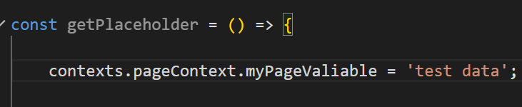

# Application, page and form contexts

Сontexts for storing temporary data for application, page and form.

`appContext` - aplication level context. All data stored in this context is available on any page or form. It can be used to save any global application data, transfer data between pages, or store temporary data needed for the entire application.

`pageContext` - page level context. All the data stored in this context is available inside the open page and the forms used on this page (Sub forms, Modal dialogs, Form cells, Data list items, etc.). It can be used to save any temporary data used on the page, transfer data between the forms used on the page. When closing/changing a page, all the page context data is cleared.

`formContext` - form level context. All the data stored in this context is available inside the specific form (Subforms, Modal dialogs, Form cells, Data list items, etc.). It can be used to save any temporary data used on the form. When closing a form, all the form context data is cleared.

## How to use

To save data in the context of any of these types, it is enough to specify a variable name and assign a value to it.

To use data from the context of any of these types, it is also enough to use the variable name.

## Form context features

Please note that one `appContext` and one `pageContext` are always available for use. However, there may be multiple `formContext`. For example, if two SubForms are used on a main form, then the main form has its own `formContext`, and each subform has its own `formContext`. The components on each of the forms (SubForms) will only have access to the `formContext` of their form.

## Form context example

There is a Form with TextField and Text components.

The TextField component binded to the `formContext` and `test` Property name.

The Text component has scripted Content setting

So, the Text component shows values typed in the TextField component.

Then this Form is used as a SubForm.

Main fom contains TextField compenent (also binded to the `formContext` and `test` Property name) and two SubForm. So, it's mean that all TextField components are binded to the `formContext` and `test` Property name. But as can you see each TextField components binded to their own `formContext` and their values is not mixed

