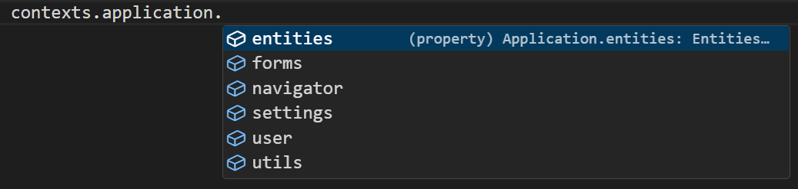

# Application API

It provides access to the main application data (user, settings) and methods of working with basic objects (entities, forms, setting), as well as to the application navigation tools and utilites.

