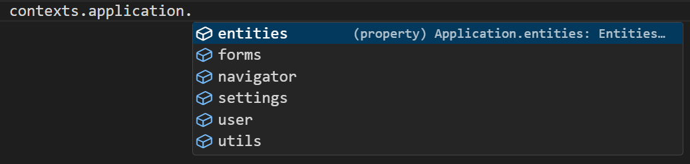

# Application API

The `application` object is available in every Shesha script and gives access to the core services of your application. Use it to work with the current user, navigate between pages, read application settings, and perform CRUD operations on entities - all without writing custom API endpoints.


*The Application API object shown in the script editor autocomplete.*

---

## Sub-Objects

The `application` object is divided into focused sub-objects. Each one covers a specific area of the application.

| Sub-object | What it gives you |
|---|---|
| `application.user` | Current user details and permission checks |
| `application.navigator` | Navigate between pages and forms, or get a form's URL |
| `application.entities` | Create, read, update, and delete entities by module |
| `application.settings` | Read application settings by module |
| `application.utils` | Evaluate template strings against data |
| `application.forms` | Prepare form templates with dynamic replacements |

---

## application.user

The `user` sub-object gives you information about the person who is currently logged in and lets you check their permissions before running sensitive logic.

| Property / Method | Type | Description |
|---|---|---|
| `user.id` | `string` | The ID of the current user record |
| `user.userName` | `string` | The login username |
| `user.firstName` | `string` | First name |
| `user.lastName` | `string` | Last name |
| `user.personId` | `string` | The ID of the Person entity linked to this user |
| `user.isLoggedIn` | `boolean` | Whether a user is currently authenticated |
| `user.hasPermissionAsync(permission)` | `Promise<boolean>` | Check whether the user has a named permission |
| `user.hasRoleAsync(role)` | `Promise<boolean>` | Check whether the user has a named role |

**Form type to use:** Any form where access must be restricted to specific users.

**Example - Show a panel only to users with a specific permission:**

```javascript
const canApprove = await application.user.hasPermissionAsync('app:Approvals:Approve');
form.setFieldsValue({ showApprovalPanel: canApprove });
```

---

## application.navigator

The `navigator` sub-object handles page and form navigation. See the [Navigator](/docs/front-end-basics/javascript-api/application/navigator) page for full method details and examples.

---

## application.entities

The `entities` sub-object gives access to the standard CRUD operations for any entity in your application. Use the pattern `application.entities.[module].[EntityName].[method]`. See the [Entities](/docs/front-end-basics/javascript-api/application/entities) page for full method details and examples.

---

## application.settings

The `settings` sub-object lets you read application settings that are defined and stored in Shesha's settings system.

**Example - Read a setting from the Shesha module:**

```javascript
const moduleSettings = application.settings.getModuleSettings('Shesha');
```

---

## application.utils

The `utils` sub-object provides string evaluation utilities.

**Example - Evaluate a template string against the current form data:**

```javascript
const label = application.utils.evaluateString('Hello {{firstName}} {{lastName}}', data);
```

---

## application.forms

The `forms` sub-object lets you prepare dynamic form templates by substituting placeholders with runtime values.

**Example - Prepare a form template with a dynamic replacement:**

```javascript
const result = await application.forms.prepareTemplateAsync('my-template-id', { clientName: data.name });
```
