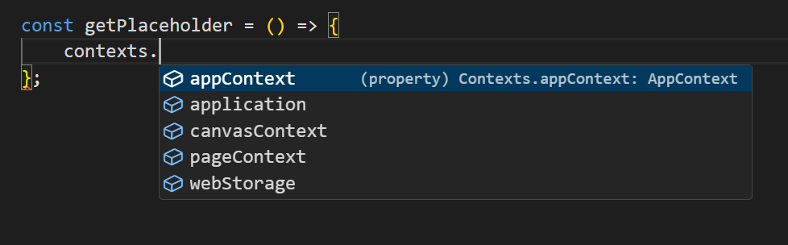

# Contexts

Contexts provide access to all the features of application data storage (except form data), as well as specific APIs of both the application and some components.

Contexts can be accessed from any script in the form configuration via the variable `contexts`

The list of available contexts may vary depending on the configuration used, the components used, as well as the location of the component to which the script is being added.

There are types of contexts:

* [`application`](docs\front-end-basics\configured-views\client-side-scripting\contexts\application.md) - provides access to the main application data (`user`, `settings`) and methods of working with basic objects (`entities`, `forms`, `setting`), as well as to the application navigation tools and utilites.
* [`canvasContext`](docs\front-end-basics\configured-views\client-side-scripting\contexts\canvas-context.md) - provides access to basic data and methods about the shape and size of application pages
* [`webStorage`](docs\front-end-basics\configured-views\client-side-scripting\contexts\web-storage.md) - provides access to browser data storages (`sessionStorage` and `localStorage`)
* [`appContext`, `pageContext`, `formContext`](docs\front-end-basics\configured-views\client-side-scripting\contexts\app-page-form-context.md) - contexts for storing temporary data for application, page and form
* [Components contexts](docs\front-end-basics\configured-views\client-side-scripting\contexts\component-context.md) - some components provide their own contexts containing the data of this component, as well as APIs, if available.
