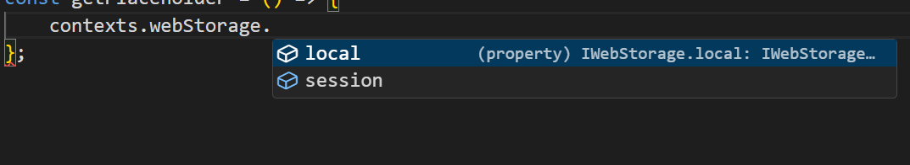
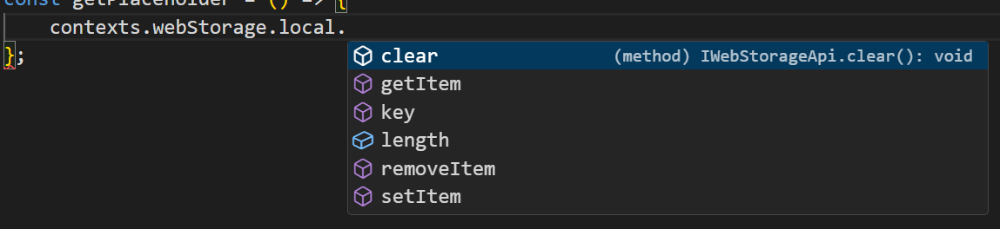

# Web storage

It provides access to browser data storages (`sessionStorage` and `localStorage`)

These variables contain methods similar to those of the `window.localStorage` and `window.sessionStorage` objects.

You can save and access storage fields directly by referring to them by name and assigning values.

