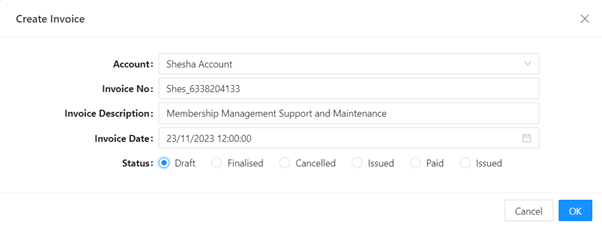

# Data

This object contains the values collected from the current form in question.

## Data Entry

This takes in all the properties that just have a [property name](/docs/front-end-basics/form-components/common-component-properties#property-name-string), or an empty [context](/docs/front-end-basics/form-components/common-component-properties#context-object) property.

The object from the below example will look like this:



```json
{
  "account": {
    "id": "953226e3-f3d4-4872-b917-d6c1e4a973c0",
    "_displayName": "Shesha Account",
    "_className": "Shesha.Domain.Account"
  },
  "invoiceNo": "Shes_6338204133",
  "invoiceDescription": "Membership Management Support and Maintenance ",
  "invoiceDate": "2023-11-23T12:00:00",
  "status": 1
}
```

:::info
The data object gets updated by the form components bound to it and is based on user input. This will be what gets sent to the backend when making PUT and POST API calls.
:::

## Data Retrieval

In the context of a details view where an API call to the backend is made to retrieve information about a selected entity's attributes and properties, the data object will contain all the values retrieved from making the API call. For example, if I am on the details view of an invoice, performing a `GET` operation, my data object will look like this:


```json
{
  "cellNumber": null,
  "telNumber": null,
  "faxNumber": null,
  "invoicingPeriodStartDate": null,
  "invoicingPeriodEndDate": null,
  "invoiceDate": "2023-11-23T12:00:00",
  "invoiceTitle": null,
  "invoiceDescription": "Membership Management Support and Maintenance ",
  "dueDate": null,
  "invoiceNo": "Shes_6338204133",
  "paymentMethod": null,
  "paymentTerms": null,
  "vatNumber": null,
  "status": 1,
  "totalExclTax": null,
  "taxAmount": null,
  "totalInclTax": null,
  "invoiceType": null,
  "cancelledReason": null,
  "invoiceSendStatus": null,
  "contactPerson": null,
  "issuedBy": null,
  "issuedTo": null,
  "issuedToPerson": null,
  "contract": null,
  "account": {
    "_displayName": "Shesha Account",
    "_className": "Shesha.Domain.Account",
    "id": "953226e3-f3d4-4872-b917-d6c1e4a973c0"
  },
  "invoiceDoc": null,
  "extSysId": null,
  "extSysSource": null,
  "extSysSyncStatus": null,
  "extSysFirstSyncDate": null,
  "extSysLastSyncDate": null,
  "extSysSyncError": null,
  "isDeleted": false,
  "deleterUserId": null,
  "deletionTime": null,
  "lastModificationTime": null,
  "lastModifierUserId": null,
  "creationTime": "2023-11-23T15:06:53.753",
  "creatorUserId": 1,
  "id": "f9911666-3a1e-4f08-922a-2118367bbe9d"
}
```
