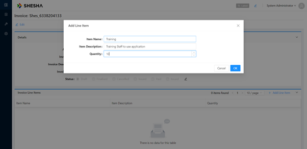

# ParentFormValues

The term **ParentFormValues** indicates that these are the values collected from the form that is considered the parent or source of the dialog. In the context of a dialog, the parent form is the form that triggers or initiates the dialog's appearance. If we have a dialog rendering on top of a form, this is considered a `parent-child` relationship. The base `invoice-details` form acts as the `parent`, and the rendered `invoice-line-item-create` form is a child. Therefore, the current context of the application looks like this:



**Data:**

```json
{
  "itemName": "Training",
  "itemDescription": "Training Staff to use application",
  "quantity": 10
}
```

**ParentFormValues:**

```json
{
  "cellNumber": null,
  "telNumber": null,
  "faxNumber": null,
  "invoicingPeriodStartDate": null,
  "invoicingPeriodEndDate": null,
  "invoiceDate": "2023-11-23T12:00:00",
  "invoiceTitle": null,
  "invoiceDescription": "Membership Management Support and Maintenance ",
  "dueDate": null,
  "invoiceNo": "Shes_6338204133",
  "paymentMethod": null,
  "paymentTerms": null,
  "vatNumber": null,
  "status": 1,
  "totalExclTax": null,
  "taxAmount": null,
  "totalInclTax": null,
  "invoiceType": null,
  "cancelledReason": null,
  "invoiceSendStatus": null,
  "contactPerson": null,
  "issuedBy": null,
  "issuedTo": null,
  "issuedToPerson": null,
  "contract": null,
  "account": {
    "_displayName": "Shesha Account",
    "_className": "Shesha.Domain.Account",
    "id": "953226e3-f3d4-4872-b917-d6c1e4a973c0"
  },
  "invoiceDoc": null,
  "extSysId": null,
  "extSysSource": null,
  "extSysSyncStatus": null,
  "extSysFirstSyncDate": null,
  "extSysLastSyncDate": null,
  "extSysSyncError": null,
  "isDeleted": false,
  "deleterUserId": null,
  "deletionTime": null,
  "lastModificationTime": null,
  "lastModifierUserId": null,
  "creationTime": "2023-11-23T15:06:53.753",
  "creatorUserId": 1,
  "id": "f9911666-3a1e-4f08-922a-2118367bbe9d"
}
```
