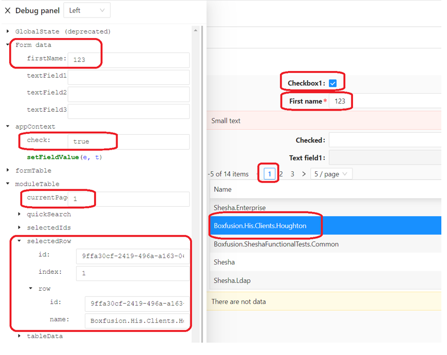

# Debug Panel

A debug panel is a valuable tool for developers that enhances their ability to diagnose and fix issues in software applications, ultimately leading to more robust and reliable code. It provides a set of features and information that helps developers identify and fix issues in their code.

## How to Access

The Debug Panel contains state and information about Form data, Contexts, TableData, etc. This is opened by clicking the `Debug` button next to the `Preview` button on the `form designer`, or by clicking `CTRL + F12` while on the form designer.

## Use of a Debug Panel

**Logging and Output:**

- Debug panels often include a logging feature that allows developers to output messages, warnings, errors, and other information from their code. This real-time feedback helps developers understand the flow of their application and identify potential issues.

**Variable Inspection:**

- Developers can inspect the values of variables at different points in the code execution. This is particularly useful for understanding how data changes over time and diagnosing unexpected behavior.

**Performance Monitoring:**

- Debug panels may provide insights into the performance of the application, including metrics such as execution time, memory usage, and network requests. Monitoring performance helps identify bottlenecks and optimize code.

**Network Requests:**

- Developers can inspect network requests made by the application, view request and response headers, and analyze data payloads. This is valuable for debugging issues related to data fetching and communication with servers.

**Event Tracing:**

- Some debug panels offer event tracing capabilities, allowing developers to trace the sequence of events or function calls. This helps in understanding the execution flow and identifying the source of issues.

**Error Tracking:**

- Debug panels often display detailed information about errors, including stack traces and error messages. Developers can quickly identify where an error occurred and the context in which it happened.

**Interactive Console:**

- A debug panel may include an interactive console that allows developers to run commands and test code snippets in the context of their application. This is valuable for experimenting with solutions and verifying hypotheses.

## Benefits of a Debug Panel

**Efficient Debugging:**

- Debug panels streamline the debugging process by providing a centralized and organized interface for various debugging tools. This improves the efficiency of developers when identifying and resolving issues.

**Real-time Feedback:**

- Developers receive real-time feedback on the behavior of their code, making it easier to catch issues during development. This immediacy helps in reducing the debugging cycle and accelerates the development process.

**Increased Visibility:**

- Debug panels provide increased visibility into the inner workings of an application, making it easier to understand complex systems and pinpoint the root cause of problems.

**Collaboration:**

- Debug panels can be beneficial for collaboration among developers. Team members can share insights, logs, and debug information, facilitating a more collaborative approach to problem-solving.

**Optimization Opportunities:**

- With performance metrics and profiling information available in the debug panel, developers can identify areas for optimization and enhance the overall performance of the application.

**Enhanced Developer Experience:**

- A well-designed debug panel contributes to a better developer experience. It offers a user-friendly interface, clear visualizations, and helpful tools that make debugging less daunting and more manageable.

**Support for Testing:**

- Debug panels can be instrumental during testing phases. Developers can use the panel to simulate various scenarios, inspect the application's behavior, and ensure that it meets the required specifications.
