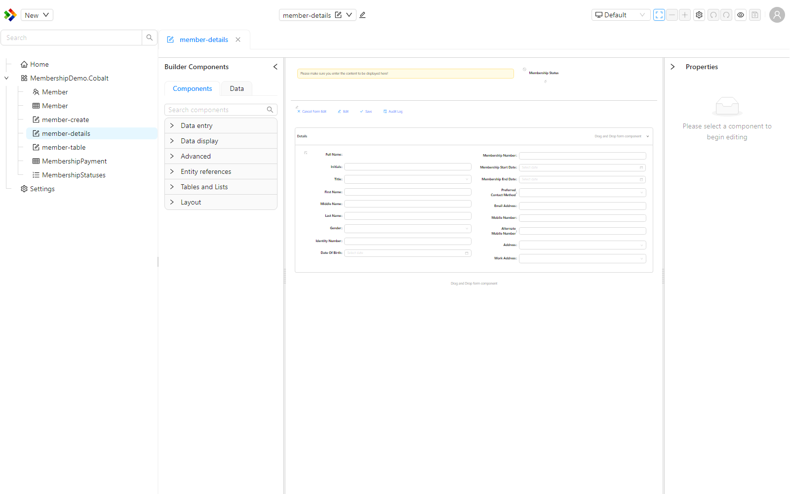
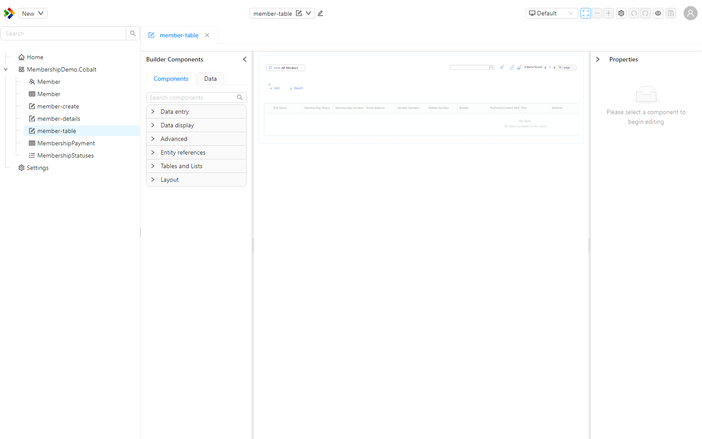

# Form Builder Canvas

The form builder canvas is the central area of the form designer where you lay out a form by dragging components onto it. The canvas is a true WYSIWYG surface, which means what you arrange on it closely matches how the form will render for a user. You can zoom and scroll the canvas, so it stays an accurate picture of the final form even as it grows larger than the screen.

---

## Zooming and scrolling

The canvas can be zoomed in and out, and scrolled, so you can work on a detailed area or step back to see the whole form. The zoom controls sit on the designer toolbar.

| Control | What it does |
|---|---|
| Zoom in | Increases the zoom level. |
| Zoom out | Decreases the zoom level. |
| Auto zoom | Fits the form to the available space. While auto zoom is on, the manual zoom buttons are disabled. |

The current zoom level is shown as a percentage, and zoom ranges from 25% to 200%. You can also zoom with a pinch gesture on a touch device, or by holding `Ctrl` while scrolling the mouse wheel.

:::tip
Turn on auto zoom to fit the entire form into view, then switch to manual zoom when you want to focus on a particular section.
:::

---

## Pre-configured components on drop

Some components are awkward to start from an empty shell, so dropping them onto the canvas inserts a ready-made template rather than a blank component. The **DataTable** and **DataList** components both drop in pre-configured.

- Dropping a DataTable inserts a full table structure, including the surrounding data context, a toolbar with Add, Edit, and Export buttons, search and paging controls, and action columns.
- Dropping a DataList inserts a list structure with a title, status, description, and metadata, using placeholder bindings so you can see the layout immediately.

This lets you see the structure and layout of the component the moment you drop it, instead of having to configure it from nothing before anything appears.

:::note
The dropped templates show the component's structure and layout with placeholder bindings. They are a configured starting point that you then bind to your own data, not live sample records.
:::

---

## Configuration indicators

When a component on the canvas is not fully configured, the designer shows a small colour-coded icon on the component rather than an inline error message. Hover over the icon to read the detail.

| Indicator | Meaning |
|---|---|
| Warning icon (yellow) | The component has a configuration issue that needs attention. |
| Info icon | A hint about the component's configuration. |

This keeps the canvas readable while still drawing your attention to the components that need work.
