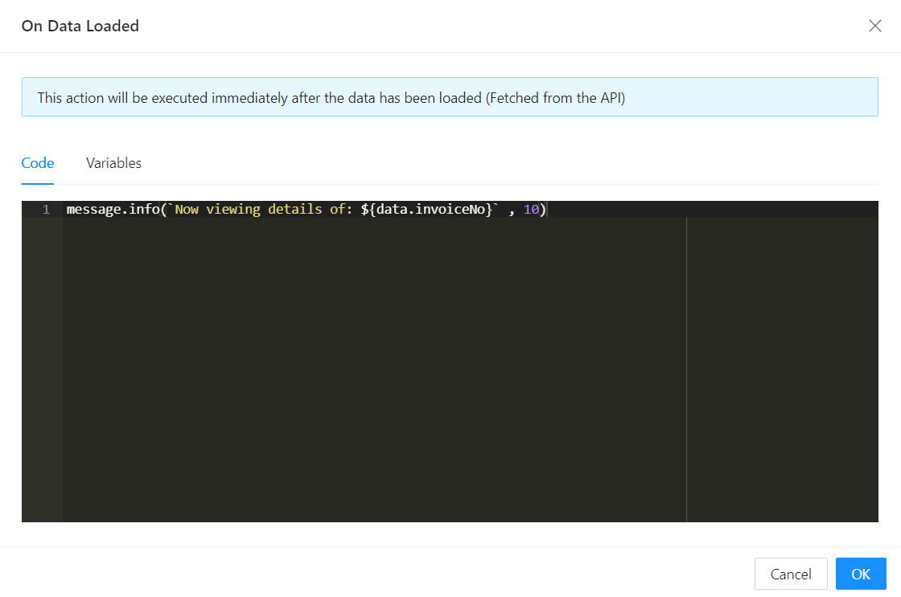

# On Data Loaded

This is an event that occurs when data has been loaded or retrieved for a specific entity or record, and the details view is being populated with that data. It's a point in the lifecycle of the details view where you can perform actions or logic that depend on the successful loading of data.

- **Benefit 1: Asynchronous Data Handling:**

  - The `OnDataLoaded` event handler is valuable for handling asynchronous data loading processes. It provides a designated point in the application's lifecycle to respond to successful data retrieval, ensuring that subsequent actions are taken when the data is available.

- **Benefit 2: UI Updates:**

  - After data is loaded, the event handler allows you to update the user interface to reflect the loaded data. This can include populating UI elements, displaying relevant information, or triggering additional actions based on the retrieved data.

- **Benefit 3: Error Handling:**

  - The event handler can also handle errors that may occur during the data loading process. This includes displaying error messages or taking alternative actions in case of data retrieval failures.

- **Benefit 4: Separation of Concerns:**
  - By providing a clear separation of concerns, the `OnDataLoaded` event handler ensures that the logic for handling data loading events is encapsulated in one place. This contributes to a modular and maintainable codebase.

## Usage Example

In the example below, we are using the `On Data Loaded` Event Handler to preview a toast message to inform the user of the invoice that we are currently viewing:

