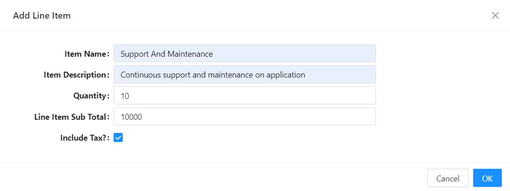

# Prepared Values

Prepared Values allows you to customize or manipulate the data that will be submitted from a form before the actual submission occurs. This can be useful for scenarios where you need to perform additional processing, validation, or transformation of the form values.

- **Benefit 1: Data Preparation:**

  - The `PreparedValues` event handler allows you to customize or modify form values before they are submitted. This is beneficial for scenarios where you need to perform additional processing, validation, or transformation of the form data.

- **Benefit 2: Consistent Workflow:**

  - By centralizing the logic for preparing form values, you ensure a consistent workflow for data submission across the application. This helps maintain a standardized approach to handling form data.

- **Benefit 3: Reusability:**
  - The ability to prepare values before submission is often a common requirement across different forms or components. Having a reusable event handler promotes code reusability and reduces duplication of logic.

## When does it get triggered?

`Prepared Values` is triggered just before the application makes an API call to submit the contents of the form with the specified `Submit Http Verb`.

In the example below, we have included a checkbox on the UI, with the name `includeTax`, which we do not necessarily want to include as part of our payload when making an API call but is used as a tactic to determine other values that are supposed to be included in the payload. We are using this checkbox to determine if this `invoice line item` should be taxed or not.



```javascript
var tax = data.includeTax ? data.lineItemSubTotal * 0.15 : 0; // JavaScript ternary expression
delete data.includeTax; // deleting the checkbox value from payload
return {
  taxAmount: tax,
  lineItemSubTotalInclTax: data.lineItemSubTotal + tax,
};
```
