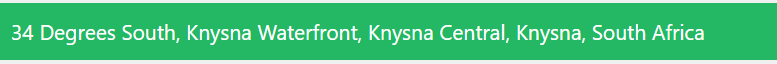

# Address

The Address component is a generic component that is useful in any instance where an address field is required and must be stored. It’s designed for smart and dynamic address input, with support for advanced configurations like bounds and prioritization.

[//]: # '<iframe width="100%" height="500" src="https://pd-docs-adminportal-test.shesha.dev/shesha/forms-designer/?id=d1a61bc8-6960-4426-9e00-b0637f39d8b1" title="Address Component" ></iframe>'

## Properties

The following properties are available to configure the behavior of the component from the form editor (this is in addition to [common properties](/docs/front-end-basics/form-components/common-component-properties)).

### Data

#### Min Characters Before Search `number`
Minimum characters a user must type before the address API is called.

#### Debounce (MS) `number`
Delays the API call to reduce the number of requests while the user is typing.

#### Google Maps Key `string`
API key used to authenticate with Google Maps.

#### OpenCage Key `string`
API key for accessing OpenCage Data services.

#### Country Restriction `object`
Restrict searches to one or more specific countries.

#### Prefix (Area Restriction) `string`
A text prefix appended to the search query to bias the results.

#### Priority Bounds (Advanced) `boolean`
Enables advanced search priority based on coordinates.
