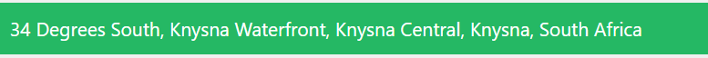

# Address

The Address component is a smart address input that connects to the Google Places API. As the user types, it suggests matching addresses, and when the user picks one Shesha receives the formatted address along with its latitude and longitude coordinates. Use it anywhere you need to capture a real-world address and, optionally, store the exact map coordinates for that address.

One of the key advantages of this component is that it integrates with the Google API and returns the lat/long for the selected address, so you can store coordinates alongside the address text and use them later for mapping, distance calculations, or location-based queries.



---

## Properties

The following properties are available to configure the behaviour of the component from the form editor (this is in addition to [common properties](/docs/front-end-basics/form-components/common-component-properties)).

### Configuration

These settings control how the component talks to Google Places and OpenCage, and how it biases search results.

#### **Min Characters Before Search** `number`

The minimum number of characters the user must type before Shesha calls the Google Places API. Use this to avoid making a call on the first one or two keystrokes, which usually return noisy results.

#### **Debounce (MS)** `number`

The number of milliseconds Shesha waits after the user stops typing before calling the API. Increasing this value reduces the number of API calls while the user is still typing.

#### **Google Maps Key** `string`

The API key used to authenticate with Google Maps. The component will not return suggestions until a valid key is provided.

:::warning
The Google Maps Key is required for the autocomplete to work. Without it, the field will accept free text but will not suggest addresses and will not return latitude or longitude.
:::

#### **OpenCage Key** `string`

An optional API key for [OpenCage](https://opencagedata.com/api). When set, Shesha calls OpenCage after the user picks an address and adds the full geocoded response (country, suburb, postcode, time zone, and more) to the On Select payload.

#### **Country Restriction** `object`

Restricts search results to one or more selected countries. Use this when your application only operates in a known set of countries to avoid suggesting addresses from elsewhere.

#### **Prefix (Area Restriction)** `string`

A text prefix that Shesha appends to the search query (but not to the input field) to bias results. For example, setting the prefix to `Cape Town` biases results toward that city without forcing the user to type it.

#### **Priority Bounds (Advanced)** `boolean`

When checked, Shesha biases search results toward a specific point on the map. This is useful when you want to favour addresses near a known location (such as the user's office or a project site) without strictly restricting them.

When Priority Bounds is enabled, three additional fields appear:

#### **Latitude (Priority Bound)** `number`

The latitude of the point search results should be biased toward. Required when Priority Bounds is enabled.

#### **Longitude (Priority Bound)** `number`

The longitude of the point search results should be biased toward. Required when Priority Bounds is enabled.

#### **Radius (Priority Bound)** `number`

The radius (in metres) around the latitude and longitude within which search results are prioritised. Required when Priority Bounds is enabled.

:::note
Priority Bounds is discarded unless Latitude, Longitude, and Radius are all provided. Partially filled bounds have no effect.
:::

___

### Events

Events are JavaScript handlers that run when the user types in the field or picks an address from the dropdown. They give you a chance to react to the user's selection and pull values (such as latitude and longitude) onto the form.

All event handlers have access to the following variables:

| Variable | Type | Description |
|---|---|---|
| `data` | `object` | The current values of all fields on the form |
| `event` | `object` | The event payload (see each event below for what this contains) |
| `form` | `FormInstance` | The form instance - use `form.setFieldsValue({ ... })` to update field values |
| `globalState` | `object` | The global state of the application |
| `http` | `object` | Axios instance for making HTTP requests |
| `message` | `object` | Functions to show toast notifications: `message.success(...)`, `message.error(...)` |
| `moment` | `object` | The Moment.js object for working with dates |
| `setGlobalState` | `function` | A function to update the global application state |

#### **On Change** `function`

Fires every time the value in the address input changes - that is, every keystroke as the user types. The `event` variable here is the current string value typed in the field.

Use this for lightweight reactions to typing, such as clearing previously stored coordinates when the user starts editing the address.

**Form type to use:** Edit Form - use when capturing or updating a record that has an address field.

**Example - Clear previously stored coordinates when the user edits the address:**

```js
// event holds the current string typed in the field
if (event !== data.address) {
  form.setFieldsValue({
    latitude: null,
    longitude: null,
  });
}
```

#### **On Select** `function`

Fires once when the user picks an address from the Google Places dropdown. This is where Shesha exposes the latitude and longitude returned by Google. The `event` variable contains the selected address and its coordinates:

| Property | Type | Description |
|---|---|---|
| `address` | `string` | The formatted address text |
| `lat` | `number` | Latitude returned by the Google Places API |
| `lng` | `number` | Longitude returned by the Google Places API |

If an OpenCage Key is configured on the component, `event` is extended with the full OpenCage geocoding response - including `results`, `status`, and the parsed address components - so you can also read values such as `event.results[0].components.country` or `event.results[0].components.postcode`.

**Form type to use:** Edit Form - use when capturing or updating a record that stores latitude and longitude alongside the address.

**Example - Store the selected address and its coordinates on the form:**

```js
// event = { address, lat, lng, ...optional OpenCage response }
form.setFieldsValue({
  address: event.address,
  latitude: event.lat,
  longitude: event.lng,
});
```

This assumes your form is bound to an entity with `address`, `latitude`, and `longitude` properties. The Address component itself writes the formatted address to the property bound by Property Name. The On Select handler is where you copy `event.lat` and `event.lng` onto your own fields so they are saved with the record.

**Example - Also capture city and country when OpenCage is configured:**

```js
const top = event?.results?.[0];
form.setFieldsValue({
  address: event.address,
  latitude: event.lat,
  longitude: event.lng,
  city: top?.components?.city,
  country: top?.components?.country,
});
```

:::tip
Bind your `latitude` and `longitude` fields to numeric properties on your entity (for example, `double` or `decimal` on the backend) so the values can be queried later for distance or map-based searches.
:::

:::warning Avoid infinite loops
If a downstream On Change handler also writes to the address field, guard your updates with a condition so you only call `form.setFieldsValue` when the value actually needs to change.
:::
