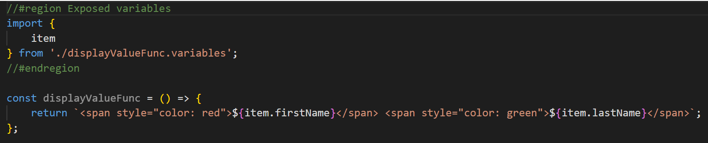
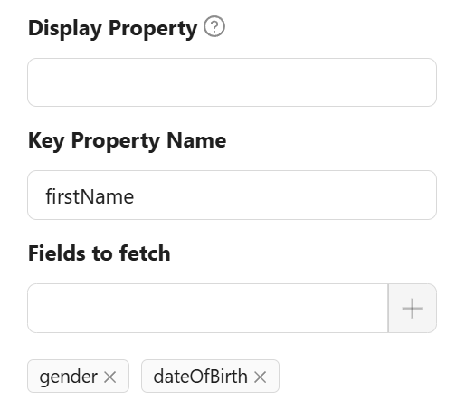

# Autocomplete

import LayoutBanners from './LayoutBanners';

The Autocomplete component enhances user input fields with dynamic suggestions based on the user's typing.It is an input box with text hints, and users can type freely. The keyword is aiding input.


## Properties

The following properties are available to configure the behavior of the component from the form editor (this is in addition to [common properties](/docs/front-end-basics/form-components/common-component-properties)).

### Data

#### **Disable Search** ``boolean``
Hides the search bar and disables real-time filtering.

#### **Selection Mode** ``string``
Sets how many options can be selected:

- Single *(default)*
- Multiple

#### **Default Value** `function`  
JavaScript code to compute the initial value.

#### **Data Source Type** `object`  
Choose source for suggestions:
- Entities List *(default)*
- URL

#### **Entity Type** `string`  
Entity to search within.

#### **Data Source URL** `string`  
External data source URL.

#### **Value Prop Name** `string`  
Value property in external source.

#### **Query Param** `string`  
Parameter for search queries.

#### **Entity Filter** `object`  
Filter options using a query builder.

#### **Custom Source URL** `string`  
Custom URL for fetching data.

#### **Value Format** `string`  
How values are formatted:
- Entity Reference *(default)*
- Simple ID
- Custom

#### **Display Value Function** `function`  
Custom display function for values.

#### **Display Property** `object`  
Property used to display selected value.

#### **Display Value Function** `function` (when Value Format is Custom)  
Function to render display text.

#### **Allow Free Text** `boolean` (when Value Format is Simple ID)  
Allow user to type custom text.

#### **Key Value Function** `function` (when Value Format is Custom)  
Function for key value mapping.

#### **Value Function** `function` (when Value Format is Custom)  
Function to get value.

#### **Key Value Function** `function` (when Value Format is Custom)  
Function for key value mapping.

#### **Display Value Function** `function` (when Value Format is Custom)  
Function to render display text.

#### **Filter Selected Function** `function` (when Value Format is Custom)  
Function to filter selected items.

#### **Use Quickview** `boolean`  
Enable modal quickview for selections.

#### **Fields to Fetch** `object`  
Additional fields to load.

#### **Sort By** `object`  
Sorts options by a specified property.

#### **Grouping** `object`  
Groups options by a property.

___

### Validation

#### **Required** `boolean`  
Enforces input before submission.

___

### Appearance

#### **Font** ``object`` 

Customize the dropdown's font family, weight, color, and alignment.

#### **Dimensions** ``object`` 

Specify the size of your component:
- Width, Height
- Min/Max Width and Height
- Overflow behavior

#### **Border** ``object`` 

Personalize the borders:
- Set border width, color, and style
- Round the corners for a softer touch

#### **Background** ``object``

Pick your flavor of background:

- Color
- Gradient
- Image URL
- Uploaded Image
- Stored File

Also tweak background size, position, and repeat behavior.

#### **Shadow** ``object`` 

Give depth with adjustable shadows:

- Offset, Blur, Spread, Color

#### **Margin & Padding** ``object``

Fine-tune spacing inside and around the component.

####  **Custom Styles** ``function``

Inject your own CSS styles via JavaScript (must return a style object).

___

# Autocomplete examples

The Autocomplete component can work with two types of list sources - standard Entities endpoints (`Entities List` Data Source Type) and custom endpoints (`URL` Data Source Type). Custom endpoints should support `string term` parameter for filtering data. The responses from the endpoints should be either a standard response with a list of entities

```ts
export interface ITableDataResponse {
    readonly totalCount: number;
    readonly items: object[];
}
```

or an array.

## • `Entities List` Data Source Type

<LayoutBanners url="https://app.guideflow.com/embed/6kw11ndfzp" type={1}/>

If the standard entities endpoint is used, the backend returns list of entities with items in the following format

```js
{
    "id": "d519b92f-86e9-4f0f-8df4-00aae8a43158",
    "_className": "Shesha.Domain.Person",
    "_displayName": "Alex Stephens"
}
```

If you specify a value for **Display Property**, the received data will contain an additional field that will be used as name of items. For example **Display Property** = `firstName`

```js
{
    "id": "d519b92f-86e9-4f0f-8df4-00aae8a43158",
    "_className": "Shesha.Domain.Person",
    "_displayName": "Alex Stephens",
    "firstName": "Alex"
}
```

### • `Entity reference` Value format

If you will use `Entity reference` Value format then the selected value will be stored in the model as

```js
{
    "autocomplete": {
        "id": "d519b92f-86e9-4f0f-8df4-00aae8a43158",
        "_className": "Shesha.Domain.Person",
        "_displayName": "Alex Stephens"
    }
}
```

### • `Simple Id` Value format

If you will use `Simple Id` Value format then the selected value will be stored in the model as

```js
{
    "autocomplete": "d519b92f-86e9-4f0f-8df4-00aae8a43158"
}
```

If you specify a value for **KeyProperty**, the received data will contain an additional field that will be used as selected value. For example **Display Property** = `firstName`, **Key Property** = `lastName`

```js
// Received item
{
    "id": "d519b92f-86e9-4f0f-8df4-00aae8a43158",
    "_className": "Shesha.Domain.Person",
    "_displayName": "Alex Stephens",
    "firstName": "Alex",
    "lastName": "Stephens"
}

// Selected value
{
    "autocomplete": "Stephens"
}
```

## • `URL` Data Source Type

<LayoutBanners url="https://app.guideflow.com/embed/ok8eev2fxk" type={1}/>

### • `Simple Id` Value format

Standard format of response from custom endpoints

```js
// Received item
{
    "value": 1,
    "displayText": "First option"
}

// Selected value
{
    "autocomplete": 1
}
```

But you can use source with any other format of items. To do this, you need to specify in **Display Property** the field that will be used as the name of items and in **Key Property** the field that will be used as the value.

## • General Display value Function

Regardless of the selected value of **Data Source type** you can use **Display value Function**. This is a script to get the displayed name of items. In this script, you can use any field from the received data. For `Entities list` mode, you can request additional fields using the  `Fields to fetch` setting. For `URL` mode you can use only fields provided by the endpoint.




## • General `Custom` Value format

Regardless of the selected value of **Data Source type** you can use `Custom` **Value format**.

Without additional settings or with only **Display Property** and **Key Property** settings, this mode is similar to `SimpleId` **Value format**.

**To** **set** up a **custom** **mode**, you **can** **use** the following **methods**:

**Value Function** - uses Item value received from the backend to return value in custom format.

**Key value Function** - uses value in custom format to return key value. Used with **Key Property Name** to create filter for request data

**Display value Function** - gets the display name of items. You can use **Display Property** instead or leave they empty to use standard display properties

### Example

Configure Autocomplete to get additional fields (`firstName`, `gender`, `dateOfBirth`). Use `firstName` as Key property.



Configure **Value function** to return value in custom format

```ts
const outcomeValueFunc = () => {
    return `${item.firstName}|${item.gender}|${item.dateOfBirth}`
};
```

Now, when selecting a list item, the value will have a custom format.

```js
{
  "autocomplete": "Alex|1|2088-06-06T00:00:00"
}
```

Configure **Key value function** to get correct Key value (needed to get correct item from the backend). Take first element from splitted value as this is `firstName`

```ts
const keyValueFunc = () => {
    return value?.split('|')[0];
};
```

### Advanced filtering

In the example above, we use only one `firstName` field. However, one field may not be enough to uniquely identify an item. For more accurate identification, you can use **Filter selected Function**. This method returns a filter in [JsonLogic](https://jsonlogic.com/) format for more accurate selection of an element on the backend.

```ts
const filterSelectedFunc = () => {
    const parts = value?.split('|');
    if (parts.length < 2)
        return null;
    return {
        and: [
            {"==":[{"var":"firstName"}, parts[0]]},
            {"==":[{"var":"gender"}, Number(parts[1])]}
        ]
    };
};
```

This script use two fields as a key.