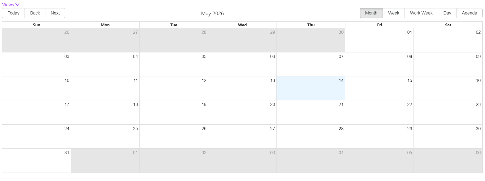
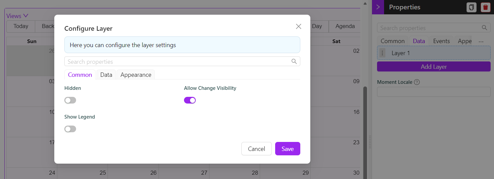

# Calendar

The Calendar component displays scheduled events on an interactive calendar view. It supports multiple data layers - each layer is a separate data source that contributes its own events to the same calendar. Use it to visualise time-based data such as bookings, tasks, meetings, or any entity that has a start and end date.



---

## Common

The following properties are available to configure the behaviour of the component from the form editor (this is in addition to [common properties](/docs/front-end-basics/form-components/common-component-properties)).

___

### Display

#### **Default Display Period** `object`

Controls which view options are available in the calendar toolbar. Select one or more views to show. The first selected view becomes the default when the calendar loads.

| Option | Description |
|---|---|
| `Month` | Shows all events in a monthly grid |
| `Week` | Shows events across a 7-day week |
| `Work Week` | Shows events across Monday to Friday only |
| `Day` | Shows events for a single day |
| `Agenda` | Shows a scrollable list of upcoming events |

:::note
All five views are enabled by default. Remove any views you do not need to keep the toolbar uncluttered for your users.
:::

___

### Date Range

#### **Min Date** `string`

The earliest date the user can navigate to. Dates before this value are not selectable. Leave blank to allow navigation to any past date.

#### **Max Date** `string`

The latest date the user can navigate to. Dates after this value are not selectable. Leave blank to allow navigation to any future date.

#### **External Start Date** `function`

A JavaScript expression that sets the calendar's initial start date at runtime. Use this when the starting date should be derived from form data or a context variable rather than being a fixed value.

**Example - Set the start date from a form field:**

```javascript
return data.contractStartDate;
```

#### **External End Date** `function`

A JavaScript expression that sets the calendar's initial end date at runtime. Works the same way as External Start Date.

**Example - Set the end date 30 days after the start date:**

```javascript
return moment(data.contractStartDate).add(30, 'days').toISOString();
```

---

## Data

The Data tab configures the calendar's **layers**. A layer is a named data source that provides events to the calendar. You can add multiple layers to display different types of events together on the same calendar - for example, a Tasks layer and a Meetings layer shown side by side.

Each layer is configured independently with its own data source, field mappings, colour, and event handlers.

### Adding a Layer

Click **Layer Selector Settings Modal** to open the layer configuration panel, then add one or more layers.


___

### Layer - Common

#### **Hidden** `boolean`

Hides this layer from the calendar. Hidden layers do not fetch data.

#### **Allow Change Visibility** `boolean`

When enabled, the user can toggle this layer on and off from the calendar UI using the legend. Requires Show Legend to also be enabled.

#### **Show Legend** `boolean`

Displays a legend entry for this layer. Users can see which colour belongs to which layer.

#### **Name** `string`

The label shown in the legend for this layer. Only visible when Show Legend is enabled. Required when Show Legend is on.

___

### Layer - Data

#### **Data Source** `object`

Defines how the layer fetches its events.

| Option | When to use |
|---|---|
| `Entity` | Fetch events from a Shesha entity using the standard endpoint |
| `URL` | Fetch events from a custom API endpoint |

#### **Entity Type** `string`

The Shesha entity to load events from. Required when Data Source is `Entity`.

#### **Entity Filter** `object`

A query builder filter applied when fetching events for this layer. Use this to limit which records appear - for example, only show tasks assigned to the current user. Available when Data Source is `Entity`.

#### **Endpoint** `string`

The custom API endpoint to call when Data Source is `URL`. Select from available endpoints in the autocomplete.

#### **Event Name** `string`

The text to display on each event block in the calendar. Supports Mustache syntax to include field values from the fetched record.

**Example - Show a person's name and task status:**

```
{{firstName}} {{lastName}} - {{status}}
```

:::tip
Any field referenced in the Event Name template must either be returned automatically by the entity endpoint or added to Additional Fields To Fetch.
:::

#### **Event Start Time** `object`

The entity property that holds the event's start date and time. Required. Must be a date/time field on the selected entity.

#### **Event End Time** `object`

The entity property that holds the event's end date and time. Required. Must be a date/time field on the selected entity.

#### **Avoid Overfetching** `boolean`

When enabled, the layer only fetches the fields you explicitly list rather than the full entity. Enable this on entities with many properties to improve load performance.

#### **Additional Fields To Fetch** `object`

The list of entity properties to fetch in addition to the Event Start Time, Event End Time, and any fields used in the Event Name template. Only available when Avoid Overfetching is enabled.

___

### Layer - Appearance

#### **Event Color** `object`

The background colour of event blocks for this layer. Each layer should use a distinct colour so users can tell layers apart at a glance. Supports JavaScript expressions for dynamic colouring.

#### **Show Icon** `boolean`

Displays an icon on each event block for this layer.

#### **Pick Icon** `function`

A JavaScript expression that returns the icon to display on each event. Available when Show Icon is enabled. Use the `item` variable to access the current event's data.

**Example - Return a different icon based on event type:**

```javascript
return item.type === 'meeting' ? 'CalendarOutlined' : 'CheckCircleOutlined';
```

#### **Icon Color** `object`

The colour of the icon on event blocks. Available when Show Icon is enabled.

#### **On Select** `function`

Action that runs when the user clicks an event in this layer. Use this to open a details form, run a workflow, or show a modal.

#### **On Double Click** `function`

Action that runs when the user double-clicks an event in this layer.

___

### Moment Locale

#### **Moment Locale** `string`

Sets the locale used to format dates and times on the calendar. Uses standard Moment.js locale codes. Leave blank to use the application's default locale.

| Example value | Locale |
|---|---|
| `en` | English (US) |
| `en-gb` | English (UK) |
| `fr` | French |
| `de` | German |
| `af` | Afrikaans |

---

## Events

#### **On Slot Click** `function`

Action that runs when the user clicks on an empty time slot in the calendar - that is, a date or time cell that does not have an event on it. Use this to open a create form pre-filled with the clicked date.

#### **On View Change** `function`

Action that runs when the user switches between calendar views (for example, from Month to Week). Use this to react to the change, such as adjusting what data is shown based on the new view period.

---

## Appearance

#### **Selected Date Color** `object`

The highlight colour shown on the date the user has selected. Defaults to the application's primary colour.

#### **Width** `string`

The width of the calendar. Accepts any CSS unit. Defaults to `100%`.

#### **Height** `string`

The height of the calendar. Accepts any CSS unit. Defaults to `500px`.

:::tip
Set a fixed height in pixels when the calendar is inside a scrollable panel. A height of `100%` requires the parent container to have a defined height, otherwise the calendar may collapse to zero height.
:::
