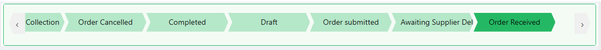

# Chevron

The Chevron is a simple arrow-like symbol (›) that helps users navigate through the application. Think of it as a visual signpost that shows users where they can click or what will happen next.

## Properties

The following properties are available to configure the behavior of the component from the form editor (this is in addition to [common properties](/docs/front-end-basics/form-components/common-component-properties)).

### Data

#### **Reference List** `object`
Defines which reference list is used to drive the Chevron items. Ensure the list is properly selected to reflect updates.

#### **Items** `object`
A selector for managing specific items from the chosen reference list.

___

### Appearance

#### **Show Icons** `boolean`
Toggle visibility of icons next to items.

