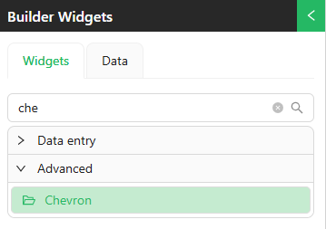
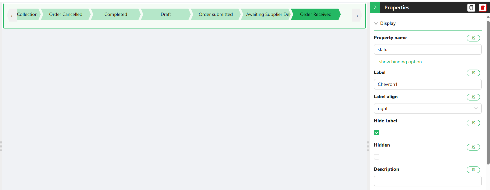
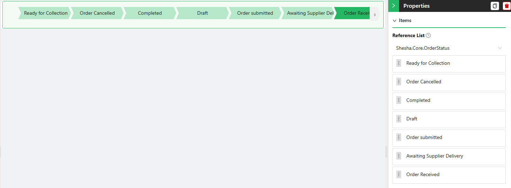
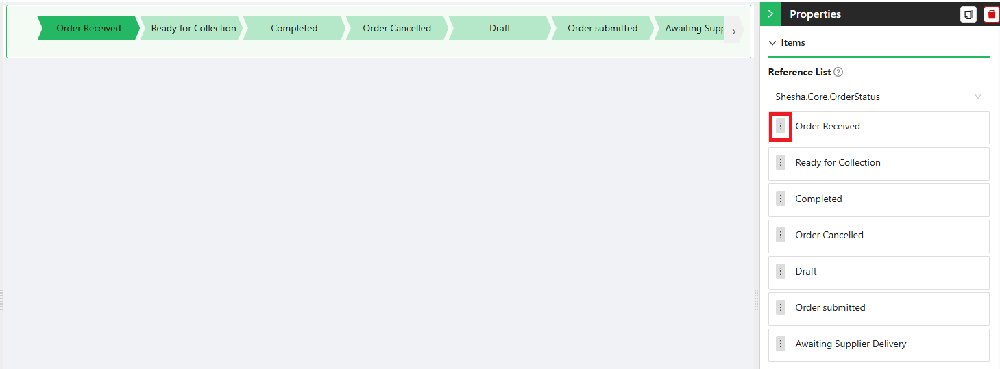
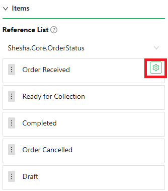
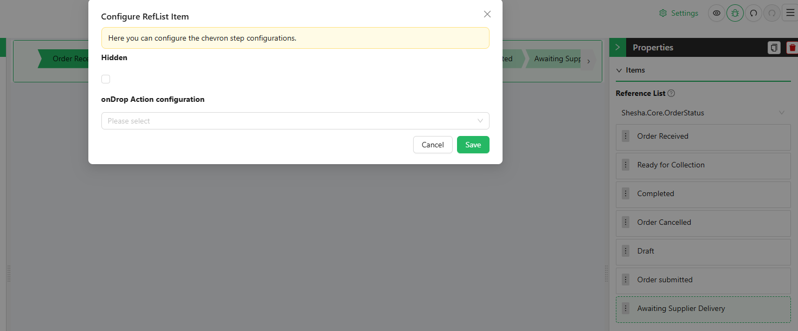
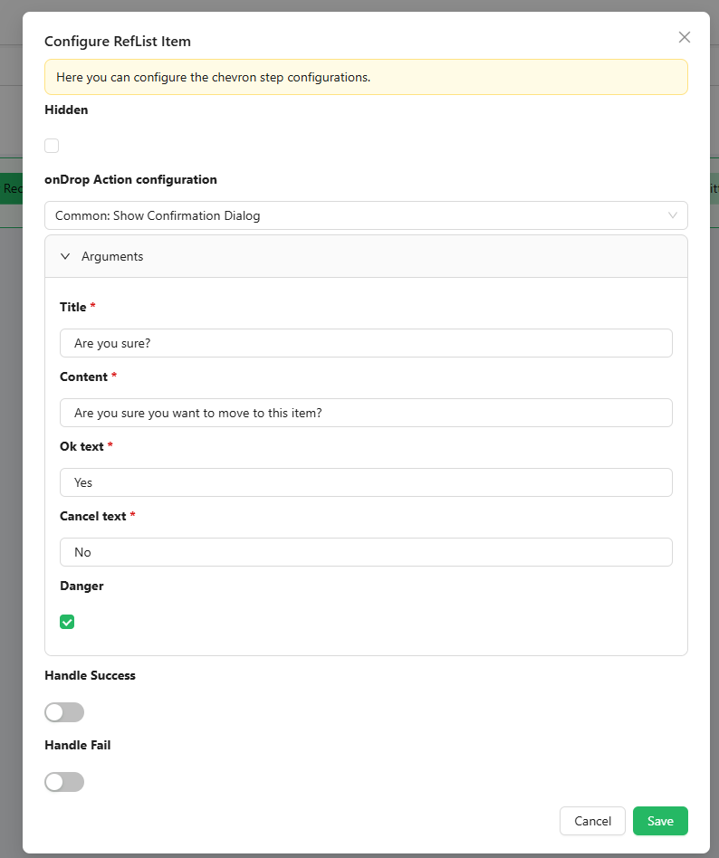
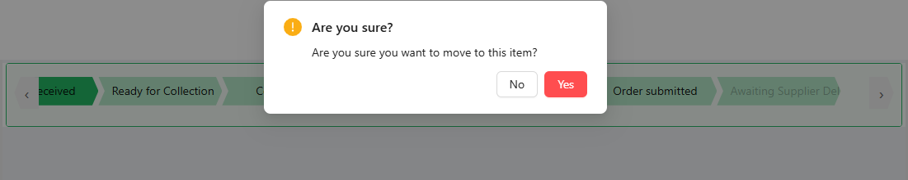

# Chevron Component

## Overview

A chevron is a simple arrow-like symbol (›) that helps users navigate through your application. Think of it as a visual signpost that shows users where they can click or what will happen next.

## Features

- **Customizable Items**: Adjust chevron items to suit your specific workflow and project needs.
- **Customizable Styles**: Modify the appearance of the Chevron board to fit your preferences, from colors, visibility, fonts, and icons.
- **Configured Actions**: Control behaviour or acceptance criteria at each step.

## How to Configure the Component

### Location of the Component

The Chevron Component can be found under the **Advanced** group in the form designer.

### Configuration Steps

Follow the steps below to configure the Chevron Component:

#### 1. **Add the Component**
- Navigate to the **Advanced** group in your form designer.
- Drag and drop the **Chevron Component** onto your form.

#### Display Section

These are common properties, which are clearly explained in the [Common Properties and Events Section](/docs/front-end-basics/form-components/common-component-properties).

The `Property Name` configuration gives the component context on which step is currently action. In this example, I have binded my component to `status`, which currently has a value of 1. This will highlight the relevent reflist item within the list.

#### Items Section

- **Reference List**: Select the reference list that will  be the source of your items. For instance, you might choose a reference list like `orderStatus` to track status of the current order and enforce actions upon each stage (e.g., `Ready for collection`, `Order Cancelled`, `Completed`,`Draft`,`Order Submitted`,`Order Recieved`).

   - Once the reference list is selected, all items within that list will be displayed as individual chevron components.

      

   - You can reorder the columns based on your preferences to better match your workflow by easily grabbing onto the drag handle and reorder to your project specifications.

      

   - Each column will display a gear icon when hovered over, allowing you to configure actions specific to that column. For instance, you can define what should happen when a user clicks to move forward, or move back to a certain step within the chevron, or choose to hide certain items.

      

   - When you click the gear icon, a configuration window will appear, enabling you to define specific actions for each item.

     

     - These item specific configurations include:

        - **Hidden** - When toggled to `true`, this hides the item from the rendered list.
        - **Action Configuration** - This handles the behaviour of the item when clicked. More specific explanations of this can be found in the [Action Configurations Section](/docs/front-end-basics/configured-views/action-configurations)

        

        

#### Style Section
  **Color Source**
   - This property lets user decide where to source color for the rendered items. The active step will be of full opacity, while the inactive colors will be a dimmed down version of the selected color option. 
   - Options: 
      - Primary Color
      - Custom Color
      - From RefList Item

   **Font Color**
   - This property lets you set the font color for the chevron items

   **Show Icons?**
   - If the reference list has icons associated with its items, you can display these icons on the left side of the header when this option is enabled.

   **Width**
   - Define the component width

   **Height**
   - Define the component height

   **Font Size**
   - This property allows you to adjust the font size of the text in the component