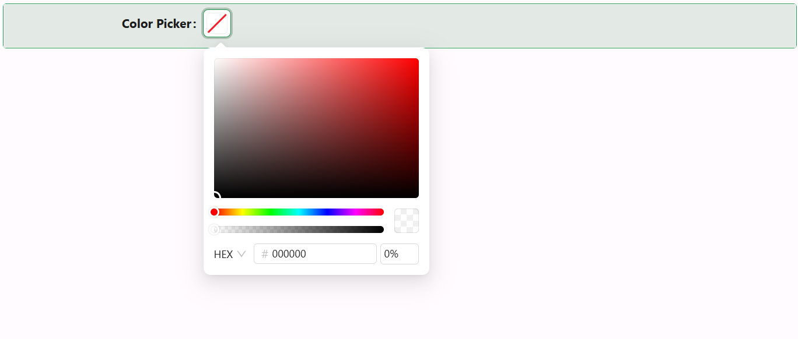

# Color Picker

The Color Picker component enables users to select colors from a visual palette or enter their own values. It supports custom titles, hex/rgb display, opacity control, and full design customization.

## Properties

The following properties are available to configure the behavior of the component from the form editor (this is in addition to [common properties](/docs/front-end-basics/form-components/common-component-properties)).

### Common
#### Property Name `string`
Unique identifier for binding the color picker to form data.

#### Label `object`
Toggles the visibility of the label.

#### Tooltip `string`
Displays help text when hovering over the component.

#### Edit Mode `string`
Specifies the input's interactivity:
- **Editable**: Users can interact with and select a color.
- **Read Only**: Display only.
- **Inherited** *(default)*: Inherits from form settings.

#### Hide `boolean`
Controls whether the component is visible.

___

### Main Settings

#### Title `string`
Label shown above the color picker.

#### Allow Clear `boolean`
Enables a clear button to reset the selected color.

#### Show Color Code `boolean`
Displays the hex or RGB value alongside the color preview.

#### Disable Opacity `boolean`
Disables the ability to select transparency or alpha values.

___

### Appearance

#### Size `object`
Size of the component:
- **Small**
- **Middle** *(default)*
- **Large**

#### **Margin & Padding** ``object``

Fine-tune spacing inside and around the component.

####  **Custom Styles** ``function``

Inject your own CSS styles via JavaScript (must return a style object).