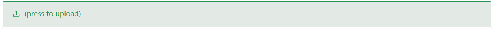

# Image

The Image component allows you to display visuals using various sources like URLs, and stored files. It comes with powerful preview settings, flexible sizing, object-fit controls, and design filters for a complete image experience.

## Properties

The following properties are available to configure the behavior of the component from the form editor (this is in addition to [common properties](/docs/front-end-basics/form-components/common-component-properties)).

### Common
#### Property Name `string`
Unique key binding the component to form data.

#### Label `boolean`
Choose whether the image label is shown.

#### Alt Text `string`
Alternative text shown when the image fails to load.

#### Tooltip `string`
Tooltip text displayed on hover.

#### Edit Mode `object`
Controls interactivity:
- **Editable**: User can change/upload image.
- **Read Only**: Image is view-only.
- **Inherited** (default): Inherits from the parent form.

#### Allow Preview `boolean`
Enable an image preview popup when clicked.

#### Allowed File Types `object`
Specify file types allowed for upload (e.g. `.jpg`, `.png`, `.gif`).

#### Image Source Type `object`
Select the source of the image:
- **Stored File**
- **URL**
- **Base64**

___

### Validation
#### Required `boolean`
Mark the image as required to enforce submission validation.

___

### Appearance

#### Dimensions `object`
Control width, height, and size constraints with CSS units.

#### Object Fit `object`
How the image should be resized:
- **Cover**
- **Contain**
- **Fill**
- **Auto**

#### Object Position `object`
Sets the alignment of the image content (e.g. `top left`, `center center`).

#### Filter `object`
Apply visual filters:
- **None**
- **Grayscale**
- **Sepia**
- **Blur**
- **Brightness**
- **Contrast**
- **Hue-Rotate**
- **Invert**
- **Saturate**

#### Filter Intensity `number`
Level of filter application.

#### Opacity `number`
Controls transparency of the image.

#### Border `object`
Configure border style, width, radius, and color.

#### Shadow `object`
Apply a shadow with offset, blur, spread, and color settings.

#### Margin & Padding `object`
Fine-tune spacing around and inside the component.

#### Custom Style `function`
Write a script returning a `CSSProperties` object to dynamically style the image.

