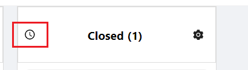
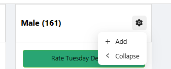
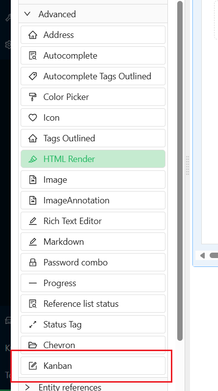
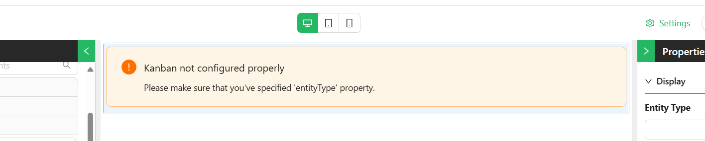
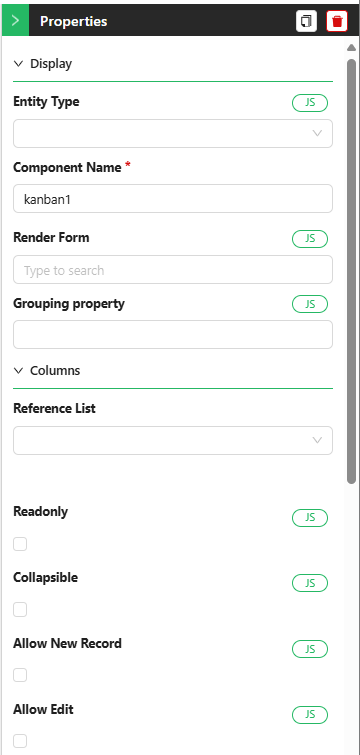
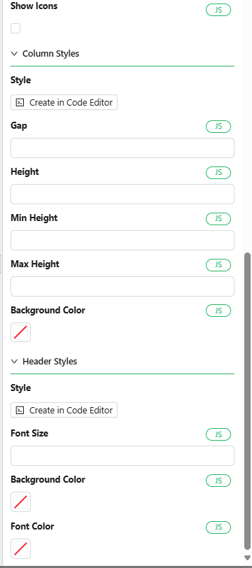
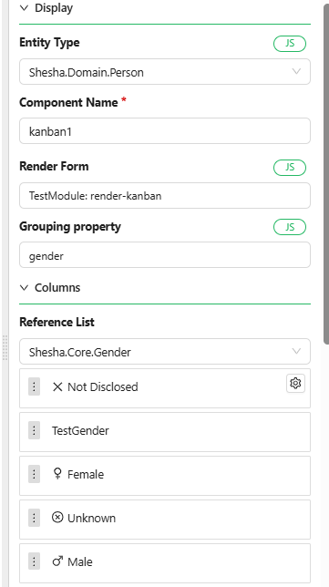
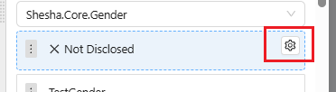
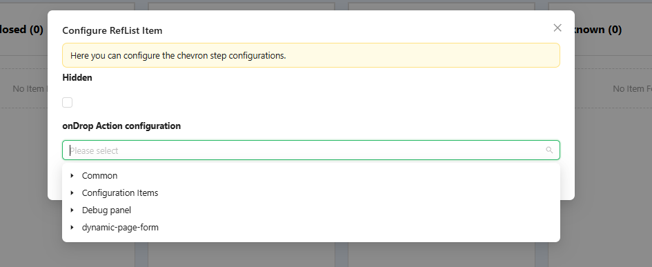

# Kanban

The Kanban board is a visual project management tool that helps teams organize tasks and track their progress. It provides a clear overview of the status of each task, allowing users to move task cards between columns such as "To Do," "In Progress," and "Done."

## Properties

The following properties are available to configure the behavior of the component from the form editor (this is in addition to [common properties](/docs/front-end-basics/form-components/common-component-properties)).

### Common

#### **Render Form** `object`  
The modal form that opens when a card is clicked. (*Required*)

#### **Grouping Property** `string`  
Field in your data model used to categorize items into columns. (*Required*)

#### **Readonly** `boolean`  
Disables drag-and-drop and editing capabilities.

#### **Allow Delete** `boolean`  
Toggles the ability to remove cards from the board.

#### **Show Icons** `boolean`  
Toggles icon visibility on card headers.

#### **Allow New Record** `boolean`  
Allows users to add new items to the board.

 

 - **Create Form** 
This option will appear when `Allow New Record` is enabled. You can select the form that will be used to create new tasks.

#### **Allow Edit** `boolean`  
Enables in-place card editing or modal editing.

 - **Edit Form**: This option will appear when `Allow Edit` is enabled. You can select the form that will be used to edit existing tasks.

#### **Collapsible** `boolean`  
If this option is enabled, you will be able to collapse each column to save space and reduce visual clutter.
___

### Appearance

   - **Gap**: This property specifies the space between columns, giving you control over the layout and spacing   
___

### Data
#### **Reference List** `object`  
The list used to define columns on the board. Re-select if reference list items are modified.

#### **Items** `object`  
Selector for customizing which reference list items appear as columns.
___

## Features

- **Drag and Drop**: Easily move cards between columns with a simple drag-and-drop interface.
- **Customizable Columns and Cards**: Adjust columns and cards to suit your specific workflow and project needs.
- **Collapsible Cards**: Minimize individual cards to reduce clutter on the board.
- **Customizable Styles**: Modify the appearance of the Kanban board to fit your preferences, from colors to fonts.

## How to Configure the Component

### Location of the Component

The Kanban Component can be found under the **Advanced** group in the form designer.

### Configuration Steps

Follow the steps below to configure the Kanban Component:

#### 1. **Add the Component**
- Navigate to the **Advanced** group in your form designer.
- Drag and drop the **Kanban Component** onto your form.

   

#### 2. **Configure the Component Properties**

   
   

#### Display Section

- **Entity Type**: Choose the entity from which the component will pull data. This selection will enable auto-complete functionality for other properties. For example, you might select the entity `Person` if your tasks are related to people.
  
- **Component Name**: Provide a unique name for this component, especially if more than one Kanban board is being used within the same form. This helps in identifying and managing different boards.

- **Render Form**: Select the form that will display the details for each task. This form defines how individual tasks will be rendered on the board.

- **Grouping Property**: Choose the property by which tasks will be grouped into columns. This property should typically be of the type `reference-list` (e.g., `status`, `priority`, or `gender`).

- **Max Result Count**: Specify the maximum number of tasks to be fetched from the database and displayed on the board.

#### Columns Section

- **Reference List**: Select the reference list that will categorize the tasks. For instance, you might choose a list like `status` to organize tasks by their current state (e.g., `To Do`, `In Progress`, `Done`).

   - Once the reference list is selected, all items within that list will be displayed as columns.

      

   - You can reorder the columns based on your preferences to better match your workflow.

   - Each column will display a gear icon when hovered over, allowing you to configure actions specific to that column. For instance, you can define what should happen when a task is dropped into a particular column, or choose to hide certain columns.

     

   - When you click the gear icon, a configuration window will appear, enabling you to define specific actions for each column.

     

After this, your Kanban board should have a basic structure and functionality, though without custom styling applied yet.

