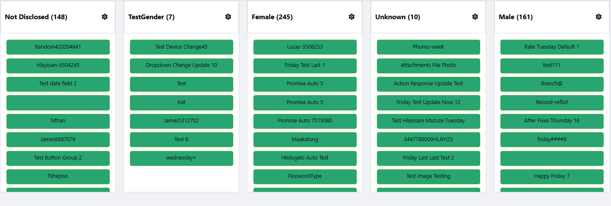
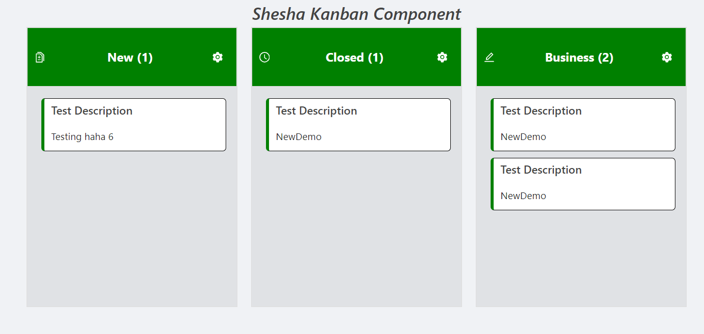

# Kanban Component

## Overview

A Kanban board is a visual project management tool that helps teams organize tasks and track their progress. It provides a clear overview of the status of each task, allowing users to move task cards between columns such as "To Do," "In Progress," and "Done."

## Features

- **Drag and Drop**: Easily move cards between columns with a simple drag-and-drop interface.
- **Customizable Columns and Cards**: Adjust columns and cards to suit your specific workflow and project needs.
- **Collapsible Cards**: Minimize individual cards to reduce clutter on the board.
- **Customizable Styles**: Modify the appearance of the Kanban board to fit your preferences, from colors to fonts.

## How to Configure the Component

### Location of the Component

The Kanban Component can be found under the **Advanced** group in the form designer.


### Configuration Steps

Follow the steps below to configure the Kanban Component:

#### 1. **Add the Component**
- Navigate to the **Advanced** group in your form designer.
- Drag and drop the **Kanban Component** onto your form.

   

#### 2. **Configure the Component Properties**

   
   

#### Display Section

- **Entity Type**: Choose the entity from which the component will pull data. This selection will enable auto-complete functionality for other properties. For example, you might select the entity `Person` if your tasks are related to people.
  
- **Component Name**: Provide a unique name for this component, especially if more than one Kanban board is being used within the same form. This helps in identifying and managing different boards.

- **Render Form**: Select the form that will display the details for each task. This form defines how individual tasks will be rendered on the board.

- **Grouping Property**: Choose the property by which tasks will be grouped into columns. This property should typically be of the type `reference-list` (e.g., `status`, `priority`, or `gender`).

- **Max Result Count**: Specify the maximum number of tasks to be fetched from the database and displayed on the board.

#### Columns Section

- **Reference List**: Select the reference list that will categorize the tasks. For instance, you might choose a list like `status` to organize tasks by their current state (e.g., `To Do`, `In Progress`, `Done`).

   - Once the reference list is selected, all items within that list will be displayed as columns.

      

   - You can reorder the columns based on your preferences to better match your workflow.

   - Each column will display a gear icon when hovered over, allowing you to configure actions specific to that column. For instance, you can define what should happen when a task is dropped into a particular column, or choose to hide certain columns.

     

   - When you click the gear icon, a configuration window will appear, enabling you to define specific actions for each column.

     

After this, your Kanban board should have a basic structure and functionality, though without custom styling applied yet.



- **Read-only**: If this option is checked, no actions will be performed on the Kanban board. It will function in a "view-only" mode.
  
- **Collapsible**: If this option is enabled, you will be able to collapse each column to save space and reduce visual clutter.

- **Allow New Record**: If checked, users will be able to add new tasks to any column.

    

    - **Create Form**: This option will appear when `Allow New Record` is enabled. You can select the form that will be used to create new tasks.

- **Allow Edit**: If checked, users will be able to edit tasks directly on the Kanban board.

    

    - **Edit Form**: This option will appear when `Allow Edit` is enabled. You can select the form that will be used to edit existing tasks.

- **Allow Delete**: If checked, users will have the ability to delete tasks from the board.

- **Show Icons**: If the reference list has icons associated with its items, you can display these icons on the left side of the header when this option is enabled.

    

#### Style Section

   ##### Column Style 

   - **Style**: This property allows you to apply custom CSS to modify the appearance of each column. You can define borders, padding, margins, and other CSS styles.

     For example:
     ```css
     const handler = () => {
           return {
             border: '2px solid red'
           };
        };
     ```

   - **Gap**: This property specifies the space between columns, giving you control over the layout and spacing.

   - **Height, MinHeight, MaxHeight**: Control the column height.
   - **Width, MinWidth, MaxWidth**: Define the column width.

   - **Background Color**: This property is used to specify the background color for each column, allowing for easy visual differentiation.

   ##### Header Style 
   
   - **Style**: You can apply custom CSS to style the header of each column. This includes borders, padding, or any other CSS property to change the appearance.

     Example:
     ```css
     const handler = () => {
           return {
             border: '2px solid blue'
           };
        };
     ```

   - **Font Size**: This property allows you to adjust the font size of the text in the header.

   - **Font Color**: This property lets you set the font color for the header items.

   - **Background Color**: This property defines the background color for the header, which can be customized for each column.


 ##### Final Result
      Here is an example of a fully styled Kanban board:

      
---
