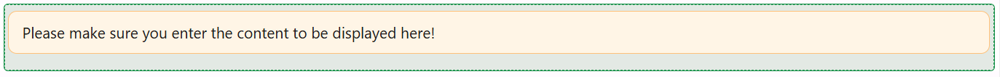

# Markdown

The Markdown component allows you to display richly formatted text using Markdown syntax. Whether you're sharing documentation, notes, or styled content, it provides a lightweight yet powerful editor and viewer.

## Properties

The following properties are available to configure the behavior of the component from the form editor (this is in addition to [common properties](/docs/front-end-basics/form-components/common-component-properties)).

### Common

#### **Content** `function`
Markdown-formatted text to display in the component. Written in Markdown language using a built-in code editor.

