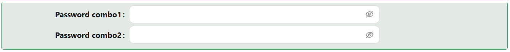

# Password Combo

The Password Combo component provides a secure and user-friendly way to capture passwords and their confirmation. It includes placeholder and tooltip support for both fields, detailed validation options, and fully customizable styling.

## Properties

The following properties are available to configure the behavior of the component from the form editor (this is in addition to [common properties](/docs/front-end-basics/form-components/common-component-properties)).

### Validation

#### **Message** `string`
Custom validation message to show when input does not meet rules.

#### **Validator** `function`
Custom JavaScript-based validation logic. Should return a Promise.