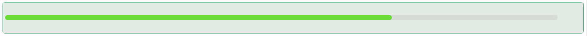

# Progress

The Progress component is a visual indicator that represents task completion, processes, or status in either linear or circular form. It supports various styles, types, and customization options for a dynamic and informative user interface.

## Properties

The following properties are available to configure the behavior of the component from the form editor (this is in addition to [common properties](/docs/front-end-basics/form-components/common-component-properties)).

### Common
#### Property Name `string`
Unique identifier used to bind the component to the form data model.

#### Label `boolean`
Toggles display of the label.

#### Tooltip `string`
A hover-over message providing extra guidance.

#### Percent `number`
Sets the current progress percentage (0 to 100).

#### Type `object`
Visual type of the progress bar:
- **Line** *(default)*: Horizontal bar.
- **Circle**: Circular progress.
- **Dashboard**: Semi-circular gauge-like view.

#### Status `object`
Indicates the progress status:
- **Normal**
- **Active**
- **Success**
- **Exception**

#### Show Info `boolean`
Whether to display the percentage inside the progress bar.

#### Hide `boolean`
Control visibility of the component.

___

### Appearance
#### Stroke Color `object`
The active bar color.

#### Trail Color `object`
The background (trail) color of the progress track.

#### Stroke Linecap `object`
Line ending style:
- **Round** *(default)*
- **Butt**
- **Square**

#### Stroke Width `number`
Thickness of the progress stroke (default is 6).

#### Margin & Padding `object`
Fine-tune spacing around and inside the component.

#### Custom Style `function`
Inject your own CSS styles via JavaScript (must return a style object).