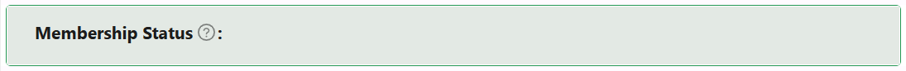

# Reference List Status

The Reference List Status component displays values from a reference list, offering optional icons and display names.

## Properties

The following properties are available to configure the behavior of the component from the form editor (this is in addition to [common properties](/docs/front-end-basics/form-components/common-component-properties)).

### Common
#### Property Name `string`
A unique key that links the selected reference list value to your data model.

#### Label `object`
Determines whether the field label is shown or hidden.

#### Tooltip `string`
Hover text that provides additional context about the component.

#### Reference List `object`
The ID of the reference list that drives the value set for this component. This is a required field.

#### Show Reflist Item Name `boolean`
*When enabled (default)*, displays the name of the selected item from the reference list.

#### Show Icon `boolean`
Toggle to display an icon to the left of the DisplayName.

#### Hide `boolean`
Control the visibility of the component.

___

### Appearance
#### Font
Customize how text looks with the following options:
- **Family**: Choose from system or web-safe fonts.
- **Size**: Set the font size using CSS units.
- **Weight**: Adjust text thickness (light, normal, bold, etc.).
- **Color**: Pick the text color.
- **Align**: Set horizontal alignment (left, center, right).

#### Dimensions `string`
Set width, min/max width constraints using any CSS units.

#### Border `object`
Configure border style, width, radius, and color.

#### **Background** ``object``

Pick your flavor of background:

- Color
- Gradient
- Image URL
- Uploaded Image
- Stored File

#### Shadow `object`
Apply a shadow with offset, blur, spread, and color settings.

#### Margin & Padding `object`
Fine-tune spacing around and inside the component.

#### Custom Style `function`
Inject your own CSS styles via JavaScript (must return a style object).

