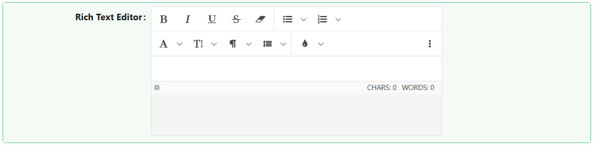

# Rich Text Editor
The Rich Text Editor component allows users to write and format content with a WYSIWYG interface. It supports various toolbars, plugins, and storage options, making it ideal for complex input scenarios such as note-taking, content creation, or documentation.

## Properties

The following properties are available to configure the behavior of the component from the form editor (this is in addition to [common properties](/docs/front-end-basics/form-components/common-component-properties)).

### Data

#### **Save Height In Storage** `boolean`  
Persists the editor height in browser storage.

#### **Save Mode In Storage** `boolean`  
Persists the active editor mode (e.g., code view).

#### **Ask Before Paste HTML** `boolean`  
Prompts users when pasting HTML.

#### **Ask Before Paste From Word/Excel** `boolean`  
Prompts when pasting from Word or Excel.

#### **Default Insert Method** `object`  
Defines how pasted content is inserted:
- Insert as HTML
- Insert cleared HTML
- Insert as plain text
- Insert only text

#### **Show Toolbar** `boolean`  
Toggles the main formatting toolbar. *(default: true)*

#### **Text Icons** `boolean`  
Display text instead of icons.

#### **Presets** `object`  
Defines initial editor configuration:
- None
- Inline Mode

#### **Size Of Icons** `object`  
Sets icon size:
- Tiny
- Extra small
- Middle
- Large

#### **Sticky Toolbar** `boolean`  
Makes the toolbar stick to the top during scroll.

#### **Auto Focus** `boolean`  
Editor focuses automatically on load.

#### **Use Search** `boolean`  
Enable or disable in-editor search.

#### **Iframe Mode** `boolean`  
Renders the editor inside an iframe.

#### **Spell Check** `boolean`  
Enables browser-based spell checking.

#### **Direction** `object`  
Text direction:
- Auto *(default)*
- rtl
- ltr

#### **Element That Will Be Created On Enter** `object`  
Controls what tag is created on Enter:
- Break (BR)
- Paragraph (P)
- Block (DIV)

#### **Default Mode** `string`  
Initial mode of editor:
- WYSIWYG *(default)*
- Source code
- Split code

#### **Show Characters Counter** `boolean`  
Toggles live character count.

#### **Show Words Counter** `boolean`  
Toggles live word count.

#### **Show Path To Selected Element** `boolean`  
Shows the DOM path to the selected element.

#### **Insert Image As Base64 URI** `boolean`  
Stores images as base64 strings.

#### **Disabled Plugins** `array`  
List of Jodit plugins to disable.

___

### Appearance

#### **Theme** `string`  
Choose between:
- Default *(default)*
- Dark

#### **Auto Height / Width** `boolean`  
Enable automatic sizing.