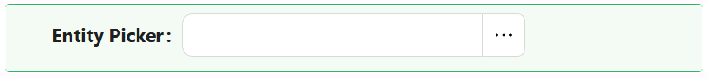

# Entity Picker

An entity is any record from your data model, such as a Person, Product, or Order. The Entity Picker component lets a user find and select one of those records from a searchable list, instead of typing a raw ID by hand. It supports both single and multiple selection modes, and gives you deep customization for filtering, formatting, and modal creation, making it a powerful tool for relational forms.

Use it whenever a field on your form needs to point at another record, for example assigning a manager to an employee, or linking an order to a customer. The component can also let users create a brand new related record on the fly, in a modal dialog, without leaving the current form.



---

## Properties

The following properties are available to configure the behavior of the component from the form editor. These are in addition to the [common properties](/docs/front-end-basics/form-components/common-component-properties) shared by all Shesha components.

---

### Data

#### **Selection Type** `string`

Controls how many records the user can pick.

| Option | Description |
|---|---|
| `Single` | The user can select only one record. This is the default. |
| `Multiple` | The user can select several records at once. |

---

#### **Entity Type** `string`

The entity to pick from, for example `Shesha.Domain.Person`. This setting is required - the picker cannot search or display anything until an entity type is selected.

---

#### **Display Property** `string`

The name of the property on the selected entity that should be shown as its label, for example `fullName`. Leave this empty to use the default display name that the backend defines for the entity.

---

#### **Entity Filter** `object`

A pre-filter, built with the query builder, that limits which records the user can search and select from. For example, filter a Person picker so it only shows people with an `Active` status.

:::note
This field only becomes available once you have selected an **Entity Type**, since the filter needs to know which entity's fields it can filter on.
:::

---

#### **Value Format** `string`

Controls the shape of the value that gets stored in the form's data when a record is selected.

| Option | Description |
|---|---|
| `Simple ID` | Stores just the ID of the selected record as a plain string. This is the default. |
| `Entity reference` | Stores an object containing the record's ID, display name, and entity type. |
| `Custom` | Stores whatever value your own script returns, built from the selected record. |

With `Simple ID`, selecting a person stores:

```js
{
  "manager": "d519b92f-86e9-4f0f-8df4-00aae8a43158"
}
```

With `Entity reference`, the same selection stores:

```js
{
  "manager": {
    "id": "d519b92f-86e9-4f0f-8df4-00aae8a43158",
    "_displayName": "Alex Stephens",
    "_className": "Shesha.Domain.Person"
  }
}
```

#### **ID Value** `function` (when Value Format is Custom)

A script that returns the string ID to use when the form loads an existing value into the picker. The current field value is available as `value`.

#### **Custom Value** `function` (when Value Format is Custom)

A script that returns the value to store on the form when the user selects a record. The selected record is available as `value`.

---

#### **Columns** `object`

Configures which columns appear in the picker's selection list, so users can see and search by more than just the display name. Add a column for each property on the entity you want visible, for example `emailAddress1` or `phoneNumber1`.

---

#### **Allow New Record** `boolean`

When enabled, adds a button that lets the user create a brand new record directly from the picker, opening it in a modal dialog, instead of having to leave the form to create one first.

---

### Dialog Settings

This section only appears when **Allow New Record** is enabled. It configures the modal dialog used to create a new record.

#### **Title** `string`

The heading text shown at the top of the modal dialog. This setting is required.

---

#### **Modal Form** `object`

The form that renders inside the modal dialog for creating the new record. This setting is required.

---

#### **Buttons Type** `object`

Controls which buttons appear in the dialog footer.

| Option | Behaviour |
|---|---|
| `Default` | Shesha adds standard footer buttons that submit the dialog form. |
| `Custom` | You configure the footer buttons manually using the button group builder. |
| `None` | No footer buttons are shown. |

When Buttons Type is `Default`, the **Submit HTTP Verb** setting appears. Choose `POST` (default) or `PUT` to control how the new record is submitted.

When Buttons Type is `Custom`, the **Configure Modal Buttons** builder appears. Add and configure the buttons to show in the dialog footer.

---

#### **Dialog Width** `string`

Controls the width of the modal dialog. Pick one of the presets, or type your own value directly into the field.

| Option | Width |
|---|---|
| `Small` | 40% of the viewport. |
| `Medium` | 60% of the viewport. |
| `Large` | 80% of the viewport. |

:::tip
You can type any CSS width into this field, for example `500px` or `30em`. If you don't specify a unit, Shesha uses pixels by default.
:::

---

### Events

Events are JavaScript handlers that run when the user interacts with the picker. They give you a chance to react to a selection, such as populating related fields or clearing a dependent value.

All event handlers have access to the following variables:

| Variable | Type | Description |
|---|---|---|
| `value` | `any` | The item value, when this Entity Picker is rendered inside a sub-form. |
| `formMode` | `'edit' \| 'readonly' \| 'designer'` | The current mode of the form. |
| `data` | `object` | The current values of all fields on the form. |
| `globalState` | `object` | The global state of the application. |
| `form` | `FormInstance` | The form instance. Use `form.setFieldsValue({ ... })` to update field values. |
| `http` | `object` | Axios instance for making HTTP requests. |
| `message` | `object` | Functions to show toast notifications: `message.success(...)`, `message.error(...)`. |
| `setFormData` | `function` | Updates the form's data. Call it as `setFormData({ values, mergeValues })`. |
| `setGlobalState` | `function` | Updates the global application state. |
| `option` | `object` | Metadata about the component's currently selected value. |

#### **On Change** `function`

Fires every time the selected record (or records, in Multiple mode) changes, including when the selection is cleared.

Use it to react to a new selection, for example resetting a dependent field that no longer applies.

**Form type to use:** Edit Form - use when the user might change the linked record after the form has loaded.

**Example - Reset a dependent field when the selected client changes:**

```js
// The linked project belongs to the previous client, so clear it
if (data.project) {
  form.setFieldsValue({ project: null });
}
```
