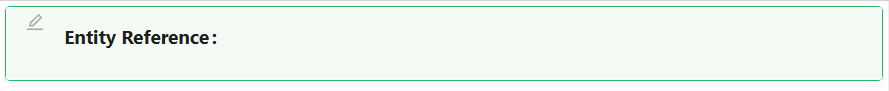

# Entity Reference

The Entity Reference component allows users to interact with a related record by linking to it through navigation, dialogs, or quickview modals. It’s ideal for referencing details or records without embedding the full form.

## Properties

The following properties are available to configure the behavior of the component from the form editor (this is in addition to [common properties](/docs/front-end-basics/form-components/common-component-properties)).

### Common
#### **Property Name** `string`  
A unique identifier that links this component to form data. *(Required)*

#### **Label** `object`  
Toggles the visibility of the field label.

#### **Placeholder** `string`  
Hint text displayed when no value is selected.

#### **Tooltip** `string`  
Informational text shown on hover.

#### **Display Type** `object`  
Choose what content to show:
- Display Property *(default)*
- Icon
- Text Title

#### **Icon** `object`  
Name of the icon to display (used when Display Type is Icon).

#### **Text Title** `string`  
Text to display instead of default (used when Display Type is Text Title).

#### **Hide** `boolean`  
Determines whether the component is visible.

___

### Data

#### **Entity Type** `string`  
Specifies the type of entity being referenced. *(Required)*

#### **Get Entity URL** `string`  
API endpoint used to retrieve full entity details.

#### **Entity Reference Type** `object`  
Determines interaction method:
- Quickview *(default)*
- Navigate Link
- Dialog

#### **Form Selection Mode** `object`  
Controls how the form is selected:
- Name *(default)*
- Dynamic

#### **Form Type** `string`  
Used for dynamic form selection.

#### **Quickview Width** `number`  
Sets the width of the quickview modal in pixels.

___

### Appearance

#### **Font** ``object`` 

Customize how your Entity picker looks. Choose the font family, size, weight, and color.

#### **Dimensions** ``object`` 

Specify the size of your component:
- Width, Height
- Min/Max Width and Height
- Overflow behavior

#### **Border** ``object`` 

Personalize the borders:
- Set border width, color, and style
- Round the corners for a softer touch

#### **Background** ``object``

Pick your flavor of background:

- Color
- Gradient
- Image URL
- Uploaded Image
- Stored File

Also tweak background size, position, and repeat behavior.

#### **Shadow** ``object`` 

Give depth with adjustable shadows:

- Offset, Blur, Spread, Color

#### **Margin & Padding** ``object``

Fine-tune spacing inside and around the component.

#### **Layout** ``object``

- **Label Col** ``number``: Column span for the label.

- **Wrapper Col** ``number``: Column span for the input/display.

####  **Custom Styles** ``function``

Inject your own CSS styles via JavaScript (must return a style object).
