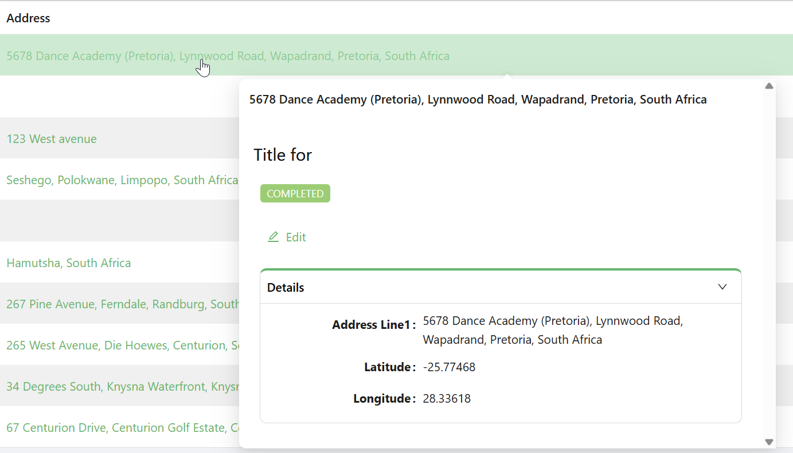

# Entity Reference

import LayoutBanners from './LayoutBanners';

The Entity Reference component allows users to interact with a related record by linking to it through navigation, dialogs, or quickview modals. It’s ideal for referencing details or records without embedding the full form.

## **Get Started**

*NB: This guide assumes a Data Table is already set up. [Learn how to configure it here.](../tables-lists/datatable.md#get-started)*

<LayoutBanners url="https://app.guideflow.com/embed/zpe5o1gc3p" type={1}/>
___

## Properties

The following properties are available to configure the behavior of the component from the form editor (this is in addition to [common properties](/docs/front-end-basics/form-components/common-component-properties)).

### Data

#### **Entity Type** `string`  
Specifies the type of entity being referenced. *(Required)*

#### **Get Entity URL** `string`  
API endpoint used to retrieve full entity details.

#### **Display Type** `object`  
Choose what content to show:
- Display Property *(default)*
- Icon
- Text Title

#### **Entity Reference Type** `object`  
Determines interaction method:
- Quickview *(default)*
- Navigate Link
- Dialog

#### **Form Selection Mode** `object`  
Controls how the form is selected:
- Name *(default)*
- Dynamic

#### **Form Type** `string`  
Used for dynamic form selection.

#### **Quickview Width** `number`  
Sets the width of the quickview modal in pixels.

___

### Appearance

#### **Layout** ``object``

- **Label Col** ``number``: Column span for the label.

- **Wrapper Col** ``number``: Column span for the input/display.
