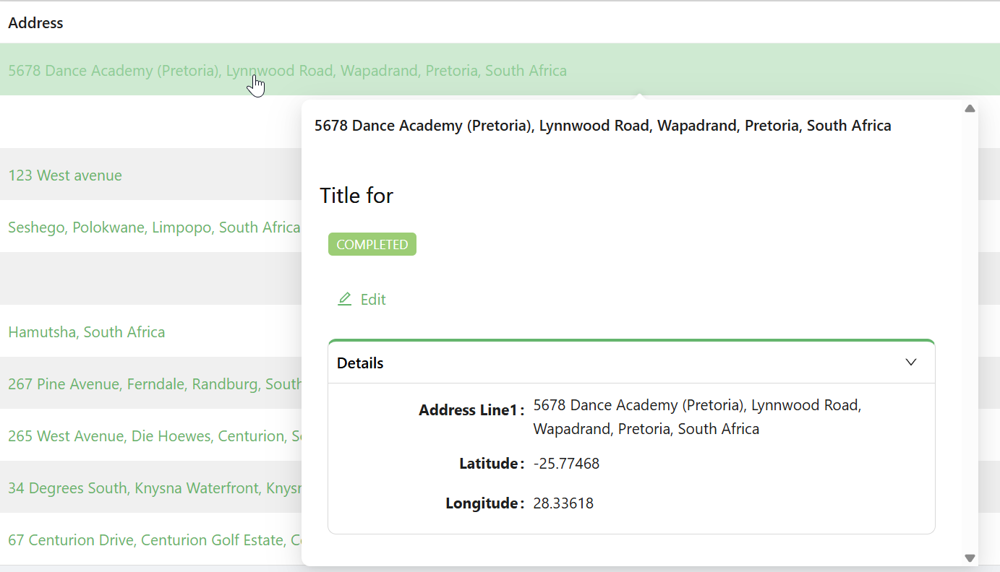

import LayoutBanners from './LayoutBanners';

# Entity Reference

The Entity Reference component displays a link or button that connects to a related record on your form. When a user clicks it, it can open a read-only quickview panel, navigate to the related record's full page, or open the record in a modal dialog. Use it anywhere a form field references another entity and you want to give users a quick way to view or interact with that related record without leaving the current form.


*The Entity Reference component renders as a clickable link, icon, or text label tied to a related record.*

---

## Get Started

:::note
This guide assumes a Data Table is already set up. [Learn how to configure a Data Table here.](../tables-lists/datatable.md#get-started)
:::

<LayoutBanners url="https://app.guideflow.com/embed/zpe5o1gc3p" type={1}/>

---

## Properties

The following properties are available to configure the Entity Reference component from the form designer. These are in addition to the [common properties](/docs/front-end-basics/form-components/common-component-properties) shared by all Shesha components.

---

### Entity Reference Configuration

#### **Placeholder** `string`

Text shown in place of the entity reference when no value is bound to the component. Use this to indicate that no related record has been selected yet.

---

#### **Entity Type** `object`

The type of entity this component references. Shesha uses this to know which entity's data to load when the user clicks the link. Select an entity from the autocomplete, for example `Shesha.Domain.Person`.

---

#### **Get Entity URL** `string`

A custom API endpoint used to retrieve the related entity's details. Use this instead of Entity Type when the data comes from a non-standard endpoint. Select from the endpoint autocomplete.

:::note
You only need to set Get Entity URL when Entity Type alone is not enough to identify the correct data source. For standard Shesha entities, Entity Type is sufficient.
:::

---

#### **Display Type** `object`

Controls what the component looks like on the form - specifically, what the user sees and clicks.

| Option | What it shows |
|---|---|
| `Display property` | Renders the value of a specific field on the related entity, for example the person's full name. This is the default. |
| `Icon` | Renders a single icon. Use this in compact layouts like table rows where space is limited. |
| `Text title` | Renders a fixed text label you specify. Use this when the link text should always be the same regardless of the entity's data. |

When Display Type is set to `Display property`, the **Display Property** field appears. Select the entity field whose value should be shown as the link text.

When Display Type is set to `Icon`, the **Icon** picker appears. Select which icon to render.

When Display Type is set to `Text title`, the **Text Title** field appears. Enter the fixed label text to display.

---

#### **Entity Reference Type** `object`

Determines what happens when the user clicks the component. This is the most important setting on the Entity Reference component.

| Option | What happens on click |
|---|---|
| `Quickview` | A read-only panel pops up showing the referenced record's details. The user stays on the current form. This is the default. |
| `Navigate Link` | The component renders as a hyperlink. Clicking it navigates the user to the referenced record's full page. |
| `Modal dialog box` | The referenced record opens in a modal dialog. The form inside the dialog can be read-only or editable depending on its configuration. |

---

#### **Form Selection Mode** `object`

Controls how Shesha determines which form to use when displaying the referenced record.

| Option | When to use |
|---|---|
| `Name` | You pick a specific form by name. Use this when you always want the same form to open for this reference. |
| `Dynamic` | Shesha selects the form automatically based on the entity type and form type. Use this when the form may vary depending on context. |

When Form Selection Mode is `Name`, the **Form** picker appears. Select the form to open when the user interacts with the component.

When Form Selection Mode is `Dynamic`, the **Form Type** field appears. Enter or select the form type to look up, for example `Details` or `Quickview`.

---

### Quickview Settings

This section only appears when Entity Reference Type is set to `Quickview`.

#### **Quickview Width** `number`

The width of the quickview popup in pixels. Defaults to `600`. Increase this if the entity's quickview form has wide content.

---

### Dialog Settings

This section only appears when Entity Reference Type is set to `Modal dialog box`.

#### **Title** `string`

The heading text shown at the top of the modal dialog.

---

#### **Buttons Type** `object`

Controls which buttons appear in the dialog footer.

| Option | Behaviour |
|---|---|
| `Default` | Shesha adds standard OK and Cancel buttons to the footer. The OK button submits the dialog form. |
| `Custom` | You configure the footer buttons manually using the button group builder. |
| `None` | No footer buttons are shown. Use this for read-only dialogs where the user only needs to close the panel. |

When Buttons Type is `Default`, the **Submit HTTP Verb** setting appears. Choose `POST` (default) or `PUT` to control how the dialog form submits data.

When Buttons Type is `Custom`, the **Configure Modal Buttons** builder appears. Add and configure the buttons to show in the dialog footer.

---

#### **Additional Properties** `object`

Key-value pairs passed as extra data when the dialog form is submitted. Use this to inject context values, such as a parent record ID, that the dialog form needs.

Values support Mustache expressions. For example, use `{{entityReference.id}}` to pass the ID of the currently linked entity.

Available Mustache variables:

| Variable | Description |
|---|---|
| `data` | The current form's field values. |
| `formMode` | The current form mode: `designer`, `edit`, or `readonly`. |
| `globalState` | The global application state. |
| `entityReference.id` | The ID of the linked entity. |
| `entityReference.entity` | The full linked entity object. |

---

#### **Dialog Width** `object`

Controls the width of the modal dialog.

| Option | Width |
|---|---|
| `Small` | 40% of the viewport. |
| `Medium` | 60% of the viewport. |
| `Large` | 80% of the viewport. |
| `Custom` | Enter a specific value using the Units and Enter Custom Width fields that appear below. |

When `Custom` is selected, **Units** lets you choose between `Percentage (%)` and `Pixels (px)`. **Enter Custom Width** sets the numeric value.

---

#### **Handle Success** `boolean`

When enabled, an **On Success** action configurator appears. Configure the action to run after the dialog form submits successfully, for example refreshing the parent form or showing a confirmation message.

---

#### **Handle Fail** `boolean`

When enabled, an **On Fail** action configurator appears. Configure the action to run when the dialog form submission fails, for example showing an error dialog.

---

### Layout

#### **Label Col** `number`

The number of grid columns allocated to the component label. Uses the Ant Design 24-column grid. Default is `8`. Only has an effect when the form layout is set to horizontal.

---

#### **Wrapper Col** `number`

The number of grid columns allocated to the input area. Uses the Ant Design 24-column grid. Default is `16`. Label Col and Wrapper Col values should add up to `24`.

---

#### **Style** `function`

A JavaScript expression that returns a CSS style object applied to the component. Use this for custom layout or visual overrides.

Available variables:

| Variable | Type | Description |
|---|---|---|
| `data` | `object` | The form's current field values. |

**Example - Add spacing around the component:**

```js
return {
  marginBottom: '16px',
  padding: '8px',
};
```
