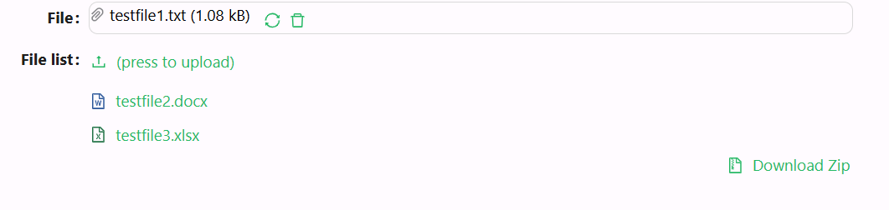

# File / File List

This enables the uploading of one or more files. It also showcases the process of uploading by selecting or dragging a file.

[//]: # '<iframe width="100%" height="500" src="https://pd-docs-adminportal-test.shesha.dev/shesha/forms-designer/?id=3745cb52-d48c-478c-8d34-b5743f7c9388" title="File / Filelist component" ></iframe>'

## Properties

The following properties are available to configure the behavior of the component from the form editor (this is in addition to [common properties](/docs/front-end-basics/form-components/common-component-properties)).

### Common
#### **Component Name** `string`  
The key for binding this upload field to form data. *(Required)*

#### **Label** `object`  
Shows or hides the label for the upload field.

#### **Tooltip** `string`  
Hover-over text providing additional context.

#### **List Type** `string`  
Display style for uploaded files:
- File name *(default)*
- Thumbnail

#### **Is Dragger** `boolean`  
Enable drag-and-drop upload (only when List Type ≠ Thumbnail).

#### **Edit Mode** `object`  
Control interactivity:
- Editable
- Read Only
- Inherited *(default)*

#### **Hide** `boolean`  
Toggles visibility of the file upload component.

#### **Allow Upload** `boolean`  
Allows users to upload files. *(default: true)*

#### **Allow Replace** `boolean`  
Permits replacing already uploaded files.

#### **Allow Delete** `boolean`  
Grants users the ability to delete files.

#### **Allow Add** ``boolean``
Controls whether users can add new files to the list.

#### **Allow Remove** ``boolean``
Controls whether users can remove files from the list.

#### **Download Zip** ``boolean``
If enabled, allows users to download all files as a zip archive.

___

### Data
#### **Owner ID** `string`  
Identifier linking uploaded files to an entity.

#### **Owner Type** `string`  
Defines the entity type that owns the file (autocomplete supported).

#### **Files Category** `string`
A label or tag that classifies uploaded files into a specific category.

#### **Synchronous Upload** `boolean`  
If true, uploads are handled synchronously.

#### **Allowed File Types** `array`  
Restricts uploads to specified file types (e.g., 'image/jpeg', 'application/pdf').

___

### Validation

#### **Required** `boolean`  
If enabled, at least one file must be uploaded.

___

### Appearance

#### **Font** ``object`` 

Customize how your Entity picker looks. Choose the font family, size, weight, and color.

#### **Dimensions** ``object`` 

Specify the size of your component:
- Width, Height
- Min/Max Width and Height
- Overflow behavior

#### **Margin & Padding** ``object``

Fine-tune spacing inside and around the component.

####  **Custom Styles** ``function``

Inject your own CSS styles via JavaScript (must return a style object).

