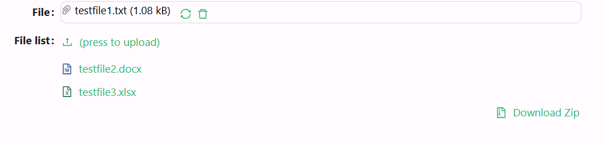

import LayoutBanners from './LayoutBanners';

# File / File List

Shesha provides two related file components. **File** handles a single file attachment - a user can upload, replace, or delete one file linked to a record. **File List** manages a collection of attachments with richer display options, version history, bulk download, and custom actions per file. Both components link uploaded files to a specific entity record using an owner ID and owner type.



## File

The File component provides a single-file upload field. The user uploads one file at a time. Depending on your settings, they can also replace or delete it. It appears on the form as an upload button or, optionally, as a drag-and-drop zone.

The following properties are available to configure the behavior of the File component from the form editor (this is in addition to [common properties](/docs/front-end-basics/form-components/common-component-properties)).

### Display

#### **Is Dragger** `boolean`

When enabled, the upload area becomes a large drag-and-drop zone instead of a button. Users can drag a file from their desktop and drop it directly onto the field.

---

#### **Allow Upload** `boolean`

Controls whether the user can upload a new file. When disabled, the upload button is hidden and no file can be added. Hidden when the component is in read-only mode.

---

#### **Allow Replace** `boolean`

Controls whether the user can replace the existing file with a new version. When enabled, a replace action appears on the uploaded file. Hidden when the component is in read-only mode.

---

#### **Allow Delete** `boolean`

Controls whether the user can delete the uploaded file. When enabled, a delete control appears on the file. Hidden when the component is in read-only mode.

---

### Files

#### **Synchronous Upload** `boolean`

When enabled, the file is uploaded to the server immediately when the user selects it, before the form is submitted. When disabled, the file is held in memory and uploaded when the form saves.

:::note
Use synchronous upload when you need the file available on the server before the form is submitted, for example to generate a document or trigger a backend process.
:::

---

#### **Owner ID** `string`

The ID of the entity record that owns this file. Shesha uses this to link the uploaded file to the correct record. You can enter a static ID or a JavaScript expression that resolves to an ID at runtime.

---

#### **Owner Type** `string`

The entity type that owns this file (for example, `Shesha.Domain.Person`). Use the autocomplete to select a registered entity type.

---

#### **Allowed File Types** `array`

Restricts which file types the user can upload. Enter one or more MIME types or file extensions, for example `.pdf`, `image/jpeg`. Leave empty to accept all file types.

---

## File List

The File List component manages a collection of file attachments on a record. Users can add, remove, and replace files. The list can display as a simple file-name list or as a thumbnail grid for image-heavy use cases. It also supports version history, bulk zip download, custom per-file actions, and embedded custom content beneath each file.

<LayoutBanners url="https://app.guideflow.com/embed/6kw1welczp" type={1}/>


The following properties are available to configure the behavior of the component from the form editor (this is in addition to [common properties](/docs/front-end-basics/form-components/common-component-properties)).

### Display

#### **Is Dragger** `boolean`

When enabled, the upload area becomes a large drag-and-drop zone. Hidden when List Type is set to `Thumbnail`.

---

#### **List Type** `object`

Controls how uploaded files are displayed. Hidden when Is Dragger is enabled.

| Option | When to use |
|---|---|
| `File Name` | Displays files as a simple list of names. Use this for documents and general attachments. |
| `Thumbnail` | Displays files as image previews. Use this when files are images. |

---

#### **Hide File Name** `boolean`

When enabled, the file name is hidden below each thumbnail. Only appears when List Type is `Thumbnail`.

---

#### **Layout** `object`

Controls how thumbnails are arranged on screen. Only appears when List Type is `Thumbnail` and Is Dragger is disabled.

| Option | When to use |
|---|---|
| `Vertical` | Thumbnails stack in a single column. |
| `Horizontal` | Thumbnails flow left to right in a single row. |
| `Grid` | Thumbnails wrap into a multi-row grid. Use this for larger collections of images. |

---

#### **Gap** `number`

The spacing between thumbnails in pixels. Only appears when List Type is `Thumbnail`.

---

#### **Allow Add** `boolean`

Controls whether the user can upload new files. When disabled, the upload control is hidden. Hidden when the component is in read-only mode.

---

#### **Allow Remove** `boolean`

Controls whether the user can remove files from the list. When disabled, the remove control is hidden on each file. Hidden when the component is in read-only mode.

---

#### **Allow Replace** `boolean`

Controls whether the user can replace an existing file with a new version. Hidden when the component is in read-only mode.

---

#### **Allow View History** `boolean`

When enabled, users can open a version history panel for each file to see all previously uploaded versions.

---

#### **Download Zip** `boolean`

When enabled, a button appears that lets users download all files in the list as a single zip archive.

---

#### **On File List Changed** `function`

A JavaScript function that runs whenever the file list changes — when a file is added, removed, or replaced. Use it to react to uploads, update a status field, or trigger a follow-up action.

Available variables:

| Variable | Type | Description |
|---|---|---|
| `value` | `any` | The component's current file list value. |
| `event` | `object` | The event data from the file change interaction. |

Plus all standard constants including `formData`, `globalState`, `http`, `moment`.

**Example - Show a confirmation message when a file is uploaded:**

```js
message.success('File list updated.');
```

---

#### **On Download** `function`

A JavaScript function that runs when a user downloads a file from the list. Use it to log download activity or trigger a follow-up action.

Available variables:

| Variable | Type | Description |
|---|---|---|
| `value` | `any` | The component's current file list value. |
| `event` | `object` | The event data from the download interaction. |

Plus all standard constants including `formData`, `globalState`, `http`, `moment`.

---

### Custom

#### **Custom Actions** `object`

Opens the action configurator to add buttons that appear on each file in the list. Use this to add actions specific to your use case, such as a button that opens a file in a viewer or marks it as reviewed.

---

#### **Show Custom Content** `boolean`

When enabled, a custom form is rendered below each file in the list. Use this to display extra metadata or controls alongside each attachment.

---

#### **Custom Content Form** `object`

The form to render below each file when Show Custom Content is enabled. Select a form from the form picker. Only appears when Show Custom Content is on.

---

### Files

#### **Owner** `string`

The property path on the form's data object that contains the owner record. Use this when the owner is derived from the form's current data rather than a static value.

---

#### **Owner ID** `string`

The ID of the entity record that owns these files. Shesha uses this to link all uploaded files to the correct record.

---

#### **Owner Type** `string`

The entity type that owns these files (for example, `Shesha.Domain.Person`). Use the autocomplete to select a registered entity type.

---

#### **Files Category** `string`

An optional label that groups uploaded files into a named category. Use this when a single record needs multiple distinct sets of files (for example, `identity-documents` and `supporting-evidence`). Add two File List components with different Files Category values to keep the groups separate.

---

#### **Allowed File Types** `array`

Restricts which file types the user can upload. Enter one or more MIME types or file extensions, for example `.pdf`, `image/jpeg`. Leave empty to accept all file types.