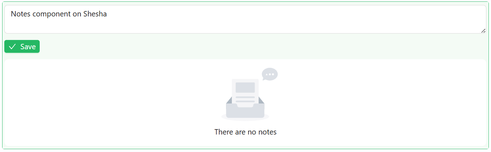

# Notes

The Notes component is a collaborative and versatile feature for capturing and managing threaded notes. It supports data ownership, conditional visibility, layout adjustments, and event scripting.

## Properties

The following properties are available to configure the behavior of the component from the form editor (this is in addition to [common properties](/docs/front-end-basics/form-components/common-component-properties)).

### Common
**Component Name** `string`  
A unique identifier used to register this Notes component on the form.

**Auto Size** `boolean`  
Automatically resizes the text area based on content.

**Allow Delete** `boolean`  
Allows users to delete notes directly from the thread.

**Edit Mode** `object`  
Specifies interaction mode:
- **Editable**: Users can add and manage notes.
- **Read Only**: Notes are view-only.
- **Inherited** *(default)*: Follows the parent form’s interaction settings.

**Hide** `boolean`  
Controls whether the Notes component is visible.

___

### Data

**Owner Id** `string`  
Specifies the ID of the entity that owns the notes.

**Owner Type** `string`  
Defines the type of entity (e.g., project, ticket) using an autocomplete input with options from a metadata API.

___

### Appearance
**Buttons Layout** `object`  
Controls the position of the save button:
- **Left** *(default)*
- **Right**

