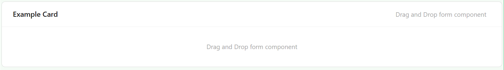
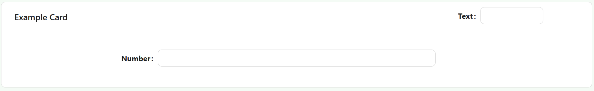

# Card

The Card component provides a styled container for grouping and displaying UI elements with optional headings, visibility control, and custom styling support.

## **Properties**

The following properties are available to configure the behavior of the component from the form editor (this is in addition to [common properties](/docs/front-end-basics/form-components/common-component-properties)).

### Common

#### **Component Name** `string`  
Unique identifier used to bind the card to your form or context. *(Required)*  
_Example: `exampleCard` — This is just for illustration; you can use any unique name._

#### **Heading** `string`  
Optional heading text displayed at the top of the card.

#### **Hide** `boolean`  
Toggles the visibility of the card.

#### **Hide Heading** `boolean`  
Controls whether the heading should be hidden even if provided.

#### **Hide When Empty** `boolean`  
Hides the entire card if all child components are hidden or empty, based on logic or visibility conditions.

___

### Appearance

#### **Border** ``object``

Personalize the borders:
- Set border width, color, and style
- Round the corners for a softer touch

#### **Background** ``object``

Pick your flavor of background:

- Color
- Gradient
- Image URL
- Uploaded Image
- Stored File

#### **Shadow** ``object``

Give depth with adjustable shadows:

- Offset, Blur, Spread, Color

#### **Margin & Padding** ``object``

Fine-tune spacing inside and around the component.

**Style** `function`  
JavaScript function that returns a `CSSProperties` object for dynamically styling the card using form data or global state.

####  **Custom Styles** ``function``

Inject your own CSS styles via JavaScript (must return a style object).

