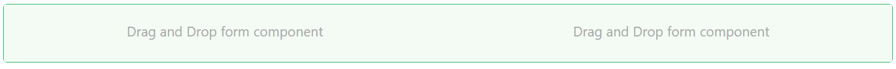
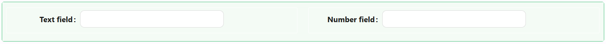

# Columns

The Columns component is a flexible layout tool that allows you to organize content side-by-side using a column-based grid structure. It's perfect for designing responsive and structured forms by splitting sections into multiple columns with individually configurable widths, minimums, and maximums.

[//]: # '<iframe width="100%" height="500" src="https://pd-docs-adminportal-test.shesha.dev/shesha/forms-designer/?id=747834b4-9ef8-4088-a951-e976776b19ec" title="Columns Component" ></iframe>'

## **Properties**

The following properties are available to configure the behavior of the component from the form editor (this is in addition to [common properties](/docs/front-end-basics/form-components/common-component-properties)).

### Common

#### **Component Name** ``string``

This sets the internal name for the component, typically used for data binding and referencing within the application.

#### **Hide** ``boolean``

Control the visibility of the Tabs component entirely.
___

### Data

#### Configure Columns

Configure your grid's columns with ease. This setting opens a friendly UI to manage each column’s name, type, and any additional configurations.

- **Width** – you can change the width size of the column until maximum of `24`.
- **Offset** – you can change the original position of the column by putting the number that will create the space between the origan position of the column and starting position.
- **Push** – to push the column to the right side.
- **Pull** – to pull the column from the right.

___

### Appearance

#### **Gutter X** ``number``
 Gutter X helps you to create gaps between column content for horizontal padding.

#### **Gutter Y** ``number``
 Gutter Y helps you to create gaps between column content for vertical padding.

#### **Dimensions** ``object``

Set the width, height, min/max sizes of the component.

#### **Border** ``object``

Personalize the borders:
- Set border width, color, and style
- Round the corners for a softer touch

#### **Background** ``object``

Pick your flavor of background:

- Color
- Gradient
- Image URL
- Uploaded Image
- Stored File

#### **Shadow** ``object``

Give depth with adjustable shadows:

- Offset, Blur, Spread, Color

#### **Margin & Padding** ``object``

Fine-tune spacing inside and around the component.

####  **Custom Styles** ``function``

Inject your own CSS styles via JavaScript (must return a style object).

