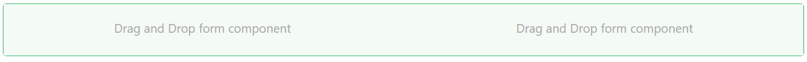
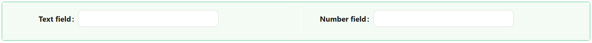
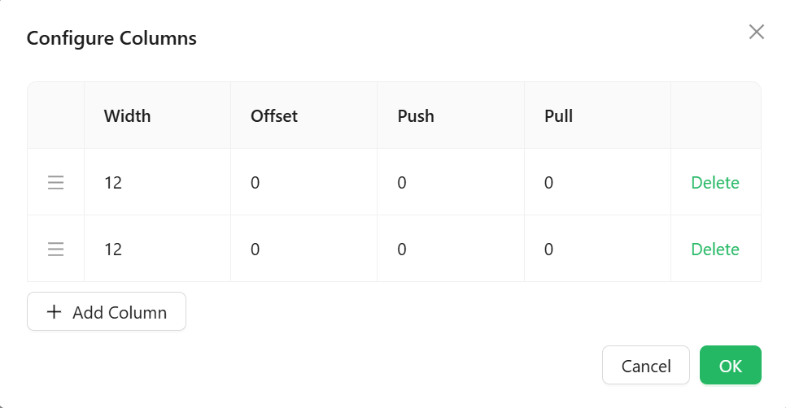

import LayoutBanners from './LayoutBanners';

# Columns

The Columns component splits a section of your form into side-by-side vertical columns. You drop other components into each column to build multi-column layouts such as a two-column form, a card row with equal-width panels, or a narrow label column alongside a wide input column. The number of columns, their widths, and the spacing between them are all configurable.





*A form using the Columns component to arrange fields side by side.*

## Get Started

<LayoutBanners url="https://app.guideflow.com/embed/gky90d2hdp" type={1}/>

---

## Properties

The following properties are available to configure the behavior of the component from the form editor (this is in addition to [common properties](/docs/front-end-basics/form-components/common-component-properties)).

---

### Columns

#### **Gutter X** `number`

The horizontal space between columns in pixels. Accepts values from `1` to `48` in steps of `4`.

---

#### **Gutter Y** `number`

The vertical space between rows when columns wrap onto multiple lines, in pixels. Accepts values from `1` to `48` in steps of `4`.

---

#### **Columns**

Opens the column builder where you define how many columns exist and how wide each one is. Click **Configure Columns** to open the editor. Click **Add Column** to add a new column. Drag the handle on the left of any row to reorder columns.


*The column builder showing two columns configured with equal widths.*

Each column in the builder has the following settings:

**Width** - The column's span in the 24-column grid. A value of `24` fills the full available width, `12` fills half, `8` fills one third, and `6` fills one quarter. Both default columns start at `12` so they share the space equally.

**Offset** - The number of grid columns to leave empty before this column. Use this to indent a column or create a visual gap without adding a blank column.

**Push** - Shifts the column visually to the right by the given number of grid columns without changing the layout flow of other columns.

**Pull** - Shifts the column visually to the left by the given number of grid columns. Use together with Push to swap the visual order of two columns without changing the markup order.

:::note
Width, Offset, Push, and Pull all use the same 24-column grid. The total Width values across all columns in a row should add up to `24` to fill the row. If the total exceeds `24`, columns will wrap onto a new line.
:::

---

### Style

#### **Style** `function`

A JavaScript expression that returns a CSS style object applied to the row wrapper around all columns. Use this to set background colour, borders, padding, or any other CSS property on the outer container.

Available variables:

| Variable | Type | Description |
|---|---|---|
| `data` | `object` | The form's current field values. |
| `formMode` | `string` | The current form mode: `'edit'`, `'readonly'`, or `'designer'`. |
| `globalState` | `object` | The global application state. |
| `value` | `any` | The item value when this component is rendered inside a SubForm. |

**Example - Add a light background and padding to the column row:**

```js
return {
  backgroundColor: '#f9f9f9',
  padding: '16px',
  borderRadius: '4px',
};
```

---

#### **Styling Box**

A visual editor for setting margin and padding on the column row. Click any side of the box to type a value directly. Changes here control the spacing around and inside the component without writing CSS.

