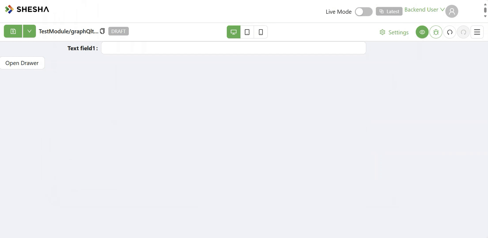

# Drawer
The Drawer component allows the opening of a sliding panel from any side of the screen, ideal for temporary form content, quick settings, or auxiliary views. It supports extensive customization around behavior, size, positioning, and content.

[//]: # '<iframe width="100%" height="500" src="https://pd-docs-adminportal-test.shesha.dev/shesha/forms-designer/?id=41d541dc-75c9-4436-ad41-3b39ea828efb" title="Drawer Component" ></iframe>'

## **Properties**

The following properties are available to configure the behavior of the component from the form editor (this is in addition to [common properties](/docs/front-end-basics/form-components/common-component-properties)).

### Common

#### **Show Header** ``boolean``
Controls visibility of the drawer's header.

#### **Show Action Buttons** ``boolean``
Toggles display of the drawer's action buttons (footer).

___

### Appearance

#### Slide Direction ``object``

Specifies the animation direction for how the drawer appears:
- Right *(default)*
- Top
- Bottom
- Left
