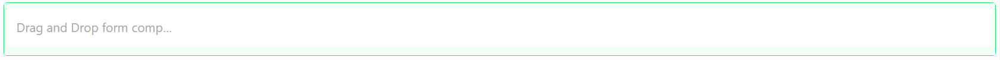
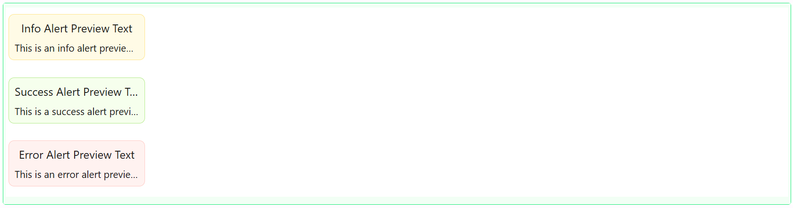
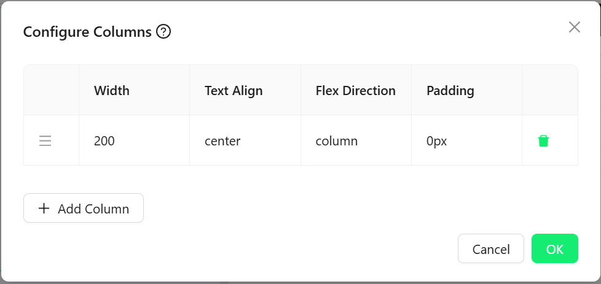

# Key Information Bar

The Key Information Bar component displays essential data in a compact, styled row or column format. Great for summaries and quick insights, it supports fully customizable layouts and styling per item.

## Properties

The following properties are available to configure the behavior of the component from the form editor (this is in addition to [common properties](/docs/front-end-basics/form-components/common-component-properties)).

### Common

#### **Columns** `keyInformationBarColumnsList`  

Defines the layout and contents of each key information column.
___

### Appearance

#### **Orientation** `object`  
Defines layout direction:
- **Horizontal** *(default)*: Items laid out in a row.
- **Vertical**: Items stacked in a column.

#### **Gap** `number`  
Spacing between columns/items.

#### **Divider** `object`  
Configure a divider line between items with properties for margin, width, height, thickness, and color.

