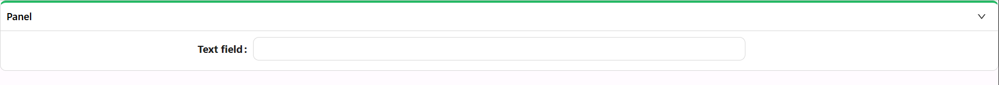

# Panel

The Panel component helps group and visually segment content inside a form. It acts as a flexible container that can include headers, icons, and conditional logic to show or hide its contents. Panels make forms easier to scan and more organized.

[//]: # '<iframe width="100%" height="500" src="https://pd-docs-adminportal-test.shesha.dev/shesha/forms-designer/?id=747834b4-9ef8-4088-a951-e976776b19ec" title="Panel Component" ></iframe>'

## **Properties**

The following properties are available to configure the behavior of the component from the form editor (this is in addition to [common properties](/docs/front-end-basics/form-components/common-component-properties)).

### Common

#### **Component Name** `string`  
A unique identifier for the panel. *(Required)*

#### **Label** `string`  
The panel header text.

#### **Custom Header** `boolean`
Enable a custom header layout instead of the standard title and icon.

#### **Icon Position** `object`
Position of the icon in the header:

- End (default)
- Hide
- Start

#### **Collapsible** `boolean`  
Enables the ability to collapse or expand the panel.

#### **Collapsible By Default** `boolean`  
If enabled, the panel starts off collapsed.

#### **Hide When Empty** `boolean`
If true, hides the panel when it contains no content.

#### **Hide** `boolean`  
Conditionally hides the entire panel.

___

### Appearance

#### **Ghost** `boolean`
Removes background and borders for a minimal, transparent look.

#### **Simple Design** `boolean`
Toggles a lightweight, minimal styling for a flatter design.

#### **Accent** `boolean`
Applies an accent border to visually emphasize the panel.

#### **Hide Top Bar** `boolean`
Hides the top bar area including title, icon, and actions.

#### **Dimensions** ``object``

Set the width, height, min/max sizes of the component.

#### **Border** ``object``

Personalize the borders:
- Set border width, color, and style
- Round the corners for a softer touch

#### **Background** ``object``

Pick your flavor of background:

- Color
- Gradient
- Image URL
- Uploaded Image
- Stored File

#### **Shadow** ``object``

Give depth with adjustable shadows:

- Offset, Blur, Spread, Color

#### **Margin & Padding** ``object``

Fine-tune spacing inside and around the component.

####  **Custom Styles** ``function``

Inject your own CSS styles via JavaScript (must return a style object).

