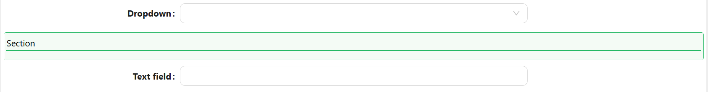

# Section Separator

The Section separator is a line that is used to organize content by dividing it into sections, it provides a structured layout that will make it easier to locate sections.

[//]: # '<iframe width="100%" height="500" src="https://pd-docs-adminportal-test.shesha.dev/shesha/forms-designer/?id=6d3e8940-66c8-4c01-98d4-9d91ac0d2478" title="Section Separator Component" ></iframe>'

## Properties

The following properties are available to configure the behavior of the component from the form editor (this is in addition to [common properties](/docs/front-end-basics/form-components/common-component-properties)).

### Common

#### **Orientation** `object`  
Defines the line direction:
- **Horizontal** *(default)*
- **Vertical**

#### **Inline** `boolean`  
Only for horizontal separators. Places the label in line with the divider.
___

### Appearance

#### Line Style
**Thickness** `number`  
Line thickness in pixels.

**Color** `object`  
Color of the line.

**Type** `object`  
Line style options:
- **Solid** *(default)*
- **Dashed**
- **Dotted**

#### Title Style
**Font Family / Size / Weight / Color** — `font`  
Customize typography for section titles.

**Title Custom Style** `function`  
Apply advanced title styling via JavaScript returning a `CSSProperties` object.

#### Container Style
**Margin & Padding** `object`  
Configure spacing around and inside the separator.

**Custom Style** `function`  
Use JavaScript to return dynamic container styles as a `CSSProperties` object.

