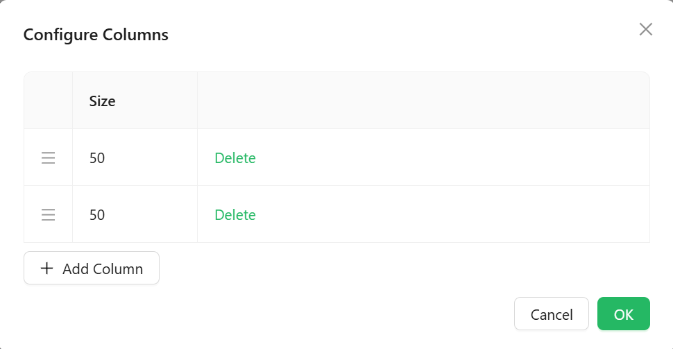

# SizableColumns

The SizableColumn component enables the configuration of column layouts with resizable dimensions, making it useful for responsive or flexible grid-based designs. Each column can be defined in terms of its width, min/max boundaries, and additional styling.

## Properties

The following properties are available to configure the behavior of the component from the form editor (this is in addition to [common properties](/docs/front-end-basics/form-components/common-component-properties)).

### Data

#### **Columns** `sizableColumnsConfig`  

Defines the layout and settings for columns in the container. A GUI editor helps configure widths, spacing, alignment, and content placement.
