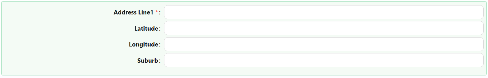

# Subform

The subform is a component used for displaying nested forms. It is a reusable section or module that contains a specific set of functionalities, fields, or elements. It allows you to encapsulate a group of related elements or controls within a form or a larger application, making it easier to manage and reuse across different parts of your project.

It operates much like a template or a mini-form within the larger application. Instead of recreating the same layout or set of functionalities multiple times, you can create a subform once and then use it multiple times within the main form or across various forms in your application.

[//]: # '<iframe width="100%" height="500" src="https://pd-docs-adminportal-test.shesha.dev/shesha/forms-designer/?id=7c2aa336-4e33-43ab-b6d1-4cb829821ea5" title="Sub Form Component" ></iframe>'

## Properties

The following properties are available to configure the behavior of the component from the form editor (this is in addition to [common properties](/docs/front-end-basics/form-components/common-component-properties)).

### Common

#### **Property Name** `string`  
Unique key to bind the SubForm to the parent form data. *(Required)*

#### **Label** ``object``
Customize whether to display a label. Hiding it can simplify the UI in some layouts.

#### **Edit Mode** `object`  
Choose interaction mode:
- **Editable**
- **Read Only**
- **Inherited** *(default)*

#### **Hide** `boolean`  
Determines visibility of the SubForm.

___

### Data

#### **Form Selection Mode** `object`  
Select how the form is determined:
- **Name** *(default)*
- **Dynamic**

#### **Form** `string`  
Used when Form Selection Mode is *Name*.

#### **Data Source** `object`  
Defines where the data comes from:
- **Form** *(default)*
- **Api**

#### **API Mode** `object`  
Used when Data Source is *Api*:
- **Entity Name** *(default)*
- **URL**

#### **Entity Type** `object`  
API Entity type (used when API Mode is *Entity Name*).

#### **Query Params** `function`  
Returns query parameters for API calls.

#### **POST Url** `function`  
API endpoint used for creating records.

#### **PUT Url** `function`  
API endpoint used for updating records.

#### **Unique State ID** `string`  
Important for accessing this component's state independently.

___

### Appearance
#### Custom Styles
**Label Col** `number`  
Width of the label column.

**Wrapper Col** `number`  
Width of the input wrapper column.
