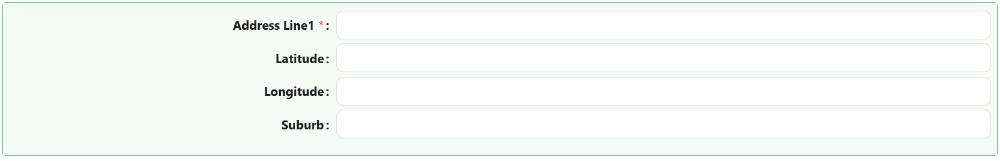

import LayoutBanners from './LayoutBanners';

# Subform

In Shesha, a **form** is a screen that displays and collects data about one thing - a person, an order, a property. Most real-world records are not just one flat list of fields. A person has an address. An order has a customer. A job has a primary contact. These related pieces of data belong to separate records in your database, but you often want to show and edit them together on the same screen.

A **Subform** solves this. It embeds a second, smaller form inside your main form so the user can view, fill in, or update a related record without leaving the page. You build the inner form once, configure it as a Subform component inside the outer form, and Shesha handles connecting the two together.

Think of it like a form inside a form. The outer form is about a `Person`. The inner Subform is about that person's `Address`. Both appear on the same screen, but they are separate forms managing separate data.

Instead of recreating the same address fields on every form that needs them, you build an address form once and embed it as a Subform anywhere you need it. This makes your configuration reusable and easier to maintain.


*A Subform component embedded inside a parent form, showing related data inline.*

## Get Started

<LayoutBanners url="https://app.guideflow.com/embed/8ko1g14i5r" type={1}/>

---

## How It Works

Before configuring the properties, it helps to understand how a Subform connects to its parent.

When you place a Subform component on a form, you give it a **Property Name**. This is the field on the parent form's data where the subform's data lives. For example, if your parent form manages a `Person` and you set Property Name to `address`, the subform reads from `data.address` and writes back to `data.address` when the parent form saves.

The subform can get its data in two ways:
- It can read what the parent form already loaded (Data Source: Form)
- It can go fetch the data itself from the backend (Data Source: Api)

The subform also needs to know which form to render inside itself. You either pick a specific form by name, or let Shesha find the right form based on the entity type at runtime.

---

## Properties

The following properties are available to configure the behavior of the component from the form editor (this is in addition to [common properties](/docs/front-end-basics/form-components/common-component-properties)).

### Property Name

**Property Name** is the first and most important setting. It is the field path on the parent form's data object where the subform's data is stored and read from.

When the parent form loads its data from the backend, Shesha places the full response onto `data`. If the response includes an `address` field, setting Property Name to `address` tells the subform to look at `data.address` for its values. When the parent form saves, the subform's field values are written back into `data.address` and submitted as part of the same payload.

For nested fields, use dot notation. For example, `address.suburb` points to `data.address.suburb`.


:::warning
Property Name is required. If you leave it empty, the subform has no place to store its data in the parent form. Anything the user fills in will be lost when the parent form submits.
:::

---

### Form Selection

Every Subform needs to know which form to render inside itself. **Form Selection Mode** controls how that form is chosen.

| Mode | When to use |
|---|---|
| `Name` | You always want to show the same form. Pick it directly from the form picker. |
| `Dynamic` | The form to show depends on the type of entity currently loaded. Shesha finds the right form at runtime. |

#### Name Mode

`Name` mode is the most common choice and the easiest to understand. You pick one specific form from the autocomplete picker in the **Form** field. Every time the Subform component renders, it renders that exact form inside itself - no matter what data is loaded.

Use this when the related entity is always the same type. If your parent form always shows a `Person` and the subform always shows that person's `Address`, Name mode is the right choice.

**Example scenario - a Person form with a fixed Address subform:**

You are building a `Person` edit form. The person always has one address. Set Form Selection Mode to `Name` and select your `address-edit` form from the picker. Every time this page opens, the address fields from that form appear inside the Person form.

:::tip
Start with Name mode. It is predictable and straightforward - you always know exactly which form is being rendered inside the Subform.
:::

#### Dynamic Mode

`Dynamic` mode is for situations where the subform might need to show a different form depending on what type of record is loaded. Instead of picking a specific form, you set a **Form Type** - a label like `details` or `edit`. At runtime, Shesha looks at the entity type of the current value in the subform and finds the form that matches both that entity type and the form type you specified.

Shesha caches the resolved form once per entity type, so the lookup only happens once per session for each type it encounters.

**Example scenario - a Case form where the contact could be a Person or an Organisation:**

You have a `Case` form with a `primaryContact` field. That field can hold either a `Person` or an `Organisation`. Set Form Selection Mode to `Dynamic` and Form Type to `details`. When the loaded contact is a `Person`, Shesha renders the person details form. When it is an `Organisation`, Shesha renders the organisation details form - automatically, with no extra configuration from you.

:::note
For Dynamic mode to work, a form matching the specified Form Type must be published for every entity type that might appear in the subform. If Shesha cannot find a matching form for the current entity type, the subform will render empty.
:::

---

### Data Source

**Data Source** answers the question: where does the subform get its data from?

| Option | What happens |
|---|---|
| `Form` | The subform reads directly from the parent form's already-loaded data. No extra API call is made. |
| `Api` | The subform makes its own separate API call to the backend to fetch its data. |

#### Data Source: Form

When you set Data Source to `Form`, the subform looks at the parent form's data at the Property Name you configured and displays whatever is already there. No network request is made. If the parent form loaded a `Person` record and that record includes an `address` object, the subform reads and displays those address fields immediately.

When the user edits fields inside the subform and the parent form submits, those changes are included in the parent form's save payload.

Use this when:
- The parent form already loads the full related object as part of its own data fetch.
- The subform is just a visual way to group and display those fields - not a separate, independently-managed record.

#### Data Source: Api

When you set Data Source to `Api`, the subform fetches its own data from the backend independently of the parent form. You control how it fetches, how it creates, and how it updates that data.

There are two ways to tell the subform which endpoint to call.

**API Mode: Entity Name**

This is the simpler option. Set **Entity Type** to the backend entity you want to load (for example `Shesha.Domain.Address`). Shesha looks up the default read endpoint for that entity and calls it automatically. You do not need to write any URLs.

You can also add a **Properties** list to limit which fields are returned. Write the field names separated by spaces, using dot notation for nested fields:

```
id addressLine1 addressLine2 suburb city postalCode
```

**API Mode: URL**

Use this when the default endpoint is not enough - for example, when your API does not follow the standard Shesha CRUD pattern, or when the URL needs to include values from the parent form's data. You write JavaScript functions that return the URL strings for fetching, creating, and updating.

---

### Query Parameters

**Query Params** only appears when Data Source is set to `Api`. It is a JavaScript function that returns an object Shesha appends to the GET request as query string parameters.

The most important thing to return here is an `id` field. Shesha uses this ID to know which record to fetch from the backend. For example, returning `{ id: '123' }` causes Shesha to call the endpoint with `?id=123`.

**Form type to use:** Edit Form or Details View - use when the subform should load a specific related entity by ID.

**Example - Pass the ID of a related entity stored on the parent form:**
```js
// The parent form's data includes an addressId field.
// Returning it here tells the subform to fetch that specific address record.
return {
  id: data.addressId
};
```

**Example - Pass the ID from the page URL:**
```js
// The current page URL contains ?id=abc123.
// Use this when the subform should load the same record the parent page is showing.
return {
  id: queryParams.id
};
```

:::warning
If the `id` you return is empty, just whitespace, or the string `'undefined'`, the subform clears its own fields and skips the API call entirely:
```
if (!finalQueryParams?.id?.trim() || finalQueryParams?.id.trim() === 'undefined')
```
Always check that the ID exists before returning it to avoid clearing the subform unexpectedly.
:::

---

### GET URL

**GET URL** appears when API Mode is set to `URL`. Instead of using the default entity endpoint, you write a JavaScript function that returns the full URL string Shesha should call to fetch the subform's data.

Use this when:
- Your data comes from a non-standard or custom API endpoint.
- The URL needs to be built dynamically from values on the parent form.

The same variables are available as in Query Params: `data`, `globalState`, `queryParams`.

**Form type to use:** Any form using API Data Source with URL mode.

**Example - Build a URL from a value on the parent form:**
```js
// Fetches the address for the person whose ID is stored on the parent form.
// data.id is the parent form's record ID.
return `/api/services/app/Address/GetByPersonId?personId=${data.id}`;
```

---

### POST URL

**POST URL** appears when Data Source is set to `Api`. It is a JavaScript function that returns the URL Shesha calls when the **Post form data** action fires. This action creates a new record.

The same variables are available: `data`, `globalState`, `queryParams`.

**Example - Return the create endpoint:**
```js
return `/api/dynamic/Shesha/Address/Create`;
```

:::warning
If POST URL is not configured and you trigger the **Post form data** action, Shesha shows an error notification at the top of the screen:
> "Please make sure you have specified the POST URL"

Configure POST URL before wiring any button to the Post form data action. 
:::

---

### PUT URL

**PUT URL** appears when Data Source is set to `Api`. It is a JavaScript function that returns the URL Shesha calls when the **Update form data** action fires. This action updates an existing record.

**Example - Return the update endpoint:**
```js
return `/api/dynamic/Shesha/Address/Update`;
```

:::warning
If PUT URL is not configured and you trigger the **Update form data** action, Shesha shows an error notification:
> "Please make sure you have specified the PUT URL"


:::

---

### Unique State ID

**Unique State ID** is an optional string you can set if you need the subform to remember its state when the user navigates away from the page and comes back. For example, if the user opens a record, scrolls through the subform, navigates to another page, and returns - the subform will restore what it was showing.

For most subforms you do not need this. Leave it blank unless you have a specific reason to persist subform state across navigation.

---

## Actions

Actions are operations you can wire to buttons or other interactive elements. The Subform registers three actions you can use in the action configurator. You will find them listed under the subform's component name when you open the action configurator on a button.

### Get Form Data

**Get Form Data** immediately re-fetches the subform's data from the backend, even if the entity ID has not changed since the last load.

Use this on a Refresh button when you want to let the user reload the subform's data without refreshing the whole page - for example, after a background process may have updated the record.

This action has no arguments.

:::note
The subform normally skips re-fetching if the entity ID has not changed since the last successful load. Get Form Data overrides that check and always calls the API.
:::

### Post Form Data

**Post Form Data** sends the current field values inside the subform to the backend using the **POST URL** you configured. Use this on a Save button when you want to create a new related record independently - without waiting for the parent form to submit.

This action has no arguments. It requires **POST URL** to be configured.

### Update Form Data

**Update Form Data** sends the current field values inside the subform to the backend using the **PUT URL** you configured. Use this on a Save button when you want to update an existing related record independently - without waiting for the parent form to submit.

This action has no arguments. It requires **PUT URL** to be configured.

---

## Events

Events are JavaScript handlers that run automatically after something happens inside the subform. You write code in these handlers to respond - showing a message, updating state, or triggering another operation.

### On Created

**On Created** fires after the **Post form data** action completes successfully. The record has been created on the backend by the time this runs.

**Example - Show a success message after creating a record:**
```js
message.success('Address saved successfully.');
```

**Example - Read a value from the POST response:**
```js
// submittedValue contains the result returned by your POST endpoint.
const newId = submittedValue?.id;
message.info(`Created record with ID: ${newId}`);
```

### On Updated

**On Updated** fires after the **Update form data** action completes successfully. The record has been updated on the backend by the time this runs.

**Example - Show a success message after updating a record:**
```js
message.success('Address updated successfully.');
```

---

## Appearance

**Label Col** and **Wrapper Col** control how wide the label column and input column are inside the subform. Shesha uses the Ant Design 24-column grid, where 24 equals the full available width.

The defaults are `8` for Label Col and `16` for Wrapper Col. This means labels take up one third of the row and inputs take up two thirds. Both accept values between 0 and 24. Setting Label Col to `0` hides labels entirely.

