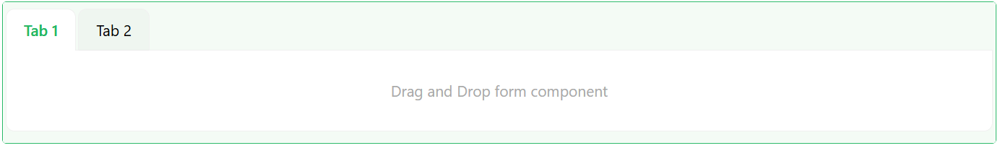
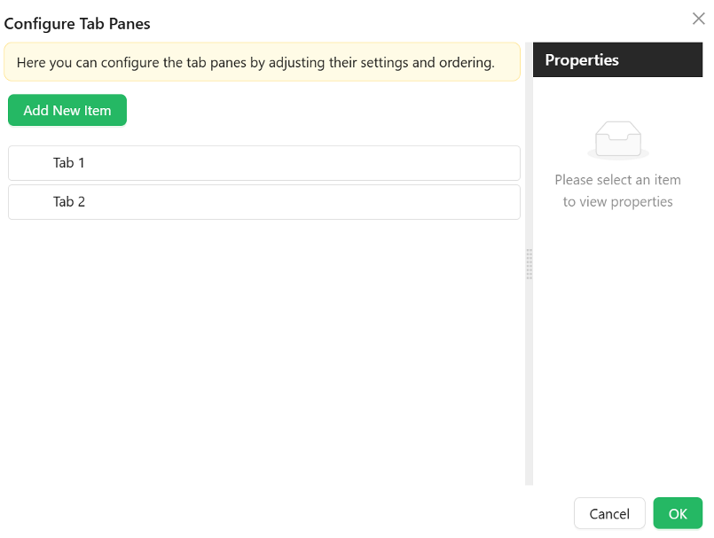

# Tabs

The Tabs component is used to organize content into separate sections or panes, where users can switch between these sections by clicking on the tabs. Each tab represents a different section, and only one section is visible at a time.

[//]: # '<iframe width="100%" height="500" src="https://pd-docs-adminportal-test.shesha.dev/shesha/forms-designer/?id=41d541dc-75c9-4436-ad41-3b39ea828efb" title="Tabs Component" ></iframe>'

## **Properties**

The following properties are available to configure the behavior of the component from the form editor (this is in addition to [common properties](/docs/front-end-basics/form-components/common-component-properties)).

### Common

#### **Default Active Tab** ``enum``

Choose which tab should greet your users first. This dropdown lets you set the initial active tab based on tab configurations.

#### **Tab Type** ``card | line``

Defines the visual style of your tabs.

- **Card** *(default)*: Each tab looks like a clickable card.

- **Line**: Sleek underline style for the minimalists.

___

#### **Tabs**

#### Configure Tab Panes

 The user can use the configure tabs option to add the tabs that they want to have.
 An array of tab configuration objects. Each tab supports:
 - **Name** ``string`` – Internal identifier used to reference the tab.
 - **Title** ``string`` – Text displayed on the tab label.
 - **Key** ``string`` – Unique key for the tab.
 - **Class Name** ``string`` – Optional CSS class applied to the tab.
 - **Animated** ``boolean`` – Enables animation transitions when switching tabs.
 - **Icon** ``object`` – Optional icon shown beside the title.
 - **Force Render** ``boolean`` – Forces rendering of tab content even when inactive.
 - **Hide** ``boolean`` – Conditionally hides this specific tab.
 - **Edit Mode** ``object`` – Defines whether tab content is editable:
    - Editable
    - Read Only
    - Inherited *(default)*
 - **Select Mode** ``object`` – Tab selection behavior:
    - Selectable *(default)*
    - Disabled
    - Inherited from Edit Mode
 - **Destroy Inactive Tab Pane** ``boolean`` – Whether to remove DOM of inactive tabs.
___

### Appearance

#### **Position** ``string``

Set where your tabs appear:

- Top *(default)*
- Bottom
- Left
- Right

#### **Card Styles** ``object`` 

For when using Card tab type:

- Font styles specific to card content
- Dimensions (width, height, min/max)
- Background types and image settings
- Custom styles just for the card view
